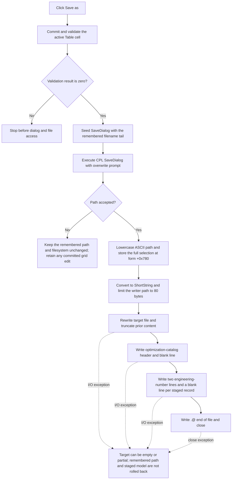

# Save the staged optimization target catalog

> Analysis status: Reviewed from recovered source, the embedded Delphi form stream, the catalog writer, and the form's working-copy and modal commit paths.

## Control

| Property | Recovered value |
| --- | --- |
| Form | CplxForm11 |
| Form caption | Target Setting Editor |
| Component path | CplxForm11.saveas |
| Control class | TButton |
| Caption | `&Save as` |
| Hint | Not present in the recovered resource. |
| Handler name | saveasClick |
| Handler address | 013e85d0 |
| Graph node | `resource:dfm:CplxForm11/CplxForm11.saveas` |
| Handler node | `function:013e85d0` |
| Graph layer | UI |

## What happens when clicked

`TCplxForm11.saveasClick` first commits and validates the active `Table` cell. If validation succeeds, it asks for a path and writes the Target Setting Editor's private working records as a text catalog. Saving does not press OK, close the editor, sort the records, or copy them to the caller-owned target table.

The handler stores the grid-validation result in form byte `+0x768`. A nonzero result stops the operation before the Save dialog opens. A zero result means that no editor is active or that the active cell was accepted. Therefore, a newly committed grid value is included in the file.

## Save dialog and remembered path

The embedded Delphi form stream gives the Save dialog these settings:

- default extension: `CPL`;
- filter: `Complex numbers from file (*.CPL)|*.CPL`;
- options: `ofOverwritePrompt`, `ofHideReadOnly`, `ofShowHelp`, and `ofEnableSizing`.

The phrase `from file` is the exact recovered filter text, although this dialog writes a file. The dialog has no recovered title, initial directory, filter index, or fixed file name. The application handler does not assign these properties.

`FormCreate` initializes form string `+0x780` to `noname.cpl`. Before each dialog execution, Save As extracts the trailing filename part of this remembered string and assigns it to `SaveDialog.FileName`. It does not seed the dialog with the remembered directory. After a successful save selection, the next Save As starts with the last selected filename.

The dialog's `Execute` result is the selection guard:

- If the user cancels, the handler does not read `FileName`, change the remembered path, or open a file. A grid edit committed before the dialog remains staged.
- If the user accepts, the handler reads the selected full path, maps ASCII `A` through `Z` to lowercase, and stores the result at `+0x780`. Other Unicode letters are not case-folded by this helper.

The default extension and overwrite request belong to the dialog. The click handler does not append `.CPL` or perform a second overwrite check. Once `Execute` returns true, the writer uses Delphi `Rewrite`, which creates a file or truncates existing content.

## Path conversion and limits

After acceptance, the handler converts the remembered Unicode path to an 8-bit Delphi ShortString with a maximum of 255 bytes. The serializer applies a second limit: it copies at most the first 80 ShortString bytes before it assigns the text file.

Thus, the form can remember a complete lowercased path while the writer uses only its first 80 encoded bytes. There is no length warning or comparison between the remembered path and the path used for file creation. A path that cannot be represented by the active conversion code page can also differ after conversion; the exact code page is runtime state.

The path assignment occurs before serialization. If file creation or writing fails, `+0x780` still contains the new selected path.

## Exact target-setting format

The writer emits this line-oriented structure:

```text
@ Catalog file for optimization

<record-0 first value>
<record-0 second value>

<record-1 first value>
<record-1 second value>

...
.@ end of file
```

The writer loops over every record in private list `+0x788`, including reserved record `0`, in the current list order. It formats each 8-byte floating-point field with the application's engineering-number formatter and recovered arguments `(2, 0, 1)`. Each value is on its own line. One blank line follows each pair. The fixed `.@ end of file` line follows the last blank line.

Save As does not sort, normalize, filter, or range-check the records. It also has no minimum-count guard. An empty private list produces only the header, one blank line, and the terminator.

## Mode, units, and tolerance

The catalog has no AC/DC marker and no dB/V marker. The serializer does not read the form mode byte at `+0x798` or the `rgMeasUnit` item index. It writes the two stored values without conversion. A later Load interprets those pairs through the mode and unit selection of the editor that opens the file.

The visible `feTolerance` value is also not serialized. The first working record is reserved form state:

- `FormCreate` initially reads its first field into `feTolerance`;
- the shared grid refresh then resets that field to zero;
- Draw ignores record `0` and starts with record `1`;
- only a successful OK reads the current tolerance editor and writes it back to record `0` before caller copy-back.

Save As validates only the attribute grid. It does not read or validate `feTolerance`. In the recovered normal editor paths, the first value written for record `0` is therefore zero, not the current tolerance text. In AC mode, record `0`'s second value is an editable staged value and is written. In DC mode, record `0` has no editable grid row, but its stored second value is still written.

The handler does not change the AC/DC mode, dB/V choice, tolerance text, current record order, or grid selection.

## Save flow



## Encoding and line output

The serializer uses the Delphi `TextFile` runtime. It passes encoding value `0` during file assignment, which selects the runtime's current default text code page. It does not request UTF-8 and does not write a Unicode byte-order mark.

Each line uses the runtime `Write` and `WriteLn` paths. `WriteLn` adds a carriage return when the text-file flag requests it, always adds a line feed, and flushes the text buffer. The exact live line-ending flag and default code page are not constants in this handler.

The writer calls the Delphi I/O-status check after file assignment, rewrite, each completed line, and close. A nonzero status raises through the runtime error path. The application handler does not convert that failure into a local message or Boolean result.

## Overwrite, errors, and partial files

- Validation failure opens no dialog and changes no file or remembered path. The invalid active editor remains for correction.
- Dialog cancellation opens no file and keeps the prior remembered path. It does not undo a grid value committed by the validation step.
- `ofOverwritePrompt` asks for overwrite confirmation in the Save dialog. After acceptance, neither the handler nor the writer asks again.
- `Rewrite` can truncate an existing target before the header is complete.
- Assignment, rewrite, numeric formatting, writing, flushing, and close have no local retry or recovery branch.
- The path is remembered before `Rewrite`. A failed save can still change the next suggested filename.
- There is no temporary file, atomic rename, transaction, or rollback. A failure after `Rewrite` can leave an empty or partial catalog.
- An exception before the explicit close skips that close statement on this recovered path. The source does not establish when later runtime cleanup closes the handle.
- A failure after some record lines preserves the unchanged staged list in memory but can leave only a prefix of it on disk.
- The recovered source does not establish how the application presents these validation-independent I/O, conversion, or formatting exceptions.

## Staging, OK, Cancel, and persistence

The form constructor stores the caller-owned target table at `+0x790` and allocates private list `+0x788`. `FormCreate` deep-copies the caller records into the private list. Save As reads only this private copy.

- A later valid OK sorts records `1` and later, writes the visible tolerance into record `0`, and replaces the caller table with a deep copy.
- A later invalid OK keeps the form open and leaves the caller table unchanged.
- The built-in Cancel button closes without the OK copy-back path. It discards private staged records but does not delete or undo a file that Save As already wrote.
- The AC caller copies the current dB/V selection back only after modal OK. Saving alone does not persist that choice to the caller.

The catalog file is the only external persistence caused by this handler. Save As does not update the caller table, registry, application preferences, or modal result.

## Handler and serialization evidence

- Save As handler: [FUN_013e85d0](../../../DecompiledSources/Tina16/functions/00000000013E85D0__FUN_013e85d0.c) contains the validation gate, filename seed, dialog guard, lowercase path assignment, ShortString conversion, and writer call.
- Grid commit and validation: [FUN_00b0a890](../../../DecompiledSources/Tina16/functions/0000000000B0A890__FUN_00b0a890.c) returns zero when no editor is active or after an accepted active-cell commit.
- Filename-tail helper: [FUN_00441920](../../../DecompiledSources/Tina16/functions/0000000000441920__FUN_00441920.c) returns the trailing filename part of the remembered path.
- Dialog filename setter: [FUN_00724380](../../../DecompiledSources/Tina16/functions/0000000000724380__FUN_00724380.c) updates `SaveDialog.FileName` when the seed differs.
- Dialog filename reader: [FUN_00724270](../../../DecompiledSources/Tina16/functions/0000000000724270__FUN_00724270.c) returns the accepted path.
- ASCII lowercase helper: [FUN_0043e1a0](../../../DecompiledSources/Tina16/functions/000000000043E1A0__FUN_0043e1a0.c) maps only `A..Z` to `a..z`.
- ShortString conversion: [FUN_00416910](../../../DecompiledSources/Tina16/functions/0000000000416910__FUN_00416910.c) converts the Unicode path and limits its result to 255 bytes.
- Catalog writer: [FUN_013e8340](../../../DecompiledSources/Tina16/functions/00000000013E8340__FUN_013e8340.c) applies the 80-byte path limit and writes the header, all record pairs, blank lines, terminator, and close operation.
- Numeric formatter: [FUN_00b8fd60](../../../DecompiledSources/Tina16/functions/0000000000B8FD60__FUN_00b8fd60.c) supplies the engineering-number text for both stored doubles.
- Text-file assignment: [FUN_0040cf10](../../../DecompiledSources/Tina16/functions/000000000040CF10__FUN_0040cf10.c) stores the target path and selects the default code page for encoding value `0`.
- Rewrite: [FUN_0040ca00](../../../DecompiledSources/Tina16/functions/000000000040CA00__FUN_0040ca00.c) opens the text file in rewrite mode.
- Line writer: [FUN_0040f590](../../../DecompiledSources/Tina16/functions/000000000040F590__FUN_0040f590.c) emits the configured line ending and flushes the text buffer.
- I/O-status check: [FUN_00409900](../../../DecompiledSources/Tina16/functions/0000000000409900__FUN_00409900.c) raises when the thread-local I/O status is nonzero.
- Close: [FUN_0040d150](../../../DecompiledSources/Tina16/functions/000000000040D150__FUN_0040d150.c) flushes and closes the text file and records close errors.
- Form creation: [FUN_013e7930](../../../DecompiledSources/Tina16/functions/00000000013E7930__FUN_013e7930.c) creates the private copy, initializes `feTolerance` and `noname.cpl`, and performs the refresh that clears reserved field `0`.
- Grid refresh: [FUN_013e7620](../../../DecompiledSources/Tina16/functions/00000000013E7620__FUN_013e7620.c) resets reserved record `0` field `0` and installs mode-dependent editors.
- OK copy-back: [FUN_013e7bc0](../../../DecompiledSources/Tina16/functions/00000000013E7BC0__FUN_013e7bc0.c) validates, sorts normal records, stores tolerance, and replaces the caller table only on modal acceptance.
- Form destruction: [FUN_013e71f0](../../../DecompiledSources/Tina16/functions/00000000013E71F0__FUN_013e71f0.c) destroys private records without modifying the caller table or saved catalog.
- Recovered control tree: [ui-evidence.json](../../../DecompiledSources/Tina16/resources/dfm/ui-evidence.json) binds `CplxForm11.saveas.OnClick` to `013e85d0` and identifies the form, controls, captions, and selected properties.
- Extractor property scope: [TiaraUiEvidence.rs](../../../analysis/undelphi/TiaraUiEvidence.rs) shows that JSON exports a selected property set. The default extension, filter, and options above were checked in the raw `CplxForm11` TPF0 stream near rebuilt-image file offset `54522880`.
- Complexity: complex; ten distinct outgoing calls are present in the graph.

## Resource evidence

- The form caption is `Target Setting Editor`.
- The command is a plain `TButton` captioned `&Save as`; the ampersand defines its keyboard mnemonic.
- `SaveDialog` is a `TSaveDialog` owned by `CplxForm11`.
- `Table` is a `TAttributeGrid`.
- `rgMeasUnit` contains `dB` and `V`; it is enabled for AC mode and disabled for DC mode.
- `feTolerance` is next to `Tol.` and `[%]` and has recovered initial text `5`.
- The button has no hint, action, image reference, embedded glyph, built-in button kind, or modal result.

## Analysis limits

- The original Delphi type and member names for each 16-byte record are not recovered. The two-double layout, working-list ownership, reserved record `0`, and tolerance boundary are established by source data flow.
- The exact text of a formatted floating-point value depends on the engineering formatter and runtime format settings. The two-values-per-record layout and formatter arguments `(2, 0, 1)` are proven.
- The exact path-conversion code page, file-output code page, and live line-ending flag are runtime state.
- The source proves that `FUN_00441920` removes a leading path portion. The exact separator set is stored in an unrecovered constant.
- Shared validator `FUN_00b0a890`, refresh helper `FUN_013e7620`, and lifecycle functions are evidence for this article but have canonical owners in other annotation fragments. They are not repeated in this Bead's fragment.
