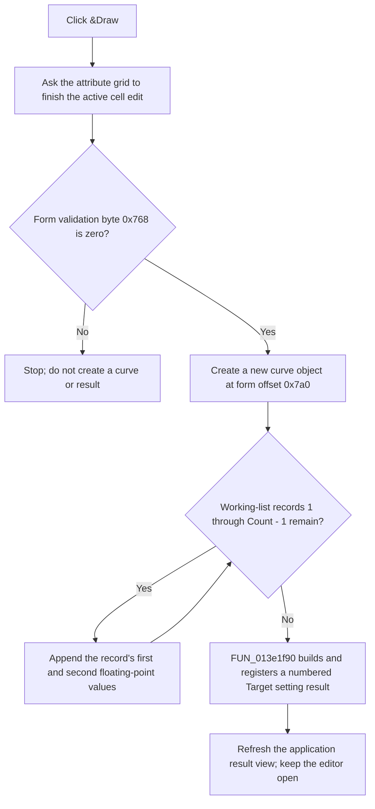

# &Draw

> Analysis status: Source reviewed.

## Control

| Property | Recovered value |
| --- | --- |
| Form | CplxForm11 |
| Component path | CplxForm11.Showp |
| Control class | TButton |
| Caption | &Draw |
| Hint | Not present in the recovered resource. |
| Text | Not present in the recovered resource. |
| Handler name | ShowpClick |
| Handler address | 013e8ed0 |
| Graph node | `resource:dfm:CplxForm11/CplxForm11.Showp` |
| Handler node | `function:013e8ed0` |
| Graph layer | UI |

## What happens when clicked

`&Draw` is a command button. It has no recovered checked state and does not toggle point visibility in the editor.

The handler first asks the `TAttributeGrid` at form offset `0x6d0` to finish its active cell edit. It does not use the returned validation result. It then reads the byte at form offset `0x768`. The editor's OK handler writes its grid-validation result to this byte, and `FormCloseQuery` clears it after it accepts or rejects a close request. If this byte is nonzero when `&Draw` runs, the handler stops without making a curve or a result view.

When the guard byte is zero, the handler creates a new curve object and stores it at form offset `0x7a0`. It reads the private working list at offset `0x788`, skips reserved record 0, and appends both eight-byte floating-point fields from every record at indexes `1` through `Count - 1`. The surrounding editor code treats these records as staged point pairs. Mode 0 labels them as X and Y, while mode 1 uses its frequency and magnitude resource path. Record 0 is not a plotted point: initialization reads its first field into the separate tolerance edit, and AC mode exposes its second field outside the repeated point rows.

The handler passes the curve and the constructor mode byte at offset `0x798` to `FUN_013e1f90`. That helper creates an application result, assigns the unique title `Target setting result` plus a counter, selects mode-specific result labels, builds a graph from the curve, registers it with the application result manager, and refreshes the application view. The output is therefore a new application result view, not a repaint of the editor grid. Each completed repeated click creates another numbered result.

The click reads the editor's private working list. It does not sort it, replace the caller-owned list at offset `0x790`, change the selected grid cell, or close the dialog. The separate OK path validates, sorts, and copies the working list back to the caller. Cancel performs no copy-back. A result already submitted to the application result manager is outside that copy-back decision; no recovered CplxForm11 Cancel path removes it.

If the working list contains only reserved record 0, the loop adds no points, but the handler still sends the empty curve to the result helper. A grid-validation failure returned by the initial commit call has no direct error branch or message in this handler. The recovered handler also has no local exception handler for curve allocation or downstream result creation.

## Click flow

## Handler evidence

- Source: [FUN_013e8ed0](../../../DecompiledSources/Tina16/functions/00000000013E8ED0__FUN_013e8ed0.c)
- Result helper: [FUN_013e1f90](../../../DecompiledSources/Tina16/functions/00000000013E1F90__FUN_013e1f90.c)
- Editor initialization: [FUN_013e7930](../../../DecompiledSources/Tina16/functions/00000000013E7930__FUN_013e7930.c)
- Accepted-state copy-back: [FUN_013e7bc0](../../../DecompiledSources/Tina16/functions/00000000013E7BC0__FUN_013e7bc0.c)
- Close guard: [FUN_013e7290](../../../DecompiledSources/Tina16/functions/00000000013E7290__FUN_013e7290.c)
- Recovered role: Builds and opens an application result graph from the Target Setting Editor's staged points.
- Current graph summary: Handles 1 Delphi UI event: CplxForm11.Showp.OnClick.
- Complexity: complex
- Distinct outgoing calls: 7

## Direct calls

- `function:004aeac0` - Reads a bounded working-list entry.
- `function:00b0a890` - Validates and commits the active AttributeGrid cell editor.
- `function:013e1f90` - Builds and registers the numbered target-setting result view.
- `function:01cc2930` - Initializes the new curve's data channel.
- `function:01cc3870` - Allocates the curve object.
- `function:01cc4620` - Appends the first value of one staged point.
- `function:01cc4790` - Appends the paired second value.

## Resource evidence

- The recovered form caption is `Target Setting Editor`.
- The control caption is `&Draw` and the control class is `TButton`.
- The same form contains an attribute grid, `Frequency`, `Magnitude`, `Tol.`, and `%` labels, and a `dB` or `V` selector for AC mode.
- The control has no hint, image, glyph, modal result, or checked-state property.

## Analysis limits

- The recovered result helper selects different string resources for mode 0 and mode 1. The exact localized strings are not present in the recovered C source.
- The initial grid-commit return value is discarded. The source does not prove which last accepted value the graph uses when the active editor rejects new text.
- Runtime allocation and result-manager failures are delegated to the Delphi and application infrastructure; this handler does not define a local recovery path.
