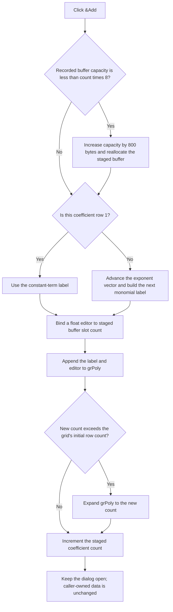

# &Add

> Analysis status: Source reviewed.

## Control

| Property | Recovered value |
| --- | --- |
| Form | CspEditorDlg |
| Component path | CspEditorDlg.pctrlMode.tshPoly.btnAddPoly |
| Control class | TButton |
| Caption | &Add |
| Hint | Not present in the recovered resource. |
| Text | Not present in the recovered resource. |
| Handler name | btnAddPolyClick |
| Handler address | 01401c80 |
| Graph node | `resource:dfm:CspEditorDlg/CspEditorDlg.pctrlMode.tshPoly.btnAddPoly` |
| Handler node | `function:01401c80` |
| Graph layer | UI |

## What happens when clicked

`&Add` appends one coefficient row to the `grPoly` attribute grid on the `Nonlinear/(POLY)` tab. It does not insert relative to the selected grid row. The handler uses the current coefficient count at form offset `0x890`, so new rows always follow the existing staged rows.

The polynomial's inputs come from the `Controlling components` list. Its click handler counts the selected components, writes that count to the read-only `Dimension` edit, creates one two-byte exponent entry per selected component, and regenerates the existing coefficient labels. `&Add` reads that dimension and the current exponent vector. It does not change the component selection.

Before it adds the row, the handler checks the staged coefficient-buffer capacity at offset `0x898`. When the recorded byte capacity is less than `coefficient count * 8`, it increases the capacity by 800 bytes and reallocates the buffer at offset `0x8b0`. The handler does not set a maximum coefficient count.

The handler requests label number `coefficient count + 1` from `FUN_014002c0`. Label 1 is the constant term. For each later label, the helper advances the exponent vector through `FUN_00dff7c0` and builds a monomial from the selected controlling-component names. The sequence groups rows by increasing total degree. Within one degree, it starts with the first selected component and moves exponent weight toward later selected components. For two selected inputs, the sequence is the constant, first input, second input, first squared, first times second, second squared, and so on.

The handler then creates a floating-point editor bound directly to `buffer[coefficient count]` and gives the generated label and editor to `grPoly`. If the new count exceeds the grid's initial row count stored at offset `0x8a0`, it expands the grid to the new count. It increments the staged coefficient count only after these steps.

The click does not initialize the target buffer slot. On a newly opened form, the private buffer comes from the form's initial allocation and existing coefficients are copied into its leading slots. The Remove and Clear handlers reduce or reset the count but do not erase the buffer. Adding a row again after Remove or Clear can therefore bind the row to the prior value in that slot.

The click also does not ask `grPoly` to commit or validate the active cell editor. Validation occurs when the user clicks OK. If validation succeeds while the polynomial tab is active, the OK handler writes polynomial mode, dimension, coefficient count, a copy of the staged coefficients, and the selected controlling-component names into the caller-owned controlled-source record. If validation fails, OK leaves that record unchanged and keeps the dialog from accepting the edit. The built-in Cancel button has no application handler; form destruction frees the private buffers without copying them to the caller-owned record.

There is no normal no-op branch: a click adds one row unless a called routine fails. The handler does not reject dimension zero. The first constant row does not need an exponent vector, but a later add with no selected controlling component passes the null exponent vector to the enumerator. The recovered code has no local recovery for that state. Invalid dimension parsing, buffer allocation, label creation, and grid insertion also have no local exception handler. A failure after capacity growth or exponent advancement can leave part of the private editor state changed, but it still does not commit the caller-owned record.

## Click flow

## Handler evidence

- Source: [FUN_01401c80](../../../DecompiledSources/Tina16/functions/0000000001401C80__FUN_01401c80.c)
- Row-label builder: [FUN_014002c0](../../../DecompiledSources/Tina16/functions/00000000014002C0__FUN_014002c0.c)
- Exponent enumerator: [FUN_00dff7c0](../../../DecompiledSources/Tina16/functions/0000000000DFF7C0__FUN_00dff7c0.c)
- Form initialization and private-buffer copy: [FUN_01400ee0](../../../DecompiledSources/Tina16/functions/0000000001400EE0__FUN_01400ee0.c)
- Controlling-component selection handler: [FUN_01401b00](../../../DecompiledSources/Tina16/functions/0000000001401B00__FUN_01401b00.c)
- Accepted-state copy-back: [FUN_01403320](../../../DecompiledSources/Tina16/functions/0000000001403320__FUN_01403320.c)
- Private-buffer cleanup: [FUN_01401ac0](../../../DecompiledSources/Tina16/functions/0000000001401AC0__FUN_01401ac0.c)
- Recovered role: Appends the next staged polynomial coefficient and its generated monomial label.
- Current graph summary: Handles 1 Delphi UI event: CspEditorDlg.pctrlMode.tshPoly.btnAddPoly.OnClick.
- Complexity: complex
- Distinct outgoing calls: 7

## Direct calls

- `function:00409620` - Reallocates the staged coefficient buffer.
- `function:00414480` - Finalizes temporary Delphi strings.
- `function:00848a70` - Expands the attribute-grid row count when required.
- `function:00b0ab70` - Adds the generated label and numeric editor to the attribute grid.
- `function:00f04d50` - Reads and range-checks the read-only Dimension edit.
- `function:014002c0` - Generates the constant or next monomial row label.
- `function:014313c0` - Creates the floating-point editor over the next staged buffer slot.

## Resource evidence

- The recovered form caption is `Controlled Source Editor`.
- The containing tab caption is `Nonlinear/(POLY)`.
- The tab contains the `Controlling components`, `Dimension`, and `Coefficients` labels.
- `iedDimension` is a read-only integer edit, `grPoly` is a `TAttributeGrid`, and `lbxCtrlComps` is a `TListBox`.
- The Add button has no hint, image, glyph, modal result, or checked-state property.

## Analysis limits

- The recovered constant-label string and punctuation strings have address-only names in the C export. Their semantic role follows from the zero exponent state and the later monomial sequence.
- The numeric editor is proven to bind to the next staged double. The Add handler does not define a new default value for that slot.
- The recovered code does not provide a safe local branch for adding a second row while Dimension is zero. External UI constraints, if any, are not present in this handler.
