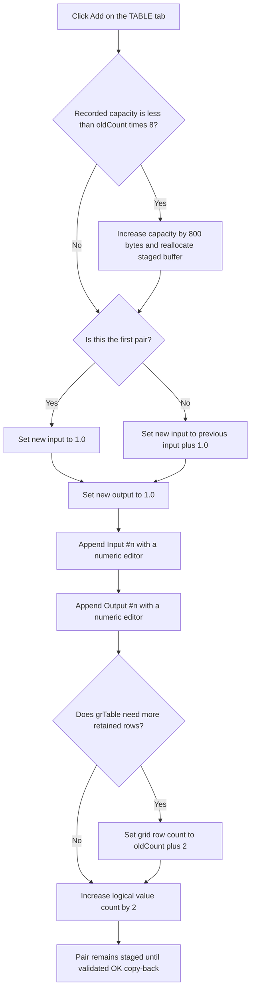

# &Add

> Analysis status: Reviewed from recovered source, form-resource, call-graph, and staged-model evidence.

## Control

| Property | Recovered value |
| --- | --- |
| Form | CspEditorDlg |
| Form caption | Controlled Source Editor |
| Tab | Nonlinear/(TABLE) |
| Component path | CspEditorDlg.pctrlMode.tshTable.btnAddTable |
| Control class | TButton |
| Caption | &Add |
| Hint | Not present in the recovered resource. |
| Handler name | btnAddTableClick |
| Handler address | 014023b0 |
| Graph node | `resource:dfm:CspEditorDlg/CspEditorDlg.pctrlMode.tshTable.btnAddTable` |
| Handler node | `function:014023b0` |
| Graph layer | UI |

## What happens when clicked

`btnAddTableClick` appends one input/output pair to the staged nonlinear table. One click creates two consecutive `grTable` rows, not one scalar row:

1. `Input #n`;
2. `Output #n`.

The pair number is `oldValueCount / 2 + 1`. The handler assumes that the old scalar-value count at form offset `+0x894` is even.

## Default values and insertion order

The staged `double` array starts at form field `+0x8b8`. The handler writes the new input at index `oldCount` and the new output at index `oldCount + 1`.

- For the first pair, the input is `1.0`.
- For a later pair, the input is the previous pair's input plus `1.0`. The source reads index `oldCount - 2`, not the previous output.
- Every new output is `1.0`.

The handler does not sort, insert at the selected row, or inspect cell values to choose a position. It always appends the input row first and the output row second. Thus repeated clicks produce default inputs `1.0`, `2.0`, `3.0`, and so on unless the user changes an earlier input before the next click.

Each `FUN_014313c0` call creates a numeric editor bound directly to the new `double` address. `FUN_00b0ab70` writes the label in column `0`, installs that editor in column `1`, and advances the grid's append-row cursor. If the retained grid row count is smaller than `oldCount + 2`, the handler grows it to that value. Otherwise, the existing spare rows remain and receive the new editors.

The logical count at `+0x894` increases by two only after both editors are installed and any row-count growth is complete.

## Validation and active-cell behavior

This handler does not call the grid commit helper `FUN_00b0a890`. It does not validate or explicitly finish a cell that is being edited before it changes the backing array and appends rows.

The handler also does not call the grid reset helper, select the new input or output row, set a current row or column, focus `grTable`, or open a new cell editor. `FUN_00b0ab70` advances only the internal append cursor. Therefore the exact selection, scroll position, active editor, and caret after the click depend on the grid implementation. There is no source evidence that the newly added pair becomes selected.

If an earlier input edit has already reached the bound staged `double`, the next default input uses that changed value plus `1.0`. If text remains only in an uncommitted editor, the handler reads the older backing value instead. Later OK performs the validation that this Add command omits.

## Staged ownership and OK or Cancel

`CspEditorDlg.FormCreate` allocates the private table buffer at `+0x8b8`. When the edited controlled source already uses TABLE mode, FormCreate copies the caller-owned scalar array into this buffer and creates the initial `Input #n` and `Output #n` editors.

Add changes only this private buffer, its logical count, and `grTable`. It does not write the controlled-source record at form field `+0x880`.

`btnOKClick` validates `grTable`. Only a zero validation result changes the caller record to TABLE mode, allocates its new value array, stores the staged count, and copies the staged doubles into it. A validation failure clears the form's modal acceptance value and does not copy the buffer.

The Cancel button is the resource-defined `bkCancel` button and has no application OnClick handler. Cancel performs no copy-back. `FormDestroy` frees the staged table buffer after the dialog closes, so added pairs are discarded on Cancel.

## Capacity behavior

FormCreate initially allocates `800` bytes for the staged table and records that size at `+0x89c`. The Add handler grows this allocation by another `800` bytes when the recorded capacity is less than `oldCount * 8`.

The guard tests the bytes used by the old count. It does not test the required size `(oldCount + 2) * 8`. At the exact initial boundary of `100` doubles, `800 < 800` is false, yet the handler writes doubles `100` and `101`. The source contains no separate pair-count limit or boundary guard. This is a recovered capacity defect if that count is reachable.

## Click flow

## Handler evidence

- Primary handler: [FUN_014023b0](../../../DecompiledSources/Tina16/functions/00000000014023B0__FUN_014023b0.c) contains the capacity test, default calculations, row labels, editor creation, grid-row growth, and final count update.
- Buffer allocator: [FUN_00409620](../../../DecompiledSources/Tina16/functions/0000000000409620__FUN_00409620.c) allocates, reallocates, or frees the raw buffer and raises on allocation failure.
- Numeric editor factory: [FUN_014313c0](../../../DecompiledSources/Tina16/functions/00000000014313C0__FUN_014313c0.c) constructs the editor over a supplied value address.
- Grid-row append helper: [FUN_00b0ab70](../../../DecompiledSources/Tina16/functions/0000000000B0AB70__FUN_00b0ab70.c) writes the label and numeric value/editor in the current append row, then advances its append cursor.
- Row-count helper: [FUN_00848a70](../../../DecompiledSources/Tina16/functions/0000000000848A70__FUN_00848a70.c) changes the grid row count when the requested count differs.
- Form initialization: [FUN_01400ee0](../../../DecompiledSources/Tina16/functions/0000000001400EE0__FUN_01400ee0.c) allocates the two 800-byte staging buffers and copies existing TABLE values into `+0x8b8` before it builds the initial pair rows.
- OK boundary: [FUN_01403320](../../../DecompiledSources/Tina16/functions/0000000001403320__FUN_01403320.c) validates `grTable` and copies count and values to the caller record only on success.
- Staging cleanup: [FUN_01401ac0](../../../DecompiledSources/Tina16/functions/0000000001401AC0__FUN_01401ac0.c) frees the private buffers when the form is destroyed.
- Complexity: complex; seven distinct outgoing calls are present in the graph.

## Resource evidence

- The button caption is `&Add`; the ampersand defines the keyboard mnemonic.
- It is on the `Nonlinear/(TABLE)` tab beside the `TAttributeGrid` named `grTable`.
- The same tab contains `Remove`, `Clear`, `Load`, `Save`, and `Check` commands plus the `Expression` edit.
- The nearby `Inputs` and `Expression` labels establish the TABLE editor context, but the precise pair defaults come from the handler.
- The button has no hint, action, image reference, or extracted glyph.

## No-op, error, and partial-state behavior

- There is no empty-state, maximum-count, confirmation, or validation no-op branch. Each normal click attempts to append one pair.
- The handler assumes an even nonnegative count. With a corrupt odd count, its pair number and `oldCount - 2` lookup do not describe a valid input/output sequence; there is no guard.
- The capacity counter is increased before reallocation. If allocation raises and an outer handler catches the exception, the recorded capacity can be larger than the actual allocation.
- The two new doubles are written before either grid row is installed, and the logical count is updated last. An exception can therefore leave hidden buffer values, only the input row, or both visible rows without the matching logical count.
- There is no local exception handler or rollback. Cancel prevents copy-back to the caller but does not repair a partially changed live grid before the dialog closes.

## Analysis limits

- The source proves that no explicit selection or focus assignment occurs. It does not prove how the custom grid preserves its current coordinate during row insertion.
- The source exposes the exact capacity-boundary defect. It does not prove that normal product limits permit 50 or more input/output pairs.
- Downstream controlled-source evaluation starts only after a successful OK copy-back and is outside this Add handler.
