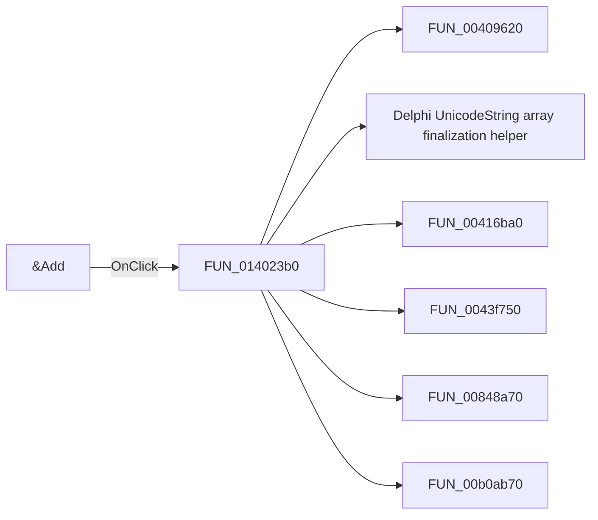

# &Add

> Analysis status: Pending individual source review.

## Control

| Property | Recovered value |
| --- | --- |
| Form | CspEditorDlg |
| Component path | CspEditorDlg.pctrlMode.tshTable.btnAddTable |
| Control class | TButton |
| Caption | &Add |
| Hint | Not present in the recovered resource. |
| Text | Not present in the recovered resource. |
| Handler name | btnAddTableClick |
| Handler address | 014023b0 |
| Graph node | `resource:dfm:CspEditorDlg/CspEditorDlg.pctrlMode.tshTable.btnAddTable` |
| Handler node | `function:014023b0` |
| Graph layer | UI |

## What happens when clicked

Pending individual analysis. An agent must read the recovered handler source and its relevant callees before it replaces this text.

## Click flow

## Handler evidence

- Source: [DecompiledSources/Tina16/functions/00000000014023B0__FUN_014023b0.c](../../../DecompiledSources/Tina16/functions/00000000014023B0__FUN_014023b0.c)
- Recovered role: Not present in the recovered resource.
- Current graph summary: Handles 1 Delphi UI event: CspEditorDlg.pctrlMode.tshTable.btnAddTable.OnClick.
- Current graph behavior: Not present in the recovered resource.
- Current graph evidence: Not present in the recovered resource.
- Complexity: complex
- Distinct outgoing calls: 7

## Direct calls

- `function:00409620` — FUN_00409620
- `function:00414560` — Delphi UnicodeString array finalization helper
- `function:00416ba0` — FUN_00416ba0
- `function:0043f750` — FUN_0043f750
- `function:00848a70` — FUN_00848a70
- `function:00b0ab70` — FUN_00b0ab70
- `function:014313c0` — FUN_014313c0

## Resource evidence

- Kind: Not present in the recovered resource.
- Modal result: Not present in the recovered resource.
- Checked state: Not present in the recovered resource.
- List items: Not present in the recovered resource.
- Image reference: Not present in the recovered resource.
- Extracted glyph: None.

## Nearby label candidates

Nearby labels are layout candidates only. They are not proof of behavior.

- Rank 1: Inputs at distance 217.
- Rank 2: Expression at distance 379.

## Analysis limits

- Do not infer behavior from the control class, caption, hint, glyph, or nearby label alone.
- Do not replace the pending status until the handler source and relevant call path provide enough evidence.
