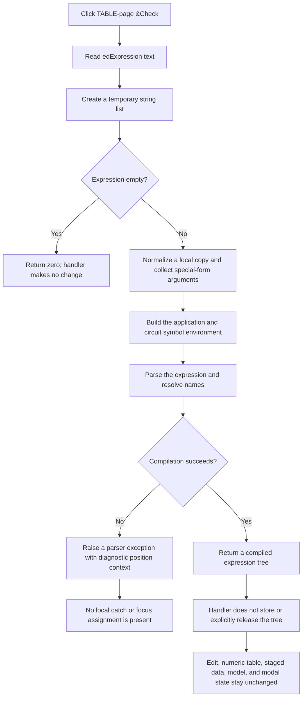

# Check the TABLE-mode expression

> Analysis status: Evidence-backed source review complete.

## Control

| Property | Recovered value |
| --- | --- |
| Form | CspEditorDlg (`Controlled Source Editor`) |
| Tab | `Nonlinear/(TABLE)` |
| Component path | CspEditorDlg.pctrlMode.tshTable.btnCheckTable |
| Control class | TButton |
| Caption | `&Check` |
| Hint or image | Not present in the recovered resource. |
| Handler name | btnCheckTableClick |
| Handler address | 014022e0 |
| Graph node | `resource:dfm:CspEditorDlg/CspEditorDlg.pctrlMode.tshTable.btnCheckTable` |
| Handler node | `function:014022e0` |
| Graph layer | UI |

## What the button checks

The button checks the expression in the TABLE page's `edExpression` edit. The handler reads that text, creates a temporary Delphi string list, and passes both values to the shared controlled-source expression compiler. The compiler uses application and circuit symbol collections to check the expression's syntax and to resolve its names, functions, parameters, and supported built-ins.

The shared compiler returns zero for an empty expression. The click handler ignores this result, so an empty edit is a silent no-op. For a nonempty expression, the compiler returns a compiled expression tree on success. The handler also ignores that result. It does not store the tree or explicitly release it.

Despite its position on the TABLE page, this button does **not** check the numeric table. The handler does not access `grTable`, the staged numeric buffer, or the staged value count. No recovered call checks ordering, duplicate inputs, ranges, or the input/output pair count on this path.

## Expression preparation and symbol lookup

The shared compiler works on a local copy of the edit text. It removes literal space characters, clears the temporary string list, and scans two special call-like text forms. It extracts their comma-separated arguments into that list and rewrites the local expression before parsing. The names of these two forms are not recovered, so this document does not assign names to them. This local normalization does not change the text that is visible in the edit.

The compiler then builds the available symbol set from the supplied application lists and circuit or device data. Its parser checks syntax and resolves supported identifiers. Recovered parser paths include built-ins such as `GMIN`, `TEMP`, `TIME`, `RNDR`, and `RNDC`. An unknown global name can produce the diagnostic `Undefined global parameter: %s`.

## Error and focus behavior

Invalid syntax or an unresolved identifier causes the parser to build a diagnostic with source-position context and raise its parser exception. `btnCheckTableClick` has no local exception handler. It also has no call that moves focus, changes the caret, or selects the bad text. The recovered path does not prove how the application-level VCL exception handler presents the exception to the user.

A successful check is also silent. It does not show a message, change a caption, move focus, or update the expression, grid, staged buffer, controlled-source model, or modal result.

## Click flow

## Relation to table editing and dialog commands

- **TABLE staging:** Form creation copies the controlled-source expression and numeric pairs into form-owned controls and a private buffer. Add, Remove, and Clear change this staged table. Check does not change it.
- **OK:** OK calls the same expression compiler and uses its return value. A zero result prevents the standard OK modal close. After a successful compile, OK separately validates the active grid editor, then replaces the controlled-source expression tree and numeric table. Thus OK repeats the expression check and also performs the commit that this button does not perform.
- **Save:** Save validates the active grid editor before it writes numeric pairs to a file. It does not call the expression compiler. Check does not open or write a file.
- **Load:** Load replaces the staged numeric pairs from a file. It does not read or check the expression. A later click on Check still checks only the current expression.
- **Expression insertion:** Leaving the expression edit records a caret position. The adjacent variable selector can insert its selected name at that position. Check does not change this insertion position.

## Handler evidence

- Handler: [FUN_014022e0](../../../DecompiledSources/Tina16/functions/00000000014022E0__FUN_014022e0.c)
- Shared expression compiler: [FUN_013fd8c0](../../../DecompiledSources/Tina16/functions/00000000013FD8C0__FUN_013fd8c0.c)
- Parser entry: [FUN_016a9250](../../../DecompiledSources/Tina16/functions/00000000016A9250__FUN_016a9250.c)
- Parser diagnostic builder: [FUN_016a6c70](../../../DecompiledSources/Tina16/functions/00000000016A6C70__FUN_016a6c70.c)
- Parser exception raiser: [FUN_016a3c50](../../../DecompiledSources/Tina16/functions/00000000016A3C50__FUN_016a3c50.c)
- TABLE-page OK path: [FUN_01403320](../../../DecompiledSources/Tina16/functions/0000000001403320__FUN_01403320.c)
- Load path: [FUN_01402730](../../../DecompiledSources/Tina16/functions/0000000001402730__FUN_01402730.c)
- Save path: [FUN_01402be0](../../../DecompiledSources/Tina16/functions/0000000001402BE0__FUN_01402be0.c)
- Form staging setup: [FUN_01400ee0](../../../DecompiledSources/Tina16/functions/0000000001400EE0__FUN_01400ee0.c)
- Expression caret capture: [FUN_014021d0](../../../DecompiledSources/Tina16/functions/00000000014021D0__FUN_014021d0.c)
- Variable insertion: [FUN_01402200](../../../DecompiledSources/Tina16/functions/0000000001402200__FUN_01402200.c)

The DFM binds `btnCheckTable.OnClick` to `btnCheckTableClick`. In the handler, form offset `+0x770` is the TABLE-page expression edit. The handler reads that edit through `FUN_0064dd90`, calls `FUN_013fd8c0`, ignores its return value, and finalizes only its temporary list and string. It never reads the grid at `+0x790`, the private numeric buffer at `+0x8b8`, or the count at `+0x894`.

## Direct calls

- `function:00410f20` - Nil-safe Delphi object destruction helper.
- `function:00414480` - Delphi UnicodeString clear and finalization helper.
- `function:004b6930` - Creates the temporary Delphi string-list object used by the compiler.
- `function:0064dd90` - Reads the expression edit's Unicode text.
- `function:013fd8c0` - Compiles and validates the controlled-source expression against the supplied symbol environment.

## Evidence limits

- The resource has no hint, action, image, or extracted glyph that adds semantic evidence.
- The source proves that the returned compiled tree is neither stored nor explicitly released by this handler. A live heap leak was not measured.
- The source proves parser exception creation, but it does not prove the final VCL error-dialog text or presentation.
- No recovered code on this path establishes numeric-table consistency rules or focus-to-error behavior.
