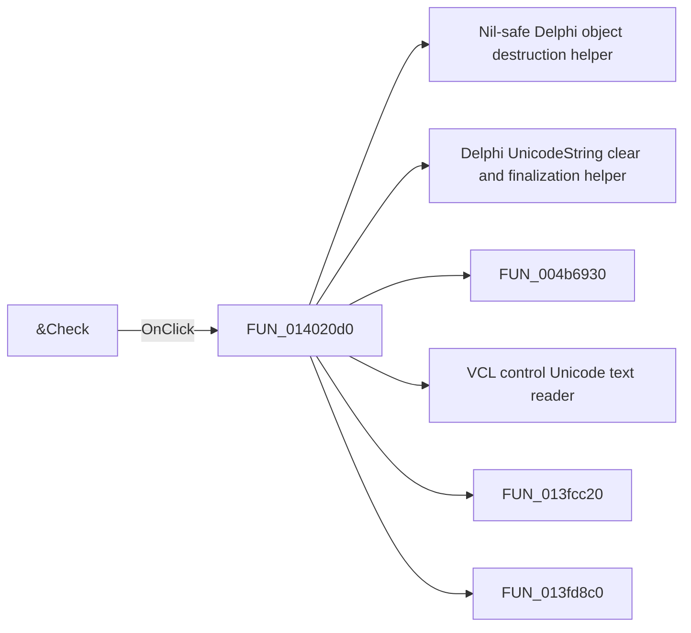

# &Check

> Analysis status: Pending individual source review.

## Control

| Property | Recovered value |
| --- | --- |
| Form | CspEditorDlg |
| Component path | CspEditorDlg.pctrlMode.tshValue.btnCheckValue |
| Control class | TButton |
| Caption | &Check |
| Hint | Not present in the recovered resource. |
| Text | Not present in the recovered resource. |
| Handler name | btnCheckValueClick |
| Handler address | 014020d0 |
| Graph node | `resource:dfm:CspEditorDlg/CspEditorDlg.pctrlMode.tshValue.btnCheckValue` |
| Handler node | `function:014020d0` |
| Graph layer | UI |

## What happens when clicked

Pending individual analysis. An agent must read the recovered handler source and its relevant callees before it replaces this text.

## Click flow

## Handler evidence

- Source: [DecompiledSources/Tina16/functions/00000000014020D0__FUN_014020d0.c](../../../DecompiledSources/Tina16/functions/00000000014020D0__FUN_014020d0.c)
- Recovered role: Not present in the recovered resource.
- Current graph summary: Handles 1 Delphi UI event: CspEditorDlg.pctrlMode.tshValue.btnCheckValue.OnClick.
- Current graph behavior: Not present in the recovered resource.
- Current graph evidence: Not present in the recovered resource.
- Complexity: complex
- Distinct outgoing calls: 6

## Direct calls

- `function:00410f20` — Nil-safe Delphi object destruction helper
- `function:00414480` — Delphi UnicodeString clear and finalization helper
- `function:004b6930` — FUN_004b6930
- `function:0064dd90` — VCL control Unicode text reader
- `function:013fcc20` — FUN_013fcc20
- `function:013fd8c0` — FUN_013fd8c0

## Resource evidence

- Kind: Not present in the recovered resource.
- Modal result: Not present in the recovered resource.
- Checked state: Not present in the recovered resource.
- List items: Not present in the recovered resource.
- Image reference: Not present in the recovered resource.
- Extracted glyph: None.

## Nearby label candidates

Nearby labels are layout candidates only. They are not proof of behavior.

- Rank 1: Inputs at distance 212.
- Rank 2: Expression at distance 519.

## Analysis limits

- Do not infer behavior from the control class, caption, hint, glyph, or nearby label alone.
- Do not replace the pending status until the handler source and relevant call path provide enough evidence.
