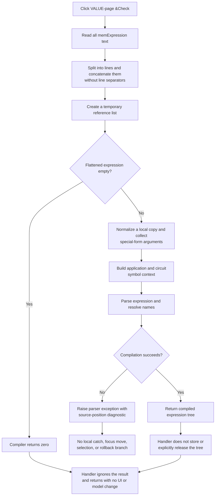

# Check the staged VALUE-mode expression

> Analysis status: Complete. The recovered click handler, line flattener, shared expression compiler, VALUE-page input insertion, and OK commit path agree on this behavior.

## Control

| Property | Recovered value |
| --- | --- |
| Form | CspEditorDlg (`Controlled Source Editor`) |
| Tab | `Nonlinear/(VALUE)` |
| Component path | CspEditorDlg.pctrlMode.tshValue.btnCheckValue |
| Control class | TButton |
| Caption | `&Check` |
| Hint or image | Not present in the recovered resource. |
| Handler name | btnCheckValueClick |
| Handler address | 014020d0 |
| Graph node | `resource:dfm:CspEditorDlg/CspEditorDlg.pctrlMode.tshValue.btnCheckValue` |
| Handler node | `function:014020d0` |
| Graph layer | UI |

## What happens when clicked

The button checks the expression in the VALUE page's `memExpression` memo. The handler reads all memo text and passes it through `FUN_013fcc20`. This helper splits the text into memo lines and concatenates those lines without adding line separators. The shared expression compiler then removes literal space characters from its own local copy, collects arguments from two unrecovered special call forms, builds the available application and circuit symbol environment, and parses the expression.

The click is a noncommitting validation pass. It creates a temporary Delphi string list for the compiler's collected references, but it ignores the compiler's returned expression tree. It does not replace the memo text, store the collected references, update the controlled-source model, change the active mode, change units, or set the dialog's modal result.

If line flattening produces an empty Delphi string, the shared compiler returns zero without parsing. The handler ignores zero, so this case is silent. A successful compilation is also silent: there is no success message, status field, caption change, focus move, or selection change in the recovered path.

## Expression and input behavior

The VALUE page has an **Expression** label for `memExpression` and an **Inputs** label for `cbxVariablesValue`. The combo's separate change handler inserts its selected text into the memo at a position recorded when the memo loses focus. Check does not read the combo or change that insertion position. It checks only the memo text that exists when the handler runs.

Although the control belongs to the VALUE tab, the handler does not read the active page. A normal user click can occur only through that tab's button, but a programmatic call would still read `memExpression` and run the same compiler.

The compiler receives global application and circuit data that supplies identifiers, parameters, functions, and supported built-ins. Recovered parser cases include `GMIN`, `TEMP`, `TIME`, `RNDR`, and `RNDC`. This proves symbol resolution. It does not prove that the Check button converts a value or changes an input or output unit. The handler has no access to a unit control or a model unit field.

## Error and focus behavior

Invalid syntax or an unresolved identifier causes the parser path to build a diagnostic with source-position context and raise its parser exception. One recovered diagnostic is `Undefined global parameter: %s`. `btnCheckValueClick` has no local exception handler, retry, or alternate error branch. It does not call a focus, caret, or selection API, so the recovered path does not prove that an error selects the invalid text or returns focus to the memo.

The application-level VCL exception handler can receive the propagated exception, but its final dialog or message presentation is outside this click path. Because the handler makes no form or model write before compilation, a parser exception does not leave a proven partial editor or controlled-source state change. Allocation, text-access, and indirect VCL failures also propagate without local recovery.

## Click flow

## Handler and call-path evidence

- Check handler: [FUN_014020d0](../../../DecompiledSources/Tina16/functions/00000000014020D0__FUN_014020d0.c)
- Memo-line flattener: [FUN_013fcc20](../../../DecompiledSources/Tina16/functions/00000000013FCC20__FUN_013fcc20.c)
- Shared expression compiler: [FUN_013fd8c0](../../../DecompiledSources/Tina16/functions/00000000013FD8C0__FUN_013fd8c0.c)
- Parser entry: [FUN_016a9250](../../../DecompiledSources/Tina16/functions/00000000016A9250__FUN_016a9250.c)
- Parser diagnostic builder: [FUN_016a6c70](../../../DecompiledSources/Tina16/functions/00000000016A6C70__FUN_016a6c70.c)
- Parser exception raiser: [FUN_016a3c50](../../../DecompiledSources/Tina16/functions/00000000016A3C50__FUN_016a3c50.c)
- VALUE-page input insertion: [FUN_01401ff0](../../../DecompiledSources/Tina16/functions/0000000001401FF0__FUN_01401ff0.c)
- VALUE-page OK commit path: [FUN_01403320](../../../DecompiledSources/Tina16/functions/0000000001403320__FUN_01403320.c)

`FUN_014020d0` reads the control at form field `+0x740`, which the DFM and RTTI map to `memExpression`. It passes the flattened string, a new string list, and four application or circuit context values to `FUN_013fd8c0`. Its only later operations destroy the temporary list and finalize the two local strings. There is no form-field write in the handler.

`FUN_013fcc20` assigns the memo text to a temporary `TStringList`, reads each line in order, and appends it to one output string. It adds no delimiter. This behavior is specific to VALUE mode: the TABLE-page Check handler passes its single-line edit text directly to the shared compiler.

## Direct calls

- `function:00410f20` - Destroys the temporary string-list object when non-null.
- `function:00414480` - Finalizes the original and flattened local Unicode strings.
- `function:004b6930` - Creates the temporary Delphi string list used to collect compiler references.
- `function:0064dd90` - Reads the memo's Unicode text.
- `function:013fcc20` - Flattens the memo lines into one expression string.
- `function:013fd8c0` - Compiles and validates the expression against the supplied symbol environment.

## Relationship to OK, Cancel, and persistence

The VALUE branch of `btnOKClick` repeats the same memo read, line flattening, and shared compiler call. The difference is ownership and commit:

- If the compiler returns zero, OK writes zero to the modal-result field and prevents the normal accepted close.
- On success, OK writes mode value `2`, replaces the model-owned expression text, copies the compiler's collected reference list into the source model, replaces the prior compiled expression tree, and rebuilds the model's derived value array from that tree.
- Check does none of these operations. A successful Check does not make a later OK skip validation; OK compiles the current memo again.
- Cancel does not run the OK copy-back. The Check handler has no source-model write to undo, so a prior successful or failed Check does not itself create persistent model state.
- The OK path commits to the supplied controlled-source model in memory. File or circuit persistence after the dialog is outside both handlers.

The visible memo retains its original line breaks. Check compiles the flattened local copy, while a successful OK stores the current visible memo text and separately retains the compiled result made from the flattened expression.

## No-op, repeated-click, and partial-state cases

- An empty flattened expression returns zero and produces no local message or modal-result change.
- A memo that contains only line breaks also flattens to an empty string. A string that contains literal spaces is nonempty before the compiler removes those spaces, so the recovered source does not prove that this separate case follows the same silent return.
- Repeated clicks repeat allocation, flattening, symbol collection, and compilation. The handler has no cached-success flag or unchanged-text shortcut.
- A successful returned tree is not stored or explicitly released by this handler. The source establishes missing ownership transfer; it does not establish measured heap growth.
- A parser exception can interrupt normal temporary cleanup. Delphi exception unwinding details are not explicit in the recovered C, so this article does not claim a temporary-object leak on failure.

## Resource evidence and limits

- The button caption is **Check**. It has no hint, action, image reference, extracted glyph, built-in button kind, or modal result.
- The same tab contains `memExpression`, `cbxVariablesValue`, and the labels **Expression** and **Inputs**. Their layout supports the field mapping, but the handler and data flow establish the behavior.
- The original Delphi names of the four global context values are not recovered. Their symbol-environment role follows from the compiler and parser data flow.
- The exact names of the two special call forms normalized by `FUN_013fd8c0` are not recovered.
- The recovered path does not prove the final VCL error-dialog format, error-focus behavior, unit checking rules, or a visible success indication.
