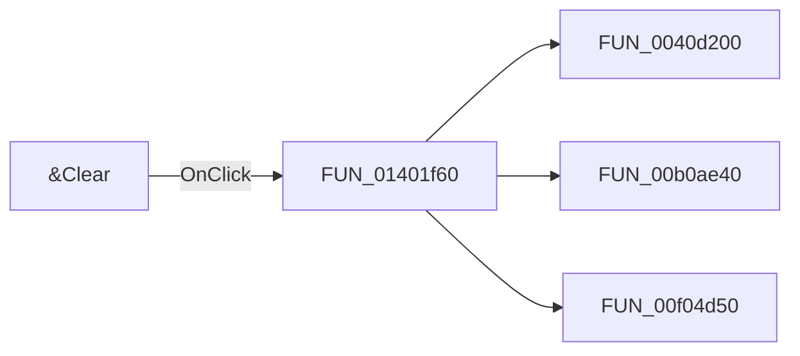

# &Clear

> Analysis status: Pending individual source review.

## Control

| Property | Recovered value |
| --- | --- |
| Form | CspEditorDlg |
| Component path | CspEditorDlg.pctrlMode.tshPoly.btnClearPoly |
| Control class | TButton |
| Caption | &Clear |
| Hint | Not present in the recovered resource. |
| Text | Not present in the recovered resource. |
| Handler name | btnClearPolyClick |
| Handler address | 01401f60 |
| Graph node | `resource:dfm:CspEditorDlg/CspEditorDlg.pctrlMode.tshPoly.btnClearPoly` |
| Handler node | `function:01401f60` |
| Graph layer | UI |

## What happens when clicked

Pending individual analysis. An agent must read the recovered handler source and its relevant callees before it replaces this text.

## Click flow

## Handler evidence

- Source: [DecompiledSources/Tina16/functions/0000000001401F60__FUN_01401f60.c](../../../DecompiledSources/Tina16/functions/0000000001401F60__FUN_01401f60.c)
- Recovered role: Not present in the recovered resource.
- Current graph summary: Handles 1 Delphi UI event: CspEditorDlg.pctrlMode.tshPoly.btnClearPoly.OnClick.
- Current graph behavior: Not present in the recovered resource.
- Current graph evidence: Not present in the recovered resource.
- Complexity: complex
- Distinct outgoing calls: 3

## Direct calls

- `function:0040d200` — FUN_0040d200
- `function:00b0ae40` — FUN_00b0ae40
- `function:00f04d50` — FUN_00f04d50

## Resource evidence

- Kind: Not present in the recovered resource.
- Modal result: Not present in the recovered resource.
- Checked state: Not present in the recovered resource.
- List items: Not present in the recovered resource.
- Image reference: Not present in the recovered resource.
- Extracted glyph: None.

## Nearby label candidates

Nearby labels are layout candidates only. They are not proof of behavior.

- Rank 1: Dimension at distance 238.
- Rank 2: Coefficients at distance 369.
- Rank 3: Controlling components at distance 531.

## Analysis limits

- Do not infer behavior from the control class, caption, hint, glyph, or nearby label alone.
- Do not replace the pending status until the handler source and relevant call path provide enough evidence.
