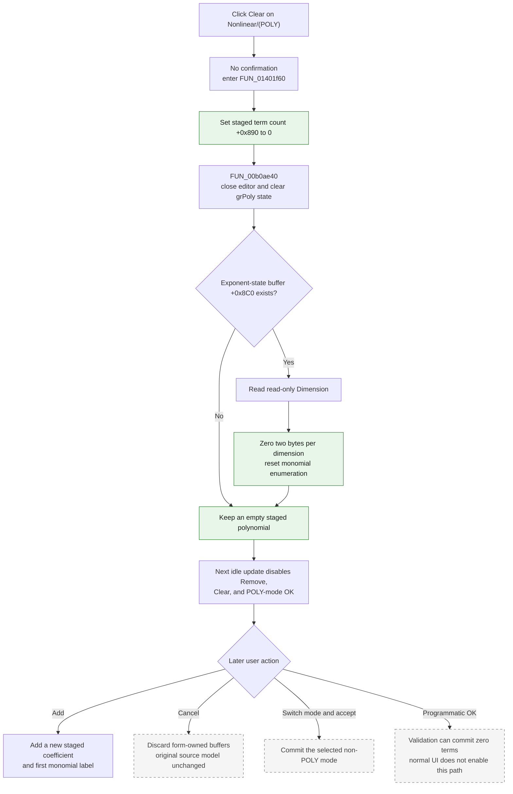

# Clear the staged polynomial terms

> Analysis status: Complete. The recovered handler, polynomial add and remove paths, monomial-label generator, grid reset, form lifecycle, idle-state logic, and OK path agree on this behavior.

## Control

| Property | Recovered value |
| --- | --- |
| Form | CspEditorDlg |
| Form caption | Controlled Source Editor |
| Component path | CspEditorDlg.pctrlMode.tshPoly.btnClearPoly |
| Control class | TButton |
| Caption | &Clear |
| Hint | Not present in the recovered resource. |
| Text | Not present in the recovered resource. |
| Handler name | btnClearPolyClick |
| Handler address | 01401f60 |
| Graph node | `resource:dfm:CspEditorDlg/CspEditorDlg.pctrlMode.tshPoly.btnClearPoly` |
| Handler node | `function:01401f60` |
| Graph layer | UI |

## What happens when clicked

The button immediately removes every staged polynomial term from the **Nonlinear/(POLY)** page. It sets the form's active-term count at `+0x890` to zero and resets the `TAttributeGrid` named `grPoly`. It does not ask for confirmation and does not validate the active coefficient editor first.

The click does not change the selected controlling components or the read-only **Dimension** value. When the form has a polynomial exponent-state buffer at `+0x8C0`, the handler reads the current dimension and fills `dimension * 2` bytes with zero. The label generator treats this buffer as one 16-bit exponent per controlling component, so the zero fill resets future monomial-label enumeration to its initial state.

No default coefficient or row is added. The resulting staged polynomial has zero terms. The coefficient backing buffer at `+0x8B0` stays allocated and is not directly zeroed by this handler.

## Confirmation and operation order

`FUN_01401f60` has one direct path and one null-buffer check. It performs these operations:

1. Write `0` to the staged polynomial term count at form field `+0x890`.
2. Call `FUN_00b0ae40` for `grPoly` at form field `+0x710`.
3. Read the exponent-state buffer pointer at `+0x8C0`.
4. If the pointer is non-null, read `iedDimension` at `+0x700`, multiply the dimension by two, and fill that many bytes with zero.
5. Return without changing modal state or another page.

There is no message-box, question-dialog, confirmation resource, alternate answer branch, or undo snapshot in this path.

## Polynomial model, buffers, and grid state

| State | Proven effect |
| --- | --- |
| Active term count | Field `+0x890` becomes `0`. Add, Remove, idle-state, and OK code use this field as the number of active polynomial coefficients. |
| Coefficient buffer | Raw buffer `+0x8B0` remains allocated. Clear does not call the memory fill or free helper for this buffer, so its previous bytes are not proven to be erased. Count zero makes them inactive. |
| Exponent state | Raw buffer `+0x8C0` is zeroed for `2 * Dimension` bytes when non-null. `FUN_014002c0` later reads these 16-bit values to build monomial labels and advances them through `FUN_00dff7c0`. |
| Controlling components | `lbxCtrlComps` selection is unchanged by a direct Clear click. The dimension edit is also unchanged. |
| Coefficient grid | `FUN_00b0ae40` closes the active editor, resets two tracked editor coordinates to `-1`, clears active cell and per-column attribute state, and resets its insertion base to the current row. |
| Grid dimensions | The handler does not call a row-count setter. A grid that grew for earlier terms keeps its current row capacity, although no term is active. |
| Selection | The handler does not explicitly assign a new current row, current column, scroll offset, focus target, caret, or selection range. Only the active-editor coordinates are explicitly cleared. |

Form creation allocates the coefficient buffer with an initial 800-byte capacity at `+0x8B0`. Existing coefficients are copied there, and each grid numeric editor holds a pointer into this form-owned buffer. The separate exponent-state buffer at `+0x8C0` is sized as two bytes per selected controlling component.

`FormDestroy` frees the coefficient buffer, the table-mode working buffer at `+0x8B8`, and the exponent-state buffer. Clear does not free or replace any of these buffers. The grid reset clears its own editor and attribute collections; the exact object-release routine behind the indirect collection methods is not recovered.

## Clear flow

## Handler and model evidence

- Clear handler: [FUN_01401f60](../../../DecompiledSources/Tina16/functions/0000000001401F60__FUN_01401f60.c)
- Attribute-grid reset: [FUN_00b0ae40](../../../DecompiledSources/Tina16/functions/0000000000B0AE40__FUN_00b0ae40.c)
- Dimension reader and range check: [FUN_00f04d50](../../../DecompiledSources/Tina16/functions/0000000000F04D50__FUN_00f04d50.c)
- Byte fill: [FUN_0040d200](../../../DecompiledSources/Tina16/functions/000000000040D200__FUN_0040d200.c)
- Monomial-label generator: [FUN_014002c0](../../../DecompiledSources/Tina16/functions/00000000014002C0__FUN_014002c0.c)
- Add-polynomial handler: [FUN_01401c80](../../../DecompiledSources/Tina16/functions/0000000001401C80__FUN_01401c80.c)
- Remove-polynomial handler: [FUN_01401de0](../../../DecompiledSources/Tina16/functions/0000000001401DE0__FUN_01401de0.c)
- Controlling-component selection handler: [FUN_01401b00](../../../DecompiledSources/Tina16/functions/0000000001401B00__FUN_01401b00.c)
- Form creation and working-copy setup: [FUN_01400ee0](../../../DecompiledSources/Tina16/functions/0000000001400EE0__FUN_01400ee0.c)
- Form-owned buffer destruction: [FUN_01401ac0](../../../DecompiledSources/Tina16/functions/0000000001401AC0__FUN_01401ac0.c)
- Idle control-state update: [FUN_01403b60](../../../DecompiledSources/Tina16/functions/0000000001403B60__FUN_01403b60.c)
- OK validation and model copy-back: [FUN_01403320](../../../DecompiledSources/Tina16/functions/0000000001403320__FUN_01403320.c)

The graph records three outgoing calls from `FUN_01401f60`: grid reset, dimension read, and byte fill. It also records `FUN_01401b00` as an application caller. That selection handler frees the old exponent-state buffer and invokes Clear when no controlling component remains selected; it then writes dimension zero. A direct button click does not run this selection-change logic.

`FUN_01401c80` proves that `+0x890` is the term count: it binds a numeric editor to `+0x8B0 + count * 8`, grows the grid when needed, and increments the field. `FUN_01401de0` removes the last grid attribute and decrements the same field.

`FUN_014002c0` uses the `+0x8C0` buffer as a sequence of 16-bit exponents. It generates the constant label for the first term, advances the exponent tuple for later terms, and builds a variable-product label from each nonzero exponent. The Clear zero fill therefore resets label generation; it is not a coefficient-value wipe.

## Downstream control state

`CspEditorDlgEventsIdle` updates button availability from the current page, dimension, and term count:

- On the POLY page, OK requires both `Dimension > 0` and `term count > 0`.
- Add requires `Dimension > 0`.
- Remove and Clear require `term count > 0`.

After a direct Clear with a positive dimension, the next idle update normally leaves Add enabled but disables Remove, Clear, and OK. The user must add at least one coefficient before normal POLY-mode acceptance becomes available.

## OK, Cancel, and persistence boundary

- Clear changes only form-owned working state. The source model at form field `+0x880` is not modified in this handler.
- On the POLY page, `btnOKClick` first validates `grPoly`. On success, it writes mode `1`, copies the current dimension, frees the source model's old coefficient buffer, allocates a new `term count * 8` buffer, copies the active coefficients from `+0x8B0`, and replaces the controlling-component name list.
- The normal UI disables OK when the cleared count is zero. If the OK handler is invoked programmatically, the recovered allocation helper returns null for zero bytes, the copy length is zero, and the source model can be committed with zero terms.
- `btnCancel` is a resource-defined `bkCancel` button with no application `OnClick` handler. Cancel therefore performs no OK copy-back. Form destruction frees the working buffers and leaves the source model unchanged.
- Switching to another mode after Clear and accepting the dialog commits that selected mode through the corresponding OK branch. It does not commit the cleared POLY buffer as the active source mode.
- Clear performs no file, registry, database, or external-DLL operation. The source model changes only through OK; any later circuit-file persistence is outside this handler.

## Repeated clicks, errors, and partial state

- Repeated direct calls still write count zero and reset the grid. If the exponent-state buffer exists, it is filled with zero again. There is no already-empty short circuit.
- If `+0x8C0` is null, the handler skips the dimension read and byte fill. It still clears the term count and grid.
- The read-only dimension normally contains a valid in-range integer. `FUN_00f04d50` can raise a range exception for invalid text or a value outside the edit's configured bounds. This call occurs after the count and grid reset, so such an exception can leave the polynomial logically empty while the exponent state remains unchanged.
- The handler does not call the grid validation helper used by OK. Text in an active coefficient editor is discarded with the cleared grid state rather than accepted through this handler's own validation path.
- There is no local exception handler, retry, or rollback. A grid-clear exception can occur after count zero but before the exponent reset. An invalid pointer or memory failure in an indirect helper can also leave only part of the UI reset.
- Because Clear does not free the coefficient buffer, it does not fail from a coefficient-buffer reallocation in the normal path. Its prior bytes remain outside the logical active range, and this source does not prove that an indirect grid-editor destructor overwrites them.

## Resource evidence

- The button caption is **Clear**. It has no hint, action, image reference, embedded glyph, built-in button kind, or modal result.
- The same tab contains the direct labels **Dimension**, **Coefficients**, and **Controlling components**, the read-only `iedDimension`, the `grPoly` attribute grid, and the `lbxCtrlComps` list.
- The tab caption is **Nonlinear/(POLY)**. The handler and related data flow, not these captions alone, establish that the cleared rows are polynomial coefficients.
- The direct button click does not modify the list-box selection or the dimension edit.

## Analysis limits

- The original Delphi names of fields `+0x890`, `+0x8B0`, and `+0x8C0` are not recovered. Their term-count, coefficient-buffer, and exponent-state roles follow from their complete add, remove, label, initialization, clear, destroy, and OK data flow.
- Clear does not explicitly erase coefficient bytes. The exact value shown after a later Add depends on the retained buffer and numeric-editor behavior; this handler does not initialize that new coefficient.
- The grid's exact current row, column, scroll position, focus, and caret after reset are not assigned in the handler.
- Exception presentation and object cleanup inside indirect VCL methods are not recovered.
