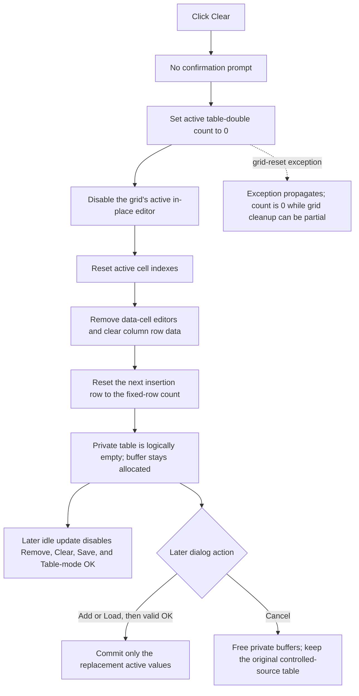

# Clear the staged input/output table

`Clear` immediately makes the Controlled Source Editor's private table empty and clears its attribute-grid rows. It does not ask for confirmation. It does not clear the table expression, change the selected mode, modify the controlled-source object, or close the dialog.

## Control

| Property | Recovered value |
| --- | --- |
| Form | `CspEditorDlg` (`Controlled Source Editor`) |
| Component path | `CspEditorDlg.pctrlMode.tshTable.btnClearTable` |
| Parent page | `Nonlinear/(TABLE)` |
| Control class | `TButton` |
| Caption | `&Clear` |
| Hint | Not present in the recovered resource. |
| Handler | `btnClearTableClick` at `01402700` |
| Resource node | `resource:dfm:CspEditorDlg/CspEditorDlg.pctrlMode.tshTable.btnClearTable` |
| Handler node | `function:01402700` |
| Graph layer | UI |

The resource has no glyph, image, action, or custom hint for this button. The source establishes the clearing behavior.

## Confirmation behavior

There is no confirmation branch. `FUN_01402700` does not call a message-box, dialog, or prompt function. It performs both state changes on every click:

1. It writes zero to the active table-value count at form offset `+0x894`.
2. It calls the shared attribute-grid reset function for `grTable` at form offset `+0x790`.

The same behavior occurs when the table is already empty. There is no Cancel choice inside this command and no undo buffer in the handler.

## Private table state

The table's private numeric buffer is at form offset `+0x8B8`. The count at `+0x894` is the number of active doubles in that buffer. Every logical row pair uses two doubles:

- `Input #n`;
- `Output #n`.

Clear sets the active count to zero. It does not overwrite, shrink, or free the allocated buffer, and it does not reset the stored capacity at `+0x89C`. Old bytes can remain in the allocation, but no table operation treats them as active after the count becomes zero.

The next Add operation overwrites the first pair with its empty-table defaults. The recovered Add handler writes `1.0` for `Input #1` and `1.0` for `Output #1`, binds two new grid editors, and changes the active count from zero to two.

## Grid reset and selection

`FUN_00b0ae40` resets the attribute grid without changing its row-count property:

- It disables the active in-place editor.
- It sets the grid's recovered active cell indexes to `-1`.
- It removes the bound editor object from every non-fixed cell.
- It clears the per-column row data used by the attribute grid.
- It resets the next insertion row to the grid's fixed-row count.

The result is an empty table display with no active data-cell editor. The handler does not select a default row, move focus, repaint explicitly, or create a placeholder input/output pair. Header or fixed-row structure and allocated grid rows stay available for later Add or Load operations.

## State that Clear does not change

The handler touches only the active table-value count and `grTable`:

- `edExpression` keeps its text.
- `cbxVariablesTable` keeps its selection.
- The active page stays `Nonlinear/(TABLE)`.
- Input and output configuration controls keep their values.
- The controlled-source object at form offset `+0x880` is not changed.
- No file is read or written.
- No modal result is set.

The form's idle handler later uses the zero count to disable the table Remove, Clear, and Save controls. It also prevents the OK button from being enabled for Table mode until the table has an active value and the expression is nonempty. Those enabled-state changes are not direct calls from Clear; they occur on a later application-idle update.

## Ownership, OK, and Cancel

Form creation allocates the private buffer and copies the controlled source's current table values into it. The buffer and active count are dialog working state. Form destruction frees the private buffer.

On a later OK click in Table mode, the handler parses the table expression and asks `grTable` to finish and validate its active editor. Only the successful path changes the controlled-source object to Table mode, replaces its owned table allocation, and copies the active values from the private buffer. A validation or expression failure resets the modal result to zero and keeps the dialog open.

The Cancel button is the built-in `bkCancel` control and has no custom click handler. Cancel destroys the dialog and its private buffers without running the OK copy. Therefore, a Clear followed by Cancel leaves the controlled-source object's original table unchanged. A Clear followed by a valid Add or Load and then OK commits only the new active values.

## Load reuse and replacement behavior

After the user accepts an open-file dialog, the Load handler calls `FUN_01402700` before it reads table rows. Load therefore replaces the staged table instead of appending to it, and it receives no extra confirmation from this shared clear path.

If parsing or allocation fails after Load has called Clear, the old staged count and grid are already gone. The Load path can then leave an empty or partly imported staged table. Clear itself has only the two operations shown above.

## No-op, errors, and partial state

- When the count is already zero, the count write has no model effect. The grid reset still clears editor and active-cell state.
- Clear does not validate a current grid edit before it removes the bound editors. No invalid-input message is produced by this handler.
- The zero count is written before the grid reset starts. The handler has no local exception handler or rollback.
- If the shared grid reset raises a VCL, allocation, or cell-object exception, the private table is already logically empty. The grid can be only partly cleared.
- There is no control-specific error message, success message, or status text.

## Click flow

## Evidence

- [Clear handler](../../../DecompiledSources/Tina16/functions/0000000001402700__FUN_01402700.c): writes zero to form offset `+0x894` and calls the grid reset for form offset `+0x790` without a prompt or branch.
- [Attribute-grid reset](../../../DecompiledSources/Tina16/functions/0000000000B0AE40__FUN_00b0ae40.c): disables the in-place editor, resets active indexes, removes non-fixed cell editors, clears column data, and resets the insertion row.
- [Table Add handler](../../../DecompiledSources/Tina16/functions/00000000014023B0__FUN_014023b0.c): proves that the count is measured in doubles, adds input/output pairs, and uses `1.0, 1.0` for the first pair after an empty table.
- [Table Remove handler](../../../DecompiledSources/Tina16/functions/0000000001402640__FUN_01402640.c): removes two grid rows and reduces the active count by two.
- [Table Load handler](../../../DecompiledSources/Tina16/functions/0000000001402730__FUN_01402730.c): calls the same Clear handler after file acceptance, then parses and binds replacement input/output pairs.
- [Form initialization](../../../DecompiledSources/Tina16/functions/0000000001400EE0__FUN_01400ee0.c): allocates the private table buffer, copies current Table-mode values, binds input/output editors, and initializes the active count.
- [OK handler](../../../DecompiledSources/Tina16/functions/0000000001403320__FUN_01403320.c): validates Table mode, replaces the controlled-source table, and copies only the active private values on success.
- [Idle handler](../../../DecompiledSources/Tina16/functions/0000000001403B60__FUN_01403b60.c): derives table-command and OK enabled states from the active count and expression text.
- [Form destructor](../../../DecompiledSources/Tina16/functions/0000000001401AC0__FUN_01401ac0.c): frees the dialog's private numeric buffers.
- [Recovered Delphi UI evidence](../../../DecompiledSources/Tina16/resources/dfm/ui-evidence.json): identifies the Table page, grid, expression and variable controls, `&Clear` binding, and built-in OK and Cancel buttons.

## Shared-helper coordination

`FUN_00b0ae40` is a common `TAttributeGrid` reset helper. Other form handlers also call it. This Bead documents its direct effect but does not add a competing graph annotation for the shared helper. The annotation fragment contains only the unique Clear-table handler. Validator and OK responsibilities remain with their owning analyses.

## Analysis limits

- The original Delphi names for the count and buffer fields are not recovered. Their roles follow from FormCreate, Add, Remove, Load, Save, idle-state, and OK data flow.
- The recovered grid fields at `+0x63C`, `+0x640`, and `+0x644` are described by their observed active-cell and insertion behavior, not original Delphi field names.
- Global exception presentation is outside this handler.
