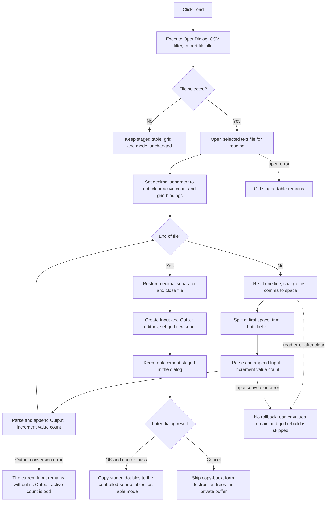

# Replace the staged table from a CSV file

> Analysis status: Reviewed from recovered source, the embedded Delphi form stream, and call-graph evidence.

## Control

| Property | Recovered value |
| --- | --- |
| Form | CspEditorDlg |
| Form caption | Controlled Source Editor |
| Component path | CspEditorDlg.pctrlMode.tshTable.btnLoad |
| Control class | TButton |
| Tab caption | Nonlinear/(TABLE) |
| Button caption | &Load |
| Handler name | btnLoadClick |
| Handler address | 01402730 |
| Graph node | `resource:dfm:CspEditorDlg/CspEditorDlg.pctrlMode.tshTable.btnLoad` |
| Handler node | `function:01402730` |
| Graph layer | UI |

## What happens when clicked

`TCspEditorDlg.btnLoadClick` opens the form's `TOpenDialog`. If the user selects a file, it reads one Input/Output pair from each line and replaces the dialog's private table. It then creates one `Input #n` and one `Output #n` grid editor for each pair.

This is a staged replacement. Load does not update the controlled-source object, set a modal result, close the dialog, or write a file. The separate OK handler can copy the staged values to the object after its expression and grid checks pass.

## Open dialog and selection

The embedded `CspEditorDlg` form stream gives the Open dialog these settings:

- default extension: `CSV`;
- filter: `Comma separated values (*.CSV)|*.CSV`;
- title: `Import file`.

The form stream does not set `InitialDir` or `FileName`. The click handler also does not set a directory, file name, filter, or default extension before it calls `Execute`. Thus, the dialog uses its existing VCL and shell path state. The handler uses the selected `FileName` only to open the file. It does not copy that path to a separate form or model field.

If `Execute` returns false, the handler skips the complete import branch. It does not open a file, clear the current table, change the grid, change the table mode, or modify the caller-owned object.

## File format and numeric conversion

The loader reads every physical line until end of file. It does not skip a header, a blank line, or a comment. Each line must contain two values:

1. Input;
2. Output.

The handler changes the first comma in a line to a space. It then splits at the first space. This accepts the normal `input,output` form and a first-space-separated form. It trims control characters and spaces from both fields before conversion. Extra text or separators remain in the second field and can make conversion fail.

The handler temporarily sets the process-wide Delphi decimal separator to `.`. A comma is therefore a field separator, not a decimal separator. It passes both fields to the application's engineering-number converter, so supported engineering suffixes are converted to their numeric scale. The matching Save handler writes one `input,output` pair per line with the same dot-decimal rule. The file has no header that identifies a controlled-source mode or an electrical unit.

## Replacement order and grid refresh

The handler opens the selected file before it changes the table. After a successful open, it saves the current decimal separator, sets it to `.`, and calls the same clear routine as the Clear button. That routine sets the active-double count at form offset `+0x894` to zero and clears the table grid's bound editors. It does not free the allocated double buffer at `+0x8b8`.

For each line, Load parses and appends the Input first. It then parses and appends the Output. The count increases after each value, so it is a value count, not a pair count. The handler grows the buffer in 800-byte steps when its pre-line capacity check requests more storage.

Only after it reaches end of file does it restore the decimal separator, close the file, and rebuild the grid. Pair `n` gets editors named `Input #n` and `Output #n`, each bound directly to its two doubles in the private buffer. The grid row count is set from the active-double count, so each pair uses two rows. An empty accepted file leaves the logical table empty; the generic row-count setter can still keep one visible grid row.

## Click flow

## Mode, units, validation, and commit

Load is available on the `Nonlinear/(TABLE)` page, but it does not switch the active page or write the model's mode byte. The file contains raw double pairs only. The load path does not convert between voltage and current, apply an engineering unit to a column, or use the form's input-count and output-type controls. The later controlled-source context gives the Input and Output values their meaning.

Load does not call the grid validator or the expression compiler. It also has no explicit ordering, duplicate-Input, finite-value, or application-range check. Its structural rule is one converted pair for each physical line.

The OK handler handles persistence for Table mode. It compiles the Table page's expression and then validates `grTable`. Only when both checks pass does it set the controlled-source mode byte to `3`, replace the caller-owned table allocation, store the active-double count, and copy the doubles from the dialog buffer. If either check fails, that copy-back path is not completed and the dialog's close state is cleared. The standard `bkCancel` button has no custom click handler, so Cancel skips this OK copy-back. Form destruction frees the dialog-owned table buffer.

The Load click itself does not persist a setting, file path, or table. Save is a separate command. It validates the grid and writes the current staged pairs after its own Save dialog is accepted.

## Error and partial-state behavior

- A dialog cancellation is a clean no-op for the staged data.
- File assignment and open happen before the destructive clear. An open failure therefore leaves the old staged table and grid in place.
- After the file opens, the old active count and grid bindings are cleared before the first line is parsed. There is no backup or rollback.
- A blank line, header line, line without a usable separator, or invalid numeric field can fail in the shared number conversion path. The handler has no local user-message or recovery branch.
- A later read or Input conversion failure can leave zero or a prefix of complete pairs in the private buffer. An Output conversion failure happens after the current Input was stored and counted, so it can leave an unmatched Input and an odd active count. The visible grid remains cleared because editor reconstruction starts only after normal end of file.
- The decimal separator is restored and the file is closed only on the normal path after the read loop. The recovered handler has no local `finally` path that proves restoration or close after an exception.
- A failure during the final editor loop can leave a fully parsed private buffer with a partially rebuilt grid.
- The capacity test runs once before the first value of each pair and tests `capacity < count * 8`. With the initial 800-byte buffer, count `100` does not request growth before the next two writes. The recovered code therefore shows an out-of-capacity write at the 51st pair before a later iteration can grow the buffer. No maximum-record guard prevents this path.

## Handler evidence

- Primary handler: [FUN_01402730](../../../DecompiledSources/Tina16/functions/0000000001402730__FUN_01402730.c) contains dialog execution, file open, delimiter normalization, two-value parsing, buffer replacement, cleanup, and grid reconstruction.
- Table clear: [FUN_01402700](../../../DecompiledSources/Tina16/functions/0000000001402700__FUN_01402700.c) resets the active count and grid bindings. Its separate Clear-button article owns its graph annotation.
- Whitespace trim: [FUN_0043ea00](../../../DecompiledSources/Tina16/functions/000000000043EA00__FUN_0043ea00.c) removes leading and trailing characters below U+0021 before conversion.
- Numeric parser: [FUN_00b8f030](../../../DecompiledSources/Tina16/functions/0000000000B8F030__FUN_00b8f030.c) applies the application's engineering-number conversion rules.
- Form initialization: [FUN_01400ee0](../../../DecompiledSources/Tina16/functions/0000000001400EE0__FUN_01400ee0.c) allocates the private buffers and copies the existing controlled-source table into the dialog for Table mode.
- OK commit: [FUN_01403320](../../../DecompiledSources/Tina16/functions/0000000001403320__FUN_01403320.c) compiles the expression, validates the grid, and copies the staged table to the controlled-source object only on success.
- Save contrast: [FUN_01402be0](../../../DecompiledSources/Tina16/functions/0000000001402BE0__FUN_01402be0.c) validates the grid and writes comma-separated staged pairs after Save-dialog acceptance.
- Form destruction: [FUN_01401ac0](../../../DecompiledSources/Tina16/functions/0000000001401AC0__FUN_01401ac0.c) releases the dialog-owned buffers.
- Recovered control tree: [ui-evidence.json](../../../DecompiledSources/Tina16/resources/dfm/ui-evidence.json) binds `btnLoad.OnClick` to `01402730` and identifies the Table page, grid, expression editor, and OK and Cancel controls.
- Embedded form stream: the `CspEditorDlg` TPF0 resource at rebuilt-image file offset `54525500` contains `DefaultExt=CSV`, the CSV filter, and `Title=Import file` for `OpenDialog`.
- Delimiter evidence: the reconstructed image maps `DAT_01402b88` to a UTF-16 comma and `DAT_01402b98` to a UTF-16 space.
- Complexity: complex; the graph records 23 distinct outgoing calls.

## Resource evidence

- The button caption is `&Load`. It has no hint, action, image reference, or extracted glyph.
- The containing page caption is `Nonlinear/(TABLE)`.
- The same page contains `grTable`, `edExpression`, and the labels `Expression` and `Inputs`.
- The nearby labels alone do not prove the file layout. The paired parse, editor-binding, OK-copy, and Save-write data flow establishes the Input/Output pair structure.

## Analysis limits

- The file-dialog settings were read from the raw embedded TPF0 stream because the selected UI evidence JSON does not export `DefaultExt`, `Filter`, or `Title`.
- The original Delphi names of the shared trim, numeric-conversion, and grid helpers are not present in RTTI.
- The handler does not identify the electrical quantity or unit for either column. Do not infer those units from the surrounding voltage and current controls.
- The recovered source proves exception-prone paths and the absence of a local rollback branch. It does not prove which top-level VCL handler shows an exception message or later closes an unclosed text-file record.
