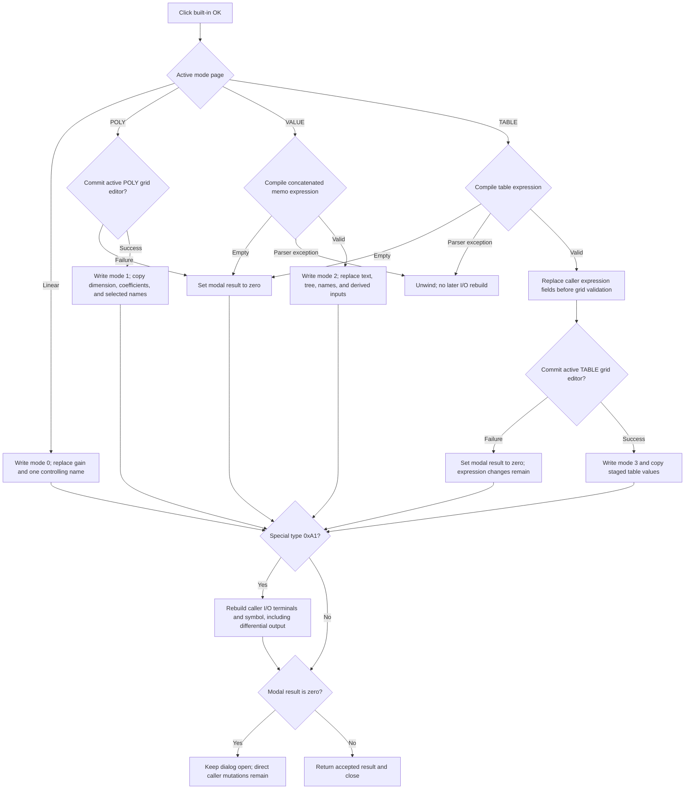

# Validate and commit the controlled source

The built-in `bkOK` button validates the active mode and writes the edited definition to the caller-owned controlled-source record. The commit rules differ for Linear, POLY, VALUE, and TABLE mode. The handler is not transactional: some TABLE and special-component fields can change even when the dialog stays open after a failed OK attempt.

## Control

| Property | Recovered value |
| --- | --- |
| Form | `CspEditorDlg` (`Controlled Source Editor`) |
| Component path | `CspEditorDlg.pnlButtons.btnOK` |
| Control class | TBitBtn |
| Kind | `bkOK` |
| Handler name | `btnOKClick` |
| Handler address | `01403320` |
| Graph node | `resource:dfm:CspEditorDlg/CspEditorDlg.pnlButtons.btnOK` |
| Handler node | `function:01403320` |
| Graph layer | UI |

The resource has no separate caption, hint, action, or glyph. Its `bkOK` kind supplies the normal modal acceptance behavior. The handler clears the form's modal result to zero when a validation result must keep the editor open. The form has no recovered `OnCloseQuery` handler.

## Staged and caller-owned state

The dialog constructor stores the caller component at form offset `+0x878`. It obtains the controlled-source record from that component and stores a direct pointer at `+0x880`. This record is not a private snapshot.

`FormCreate` does stage the editable POLY coefficients and TABLE values in private buffers at `+0x8b0` and `+0x8b8`. It also builds the private grids and selections from the record. `btnOKClick` copies those active buffers back, but it frees and replaces caller-owned arrays, expression trees, and name lists directly. There is no backup and no rollback around these changes.

## Mode-specific behavior

The current `TPageControl` page selects one of four paths.

### Linear

The Linear path writes mode 0 and configures one controlling input. It frees the record's old per-input array, allocates one 8-byte entry, reads and range-checks the visible Gain value, and stores it. It then clears the record's controlling-component list and adds the current `cbxCtrlComp` item.

There is no grid validation in this path. The Gain getter checks its numeric range and any registered value callback. If that getter raises, the handler has already changed the mode and replaced the old array.

### Nonlinear POLY

The POLY path first asks `grPoly` to commit and validate its active cell editor. A nonzero result clears the modal result and skips the caller-record copy.

On a zero result, the handler:

1. writes mode 1;
2. reads the Dimension integer;
3. frees and replaces the coefficient array with exactly the staged count at `+0x890` from buffer `+0x8b0`;
4. clears the record's controlling-component list; and
5. appends every selected `lbxCtrlComps` item in visible list order.

The handler itself does not check that Dimension or the coefficient count is positive. The form's idle handler normally disables OK until both are positive. The integer getter can raise a range error after the mode byte has changed.

### Nonlinear VALUE

The VALUE path reads `memExpression`. It splits the memo through a temporary Delphi string list and concatenates the lines without inserting line separators. The shared expression compiler then resolves the result against application and circuit symbols.

- An empty expression returns zero. The handler clears the modal result and does not change the controlled-source record in this mode branch.
- Invalid syntax or an unresolved name raises the parser exception. The handler does not catch it.
- A valid expression returns a compiled tree. The handler writes mode 2, replaces the stored expression text and compiled tree, replaces the compiler-derived controlling-name list, and rebuilds one derived expression entry for each resolved input.

VALUE mode has no numeric-grid validation after compilation.

### Nonlinear TABLE

The TABLE path first compiles the single-line `edExpression` text. Empty text clears the modal result. Invalid syntax or names raise the same parser exception as VALUE mode.

For a valid expression, the handler immediately replaces the caller record's expression text, compiled tree, controlling-name list, input count, and per-input derived-expression array. Only then does it ask `grTable` to commit and validate its active cell editor.

- If grid validation fails, the handler clears the modal result. It does not replace the TABLE value array or write mode 3. However, the expression-related caller fields are already changed. If the previous mode was not compatible with those fields, the record can be internally inconsistent.
- If grid validation succeeds, the handler writes mode 3, frees the old TABLE value array, stores the staged scalar count at `+0x894`, allocates a new array, and copies that many doubles from `+0x8b8`.

The grid helper validates only the active bound editor. This handler does not scan all stored rows, require an even scalar count, check input ordering, or detect duplicate input values.

## I/O, output type, and differential state

`FormCreate` marks one unrecovered component type code, `0xA1`, as the special I/O-editing case. In this case, the final part of `btnOKClick` reads:

- the recovered Number of voltages and Number of currents controls;
- the output Voltage or Current choice;
- the recovered Differential output state; and
- the `Shape` edit and its selected shape object.

It passes these values and the direct caller component at `+0x878` to `FUN_013ff530`. That helper clears or creates the component's symbol state. An empty Shape value makes it generate a symbol and terminals from the counts and output flags. A named Shape makes it copy the matching stored shape. It then sets the terminal count to:

`voltage count + (current count * 2) + differential output + 1`

This I/O rebuild is after the mode branches, but it is not conditional on the modal result. An empty VALUE or TABLE expression, or a TABLE grid-validation failure, sets modal result zero and then still runs the I/O rebuild. A parser exception unwinds before this block and therefore skips it.

The separate `Differential voltage input` checkbox is not copied as a standalone boolean by this handler. Its click handler rebuilds the variables offered by the mode controls. OK persists the resulting selected or compiler-resolved controlling names.

## Modal result and Cancel

If no branch clears the modal result and no exception occurs, the built-in OK action returns the accepted modal result and closes the dialog. There is no extra close-query gate.

The `bkCancel` button has no application `OnClick` handler. If the user cancels without a prior OK attempt, it skips this handler, and `FormDestroy` frees the private POLY, TABLE, and exponent buffers without copying them to the caller.

Cancel is not a general rollback. If a failed TABLE OK attempt already replaced expression fields, or a failed special-component OK attempt already rebuilt I/O state, a later Cancel does not restore the old caller object.

## Click flow

## Errors and partial mutation

The handler has no local exception handler and no rollback.

- Linear Gain and POLY Dimension conversion can raise after an earlier caller field has changed.
- POLY list copying clears the caller's name list before it appends the selected items. An exception can leave only a prefix.
- VALUE and TABLE compilation errors occur before those branches change caller fields. The parser exception also skips the later special I/O update.
- TABLE grid failure occurs after expression fields have changed. It is a normal validation veto, not an exception rollback.
- Allocation failure can occur after an old caller buffer or tree is freed.
- The special I/O helper resets existing symbol state before it completes generated-symbol or named-shape loading. A failure can leave a partial caller component.

No file is read or written by this handler. The accepted changes are in the caller's in-memory component and controlled-source record. Any later schematic save is outside this click path.

## Evidence

- [OK handler](../../../DecompiledSources/Tina16/functions/0000000001403320__FUN_01403320.c) proves the page branches, validation order, direct record replacement, modal-result vetoes, and unconditional special-I/O tail.
- [Dialog constructor](../../../DecompiledSources/Tina16/functions/00000000014000E0__FUN_014000e0.c) proves that `+0x878` is the supplied component and that `+0x880` is a record obtained from it.
- [Form creation](../../../DecompiledSources/Tina16/functions/0000000001400EE0__FUN_01400ee0.c) proves the initial mode selection, private POLY and TABLE buffers, special type `0xA1`, and recovered I/O controls.
- [Form destruction](../../../DecompiledSources/Tina16/functions/0000000001401AC0__FUN_01401ac0.c) proves that only the form-owned buffers are freed on close.
- [Expression compiler](../../../DecompiledSources/Tina16/functions/00000000013FD8C0__FUN_013fd8c0.c) proves empty-expression handling, symbol resolution, compiled-tree output, and parser-exception behavior. Its graph annotation is owned by `TIARA-diz.6.7.214`.
- [VALUE memo preparation](../../../DecompiledSources/Tina16/functions/00000000013FCC20__FUN_013fcc20.c) proves line-by-line concatenation before compilation.
- [AttributeGrid validation](../../../DecompiledSources/Tina16/functions/0000000000B0A890__FUN_00b0a890.c) proves the active-editor commit gate used by POLY and TABLE.
- [Float value getter](../../../DecompiledSources/Tina16/functions/0000000000B90090__FUN_00b90090.c) and [integer value getter](../../../DecompiledSources/Tina16/functions/0000000000F04D50__FUN_00f04d50.c) prove the Linear and POLY range checks.
- [I/O and symbol rebuilder](../../../DecompiledSources/Tina16/functions/00000000013FF530__FUN_013ff530.c) proves direct caller-component replacement, generated or named shape behavior, output flags, and the terminal-count formula.
- [Variable-list rebuild](../../../DecompiledSources/Tina16/functions/0000000001400490__FUN_01400490.c) and [Differential voltage input handler](../../../DecompiledSources/Tina16/functions/0000000001402E70__FUN_01402e70.c) prove that the input checkbox changes the offered variable names rather than a directly copied boolean field.
- [Special-component modal caller](../../../DecompiledSources/Tina16/functions/0000000001C6EC30__FUN_01c6ec30.c) proves that result 1 is accepted and result 2 is cancellation for the `0xA1` creation path.

## Analysis limits

- Original Delphi record and field names are not recovered. This article uses control names, offsets, and behavior instead.
- The parser can raise detailed diagnostics, but this path does not prove the final VCL dialog presentation or focus location.
- The exact generated terminal captions are not assigned semantic names where the referenced string data is unrecovered.
