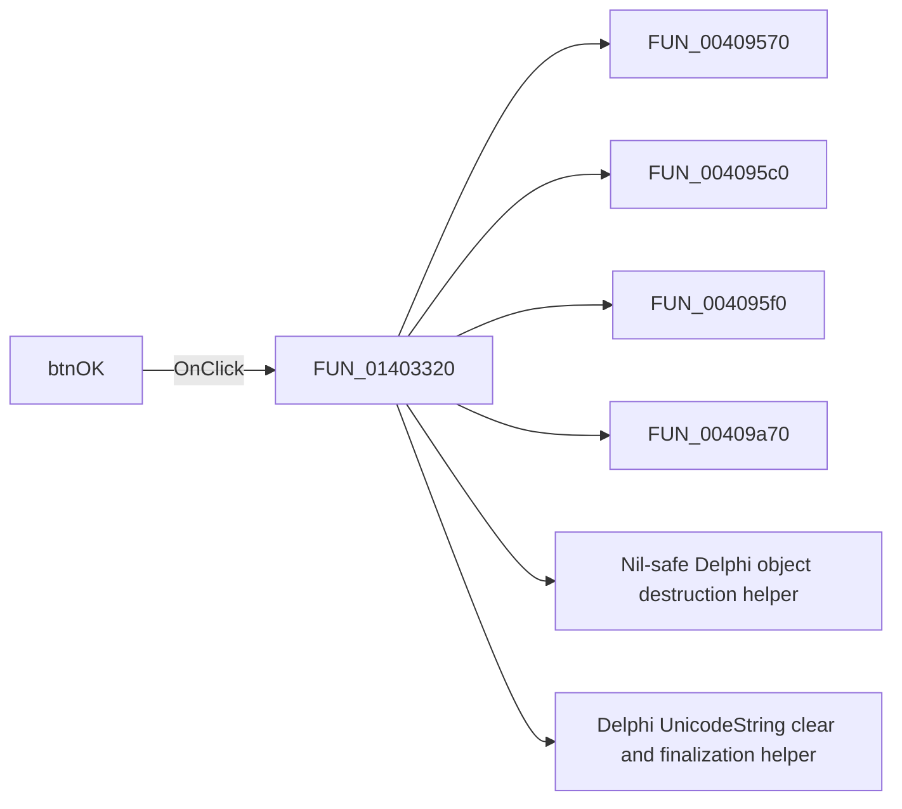

# btnOK

> Analysis status: Pending individual source review.

## Control

| Property | Recovered value |
| --- | --- |
| Form | CspEditorDlg |
| Component path | CspEditorDlg.pnlButtons.btnOK |
| Control class | TBitBtn |
| Caption | Not present in the recovered resource. |
| Hint | Not present in the recovered resource. |
| Text | Not present in the recovered resource. |
| Handler name | btnOKClick |
| Handler address | 01403320 |
| Graph node | `resource:dfm:CspEditorDlg/CspEditorDlg.pnlButtons.btnOK` |
| Handler node | `function:01403320` |
| Graph layer | UI |

## What happens when clicked

Pending individual analysis. An agent must read the recovered handler source and its relevant callees before it replaces this text.

## Click flow

## Handler evidence

- Source: [DecompiledSources/Tina16/functions/0000000001403320__FUN_01403320.c](../../../DecompiledSources/Tina16/functions/0000000001403320__FUN_01403320.c)
- Recovered role: Not present in the recovered resource.
- Current graph summary: Handles 1 Delphi UI event: CspEditorDlg.pnlButtons.btnOK.OnClick.
- Current graph behavior: Not present in the recovered resource.
- Current graph evidence: Not present in the recovered resource.
- Complexity: complex
- Distinct outgoing calls: 22

## Direct calls

- `function:00409570` — FUN_00409570
- `function:004095c0` — FUN_004095c0
- `function:004095f0` — FUN_004095f0
- `function:00409a70` — FUN_00409a70
- `function:00410f20` — Nil-safe Delphi object destruction helper
- `function:00414480` — Delphi UnicodeString clear and finalization helper
- `function:004144d0` — FUN_004144d0
- `function:00414560` — Delphi UnicodeString array finalization helper
- `function:00415dd0` — FUN_00415dd0
- `function:004425e0` — FUN_004425e0
- `function:004b6930` — FUN_004b6930
- `function:0064dd90` — VCL control Unicode text reader
- `function:0068bca0` — FUN_0068bca0
- `function:006ec320` — FUN_006ec320
- `function:00b0a890` — FUN_00b0a890
- `function:00b90090` — FUN_00b90090
- `function:00f04d50` — FUN_00f04d50
- `function:013fcc20` — FUN_013fcc20
- `function:013fd8c0` — FUN_013fd8c0
- `function:013ff530` — FUN_013ff530
- `function:01656db0` — FUN_01656db0
- `function:016a94d0` — FUN_016a94d0

## Resource evidence

- Kind: bkOK
- Modal result: Not present in the recovered resource.
- Checked state: Not present in the recovered resource.
- List items: Not present in the recovered resource.
- Image reference: Not present in the recovered resource.
- Extracted glyph: None.

## Nearby label candidates

Nearby labels are layout candidates only. They are not proof of behavior.

- No same-parent label candidate is available.

## Analysis limits

- Do not infer behavior from the control class, caption, hint, glyph, or nearby label alone.
- Do not replace the pending status until the handler source and relevant call path provide enough evidence.
