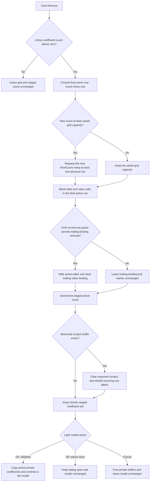

# Remove the final polynomial coefficient

> Analysis status: Reviewed from recovered source, form resources, grid helpers, private-buffer ownership, and modal commit paths.

## Control

| Property | Recovered value |
| --- | --- |
| Form | CspEditorDlg |
| Form caption | Controlled Source Editor |
| Component path | CspEditorDlg.pctrlMode.tshPoly.btnRemovePoly |
| Control class | TButton |
| Caption | `&Remove` |
| Hint | Not present in the recovered resource. |
| Handler name | btnRemovePolyClick |
| Handler address | 01401de0 |
| Graph node | `resource:dfm:CspEditorDlg/CspEditorDlg.pctrlMode.tshPoly.btnRemovePoly` |
| Handler node | `function:01401de0` |
| Graph layer | UI |

## What happens when clicked

The button removes the final active coefficient from the staged `Nonlinear/(POLY)` definition. It does not remove the selected grid row. The handler does not read the current row or a selected-row index. Its only entry guard is the active coefficient count at form field `+0x890`.

When that count is positive, the handler performs these operations in order:

1. It calculates the removed row as `active count - 1`.
2. It requests `grPoly.RowCount = new count` only when the new count is not below the row count saved at form creation. The row-count setter independently enforces at least one physical grid row.
3. It writes empty strings to columns `0` and `1` of the removed row.
4. It asks the attribute grid to hide its active editor and clear the trailing value-column object binding. The grid helper does this only when its current-row guard permits it.
5. It decrements the active coefficient count.
6. If the monomial scratch buffer at `+0x8c0` exists, it clears `dimension * 2` bytes and regenerates the monomial label in column `0` for every remaining coefficient row.

The surviving coefficient values and their column `1` editor bindings stay in place. The handler does not shift, compact, resize, or clear the private coefficient array at `+0x8b0`.

## Row choice, selection, and minimum state

The current grid selection does not choose which coefficient is removed. A click always targets the last active row. There is no reserved coefficient row and no minimum-count confirmation. Repeated clicks can reduce the active count to zero. Further clicks are no-ops apart from finalizing the temporary Delphi string.

The handler does not assign a final row, column, focus owner, or scroll position. If the grid row count shrinks and the current row is outside the new range, the row-count helper clamps it to `new row count - 1`. If the grid remains at its saved capacity, the current row is not changed by this handler.

The trailing-binding helper has an additional guard: it clears the binding only when the grid's current row is below its internal next-binding-row marker. If that condition is false, the helper does not clear the binding or decrement its marker. The click handler still decrements the staged coefficient count and rebuilds labels. This can leave a trailing binding that is outside the active coefficient count.

## Remove flow

## Grid object and coefficient ownership

`FormCreate` allocates the form-owned coefficient buffer at `+0x8b0`. In polynomial mode, it copies the model's coefficient doubles into this buffer and creates one numeric editor object for each active row. Each editor refers directly to its corresponding private double.

The remove handler does not free a coefficient double because the doubles are elements of this one contiguous buffer. It also does not free or reallocate the buffer. `FormDestroy` frees the full buffer later.

For the removed row's editor, the handler calls the attribute-grid removal helper. That helper hides the active editor and passes a null object to the row's virtual cell-object setter. The recovered code proves that the grid binding is cleared, but it does not establish whether the setter destroys or otherwise releases the editor object. The click handler has no explicit object destructor or heap-free call.

Because the removed double is not cleared, a later Add can bind a new editor to the same array slot and reuse its previous numeric value. Add grows the buffer when necessary, but it does not initialize the double at the new active index.

## Label rebuild and dimension use

`iedDimension` is a read-only integer editor whose value is the number of checked controlling components. Its click handler reallocates the `+0x8c0` scratch buffer to two bytes per dimension and rebuilds all polynomial row labels. If the dimension becomes zero, that handler clears all polynomial coefficients.

Remove uses the same dimension and scratch buffer after it shortens the count. It zeros the scratch exponents, then calls the shared monomial-label generator in row order and writes each returned label to column `0`. It does not rebuild the surviving column `1` numeric editors.

## Staging, OK, and Cancel boundary

The form constructor stores the object being edited at `+0x880`. `FormCreate` copies its polynomial coefficients into the private buffer. Remove changes only the private active count, grid bindings, labels, and the range of that private buffer considered active.

The built-in OK button runs `FUN_01403320`. For the polynomial page, it first validates and commits the active grid editor. Only a zero validation result enters the copy-back path. That path sets the model mode to polynomial, stores the dimension, replaces the model coefficient buffer with a new `active count * 8` allocation, copies only the active private doubles, and rebuilds the model's controlling-component list from the checked list items. A validation failure sets the dialog's modal result to zero, keeps the form open, and leaves the model unchanged.

The Cancel button has `Kind = bkCancel` and no application `OnClick` handler. It closes the form without running the OK copy-back path. `FormDestroy` then frees the private coefficient and scratch buffers. It does not free or replace the model object at `+0x880`.

## No-op and error paths

- A zero active count is an exact application-level no-op. The handler does not inspect or repair any stale grid binding in that state.
- There is no confirmation dialog, selected-row validation, or active-cell validation in Remove.
- If the scratch buffer is null, the row removal and count decrement still occur, but labels are not rebuilt.
- Dimension parsing includes range validation. An exception there occurs after the count was decremented, so the staged count can be shorter while the remaining labels are stale.
- The handler has no local exception handler, undo snapshot, or rollback. A grid failure before the decrement can leave cells blanked or a binding cleared while the active count is unchanged. A later failure can leave the shorter count with only some labels rebuilt.
- The recovered source does not establish how the application presents grid, allocation, or range exceptions.

## Handler and lifecycle evidence

- Remove handler: [FUN_01401de0](../../../DecompiledSources/Tina16/functions/0000000001401DE0__FUN_01401de0.c) applies the positive-count guard, blanks the final active row, requests trailing-binding removal, decrements the count, and rebuilds surviving monomial labels.
- Form creation: [FUN_01400ee0](../../../DecompiledSources/Tina16/functions/0000000001400EE0__FUN_01400ee0.c) saves the initial grid row count, allocates private coefficient and scratch buffers, copies model coefficients, creates row editors, and records the active coefficient count.
- Add counterpart: [FUN_01401c80](../../../DecompiledSources/Tina16/functions/0000000001401C80__FUN_01401c80.c) grows the private buffer, creates an editor bound to the next double, adds a generated monomial label, and increments the active count without initializing that double.
- Clear counterpart: [FUN_01401f60](../../../DecompiledSources/Tina16/functions/0000000001401F60__FUN_01401f60.c) sets the active count to zero, resets the attribute grid, and zeros the monomial scratch buffer.
- Controlling-component change: [FUN_01401b00](../../../DecompiledSources/Tina16/functions/0000000001401B00__FUN_01401b00.c) derives the dimension from checked items, reallocates the scratch buffer, clears coefficients at dimension zero, and rebuilds labels otherwise.
- Shared monomial-label generator: [FUN_014002c0](../../../DecompiledSources/Tina16/functions/00000000014002C0__FUN_014002c0.c) enumerates the dimension-dependent monomial text for a one-based coefficient row. Its canonical annotation belongs to the adjacent Add analysis.
- Trailing-binding removal: [FUN_00b0adf0](../../../DecompiledSources/Tina16/functions/0000000000B0ADF0__FUN_00b0adf0.c) applies the current-row guard, hides the active editor, clears the last tracked value-column binding, and decrements the internal binding marker.
- Cell-object setter path: [FUN_0084e470](../../../DecompiledSources/Tina16/functions/000000000084E470__FUN_0084e470.c) passes the replacement object to the row's virtual setter and invalidates the affected grid cell.
- Row-count setter: [FUN_00848a70](../../../DecompiledSources/Tina16/functions/0000000000848A70__FUN_00848a70.c) clamps the new count to at least one and moves an out-of-range current row before it applies the row count.
- OK validation and copy-back: [FUN_01403320](../../../DecompiledSources/Tina16/functions/0000000001403320__FUN_01403320.c) validates the polynomial grid and replaces model polynomial data only on success.
- Form destruction: [FUN_01401ac0](../../../DecompiledSources/Tina16/functions/0000000001401AC0__FUN_01401ac0.c) frees the private coefficient, table, and monomial scratch buffers.
- Modal caller: [FUN_01c6ec30](../../../DecompiledSources/Tina16/functions/0000000001C6EC30__FUN_01c6ec30.c) performs its downstream update only when the dialog returns modal result `1`.

## Resource evidence

- The form caption is `Controlled Source Editor`, and the containing tab caption is `Nonlinear/(POLY)`.
- The command is a plain `TButton` captioned `&Remove`. It has no recovered hint, action, image reference, embedded glyph, built-in button kind, or modal result.
- `grPoly` is a `TAttributeGrid`. Nearby recovered labels are `Coefficients`, `Dimension`, and `Controlling components`.
- `iedDimension` is read-only and has recovered initial text `0`.
- The sibling commands are `&Add` and `&Clear`.
- OK is `bkOK`; Cancel is `bkCancel`.

## Analysis limits

- Recovered field names are not available. The private-buffer, active-count, dimension, scratch-buffer, and model roles are established by repeated reads and writes across form creation, sibling controls, OK, and destruction.
- The original Delphi type name for a coefficient editor is not recovered.
- The virtual cell-object setter's lifetime policy is not recovered, so this analysis does not claim that clearing the binding destroys the editor object.
- The exact exception presentation, final focus, scroll position, and caret state are not assigned by the recovered application handler.
- Shared helper `FUN_014002c0` is evidence for this article but is omitted from this Bead's annotation fragment because the adjacent Add analysis owns its canonical description.
