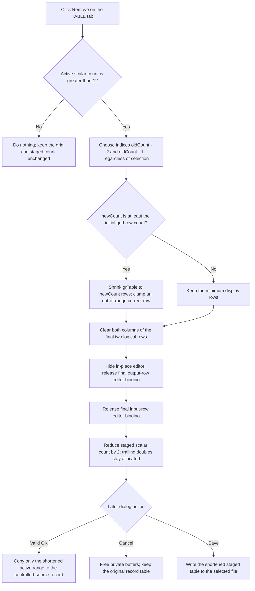

# Remove the last staged input/output pair

> Analysis status: Reviewed from recovered source, form-resource, grid-storage, staged-model, and modal-owner evidence.

## Control

| Property | Recovered value |
| --- | --- |
| Form | CspEditorDlg |
| Form caption | Controlled Source Editor |
| Tab | Nonlinear/(TABLE) |
| Component path | CspEditorDlg.pctrlMode.tshTable.btnRemoveTable |
| Control class | TButton |
| Caption | &Remove |
| Hint | Not present in the recovered resource. |
| Handler name | btnRemoveTableClick |
| Handler address | 01402640 |
| Graph node | `resource:dfm:CspEditorDlg/CspEditorDlg.pctrlMode.tshTable.btnRemoveTable` |
| Handler node | `function:01402640` |
| Graph layer | UI |

## What happens when clicked

`TCspEditorDlg.btnRemoveTableClick` removes the last complete input/output pair from the dialog's staged TABLE data. It does not use the selected row. For a normal even scalar count, one click removes these two logical rows:

1. the last `Input #n` row;
2. the matching last `Output #n` row.

The handler runs only when the active scalar count at form offset `+0x894` is greater than `1`. This is a last-pair guard, not a selection guard. A count of `0` or `1` causes a complete no-op.

## Last-pair selection and numeric state

The staged numeric buffer is at form offset `+0x8b8`. Values use consecutive `double` slots. An input is followed by its output, so the handler calculates `newCount = oldCount - 2`.

The handler does not move or erase either trailing `double`. It changes the logical count only after all grid operations finish. Thus the removed values remain as inactive bytes beyond the new logical end of the allocated buffer.

This retained storage is not a committed object deletion:

- A later Add writes a new input and output at indices `newCount` and `newCount + 1`, which overwrites the inactive pair.
- A successful TABLE-mode OK copies only `newCount` doubles to the controlled-source record.
- Form destruction frees the complete private buffer.

The source has no even-count test. With a corrupt odd count greater than `1`, it still subtracts two and treats the last two scalar slots as one pair. It does not repair the remaining odd count.

## Grid rows and editor-object release

`grTable` is the `TAttributeGrid` at form offset `+0x790`. The handler updates it in this order:

1. It can reduce the physical row count to `newCount`.
2. It clears columns `0` and `1` in rows `oldCount - 1` and `oldCount - 2`.
3. It calls [`FUN_00b0adf0`](../../../DecompiledSources/Tina16/functions/0000000000B0ADF0__FUN_00b0adf0.c) twice to remove the two final dynamic editor bindings.
4. It stores `newCount` at form offset `+0x894`.

[`FUN_0084e3e0`](../../../DecompiledSources/Tina16/functions/000000000084E3E0__FUN_0084e3e0.c) performs each cell clear and invalidates or updates the affected grid cell. `FUN_00b0adf0` hides the shared in-place editor, assigns a nil object/interface binding to the final dynamic value cell, and reduces the grid's next-insertion row by one. Two calls remove the output binding and then the input binding.

The row-storage finalizer [`FUN_0084bd10`](../../../DecompiledSources/Tina16/functions/000000000084BD10__FUN_0084bd10.c) clears the same binding slot with [`FUN_0041b800`](../../../DecompiledSources/Tina16/functions/000000000041B800__FUN_0041b800.c). That runtime helper sets an interface slot to nil and calls its release method. Therefore removal releases the grid-held references to the two bound numeric-editor objects. Normal Delphi interface reference counting decides when each wrapper is destroyed. The handler does not explicitly free a wrapper address.

The earlier rows and their value addresses do not move. There is no full table rebuild or model reload after the removal.

## Retained minimum rows and current selection

Form creation stores the initial `grTable.RowCount` at `+0x8a4`. The Remove handler changes the physical row count only when `newCount` is at least this initial value. This keeps the DFM-sized grid visible when few or no staged pairs remain.

- If the grid shrinks, [`FUN_00848a70`](../../../DecompiledSources/Tina16/functions/0000000000848A70__FUN_00848a70.c) changes `RowCount`. The grid dimension path clamps a current row that is beyond the new last row.
- If `newCount` is below the retained minimum, the handler does not change `RowCount`. It clears the removed rows and releases their editors, but it does not explicitly move the current cell. A selection can therefore remain on a now-blank retained row.

The handler never reads `grTable`'s current row or column. Selecting an earlier pair does not remove it. Selecting the last pair is not required.

The handler also does not call the active-cell commit and validation helper `FUN_00b0a890`. A normal VCL focus change can commit an editor before `OnClick`, but that event ordering is outside this recovered handler. The two row-removal helpers hide the in-place editor without an explicit validation call. The exact fate of text that remains only in an uncommitted editor is therefore grid and focus-event behavior, not a proven step in this click handler.

## Staged ownership, OK, and Cancel

[`FUN_01400ee0`](../../../DecompiledSources/Tina16/functions/0000000001400EE0__FUN_01400ee0.c), the form-create handler, allocates the private buffer at `+0x8b8`. For an existing TABLE controlled source, it copies the record's values from `record + 0x50` and its scalar count from `record + 0x48` into this working state. It then creates the `Input #n` and `Output #n` grid editors over the private values.

Remove changes only this private buffer's logical count and `grTable`. It does not change the controlled-source record at form offset `+0x880`, set a modal result, close the dialog, or write a file.

[`FUN_01403320`](../../../DecompiledSources/Tina16/functions/0000000001403320__FUN_01403320.c), the OK handler, is the TABLE copy-back boundary. It parses the table expression and validates `grTable`. On the successful TABLE path, it stores the TABLE mode, replaces the controlled-source record's value allocation, stores the shortened scalar count, and copies only that many doubles from the private buffer. The removed last pair is then absent from the controlled-source record.

A table-grid validation failure clears the modal acceptance result and skips the value-array replacement. The shortened working count remains available in the open dialog for correction or another action. The wider OK handler changes some expression and controlled-source fields before this grid-validation gate, so OK is not a form-wide transaction. The table pair array itself is replaced only after validation succeeds.

The Cancel button is the resource-defined `bkCancel` control and has no application click handler. Cancel does not run the OK copy. [`FUN_01401ac0`](../../../DecompiledSources/Tina16/functions/0000000001401AC0__FUN_01401ac0.c) frees the private buffers when the form is destroyed. Therefore Remove followed by Cancel leaves the controlled-source record's original table values unchanged.

Save is a separate boundary. Its handler validates `grTable` and writes the current staged pairs to a selected file. A Save after Remove can therefore persist the shortened table even if the user later cancels the editor. Remove itself performs no file operation.

## Later enabled-state update

The Remove handler does not enable or disable any button. [`FUN_01403b60`](../../../DecompiledSources/Tina16/functions/0000000001403B60__FUN_01403b60.c), the form's later idle-state path, uses `count > 0` to control the Table Remove, Clear, and Save commands. After removal of the only pair changes the count to zero, that later update disables these commands. It also prevents Table-mode OK from being enabled until the table has active values and the expression is not empty.

## Click flow

## Handler evidence

- Primary handler: [FUN_01402640](../../../DecompiledSources/Tina16/functions/0000000001402640__FUN_01402640.c) contains the count guard, last-two-row calculation, conditional row-count change, four cell clears, two dynamic-binding removals, and final count decrement.
- Cell clear: [FUN_0084e3e0](../../../DecompiledSources/Tina16/functions/000000000084E3E0__FUN_0084e3e0.c) assigns the cell value and invalidates or refreshes that coordinate.
- Dynamic-row removal: [FUN_00b0adf0](../../../DecompiledSources/Tina16/functions/0000000000B0ADF0__FUN_00b0adf0.c) hides the shared editor, clears the last dynamic value binding, and decrements the insertion-row field.
- Row-count change: [FUN_00848a70](../../../DecompiledSources/Tina16/functions/0000000000848A70__FUN_00848a70.c) changes `RowCount` when needed. Its dimension helper clamps a current coordinate that is beyond the new grid dimensions.
- Interface release: [FUN_0041b800](../../../DecompiledSources/Tina16/functions/000000000041B800__FUN_0041b800.c) clears an interface slot and calls its release method; [FUN_0084bd10](../../../DecompiledSources/Tina16/functions/000000000084BD10__FUN_0084bd10.c) applies it to the row-storage binding slot.
- Form initialization: [FUN_01400ee0](../../../DecompiledSources/Tina16/functions/0000000001400EE0__FUN_01400ee0.c) allocates and fills the private table buffer, records the initial grid row count, and creates the pair rows.
- Add contrast: [FUN_014023b0](../../../DecompiledSources/Tina16/functions/00000000014023B0__FUN_014023b0.c) writes a new pair at the logical end, which overwrites values retained after removal.
- OK boundary: [FUN_01403320](../../../DecompiledSources/Tina16/functions/0000000001403320__FUN_01403320.c) validates and copies only the active table values to the controlled-source record.
- Staging cleanup: [FUN_01401ac0](../../../DecompiledSources/Tina16/functions/0000000001401AC0__FUN_01401ac0.c) frees the private numeric buffers on form destruction.
- Idle state: [FUN_01403b60](../../../DecompiledSources/Tina16/functions/0000000001403B60__FUN_01403b60.c) derives Table command and OK enabled states from the count and expression.
- Recovered form evidence: [ui-evidence.json](../../../DecompiledSources/Tina16/resources/dfm/ui-evidence.json) identifies the form, TABLE page, `grTable`, `&Remove` binding, and built-in OK and Cancel controls.
- Complexity: complex; three distinct outgoing calls are present in the graph.

## Direct calls

- `function:00848a70` - changes the physical grid row count when the retained minimum permits it.
- `function:0084e3e0` - clears the label and value cells in each removed row.
- `function:00b0adf0` - releases one final bound editor row and moves the append cursor back.

## Resource evidence

- The button caption is `&Remove`; the ampersand defines the keyboard mnemonic.
- The control is on the `Nonlinear/(TABLE)` page beside the `TAttributeGrid` named `grTable`.
- The same page contains Add, Clear, Load, Save, and Check commands plus the Expression edit and Variables combo box.
- The nearby `Inputs` and `Expression` labels agree with the TABLE editor context. The last-pair behavior comes from source, not layout proximity.
- The button has no hint, action, image reference, or extracted glyph.

## No-op, error, and partial-state behavior

- A count of `0` or `1` is a complete no-op. There is no message, confirmation prompt, or attempt to repair an invalid one-value table.
- The handler assumes an initialized grid, working buffer, insertion-row field, and even scalar count. It has no page, pointer, bounds, or pair-integrity check.
- It does not validate the active editor before removal. Invalid or uncommitted editor text receives no direct error message from this handler.
- It does not zero, shrink, or free the numeric buffer. A successful removal changes only the logical count and grid ownership of the final editor wrappers.
- The handler has no local exception handler or rollback. Row-count shrink happens first, followed by four independent cell clears, two independent interface releases, and the count decrement last. An exception can leave a smaller grid, partly cleared rows, or only one released editor while the old logical count remains.
- An interface release can run an editor wrapper's final destruction. Any exception from that release follows the normal Delphi exception path; the handler has no recovery branch.
- A later idle update, not this click, changes button enabled states. A failure before the final count write can therefore leave the visible grid and later enabled-state calculation inconsistent.

## Shared-helper coordination

`FUN_00848a70`, `FUN_0084e3e0`, and `FUN_00b0adf0` are shared grid helpers. This Bead documents their direct effects but does not add competing graph annotations for them. The annotation fragment contains only the unique Remove-table handler.

## Analysis limits

- The original Delphi names for the count, buffer, retained-row, and insertion-row fields are not recovered. Their roles follow from FormCreate, Add, Clear, Remove, Load, Save, idle-state, and OK data flow.
- The source proves that the grid-held editor interface reference is released. It does not expose the wrapper's reference count at that exact moment, so this article does not claim unconditional immediate object destruction.
- Downstream controlled-source evaluation begins after a successful OK copy and is outside this handler.
