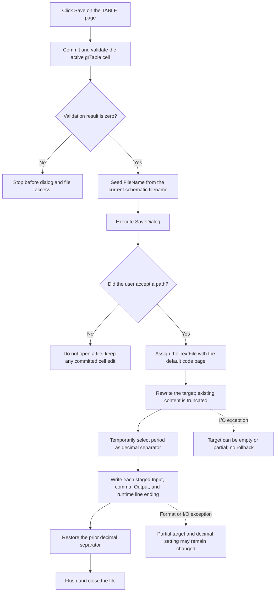

# Save the staged input/output table

`&Save` validates the active table-grid editor, asks for a target path, and exports the form-owned table as comma-separated input/output pairs. It does not save the table expression, row labels, or other Controlled Source Editor settings. It also does not press `OK`, commit the staged table to the caller, or close the dialog.

## Control

| Property | Recovered value |
| --- | --- |
| Form | `CspEditorDlg` (`Controlled Source Editor`) |
| Component path | `CspEditorDlg.pctrlMode.tshTable.btnSave` |
| Parent page | `Nonlinear/(TABLE)` |
| Table control | `grTable` (`TAttributeGrid`) |
| Control class | `TButton` |
| Caption | `&Save` |
| Hint | Not present in the recovered resource. |
| Handler | `btnSaveClick` at `01402be0` |
| Resource node | `resource:dfm:CspEditorDlg/CspEditorDlg.pctrlMode.tshTable.btnSave` |
| Handler node | `function:01402be0` |
| Graph layer | UI |

The button has no recovered glyph, image, action, or hint. The DFM places it beside `Load` on the table page, but the handler and its file-runtime calls establish the export behavior.

## Validation gate

The first call is `FUN_00b0a890(grTable)`. This shared AttributeGrid helper returns zero when no cell editor is active or when it commits the active editor successfully. A nonzero result stops the handler before it changes the Save dialog or accesses a file.

This is an active-cell validation only. The Save handler does not call the table expression compiler used by `Check` and `OK`, does not sort the pairs, and does not apply an additional range or ordering test. A successfully committed active edit remains in the form-owned table even if the user later cancels the Save dialog.

## Save dialog, filter, and default name

Before every dialog execution, the handler extracts the trailing filename from the application's current schematic path and assigns it to `SaveDialog.FileName`. Startup and document-path code populate that global path with the active `.TSC` or `.SCH` path. Therefore the dialog is seeded from the current schematic filename, or with an empty name when no current path is available. The selected export path is not copied to a separate CspEditorDlg field, and the next Save click seeds the dialog again from the current schematic path.

The handler does not assign `Filter`, `DefaultExt`, `FilterIndex`, `InitialDir`, `Title`, or `Options`. The extracted DFM evidence preserves only the `TSaveDialog` component and its layout coordinates; it does not expose those properties. Therefore the exact file filter, default extension, and overwrite-confirmation option are not established. The source does not append an extension itself.

`SaveDialog.Execute` is the path-selection boundary. If the user cancels, the handler does not read `FileName`, open a file, or change the filesystem. The earlier successful grid-cell commit is not undone.

## Exact table output

After the dialog accepts a path, the handler assigns a Delphi `TextFile` and opens it with `Rewrite`. It reads the form-owned double buffer at `+0x8B8`. The scalar count at `+0x894` is maintained in input/output pairs, so the handler writes `count / 2` lines in current table order.

Each line has this exact structure:

```text
<formatted Input #1>,<formatted Output #1>
<formatted Input #2>,<formatted Output #2>
...
```

There is one comma character (`0x2C`) and no added space between the two values. The file has no header, column names, expression, row numbers, blank separator lines, or end marker. Every pair, including the last pair, is completed with the Delphi `WriteLn` path. If the staged table has no pairs, `Rewrite` produces an empty file.

Both values use the application's engineering-number formatter with recovered arguments `(6, 0, 1)`. This selects the six-digit formatting setup, engineering scaling, and the formatter's long unit-prefix table. Before formatting, the handler saves the process format setting at `+0x17A`, changes it to `.` (`0x2E`), and restores it after all pair lines are written. Thus successfully written numeric values use a period as the decimal separator, independent of the user's locale.

The line ending comes from the Delphi `TextFile` flags. The recovered `WriteLn` helper emits an optional carriage return and then a line feed, and flushes the text buffer. The Save handler does not override that runtime flag.

## Encoding, path length, and overwrite

The file assignment passes encoding value `0`, which selects the Delphi runtime's default text code page. The handler does not request UTF-8 and does not write a Unicode BOM. The exact default code page is runtime state and is not a constant in this handler.

The text-file assignment accepts at most `0x103` Unicode characters for its stored path. For a longer accepted path, it records Delphi I/O error `3`, limits the copied path to `0x103` characters, and the immediate I/O check raises before `Rewrite`. The handler has no separate path-length message.

`Rewrite` creates a file or truncates an existing target. The handler has no second overwrite test. Any overwrite prompt must occur inside `TSaveDialog` before `Execute` returns true, but the recovered dialog options do not establish whether such a prompt is enabled.

## Errors and partial files

The handler checks the thread-local Delphi I/O status after file assignment, `Rewrite`, every completed pair line, and close. A nonzero status raises through the runtime I/O error path. There is no local exception handler, temporary file, atomic rename, retry, or rollback.

An error before `Rewrite` leaves the target unopened. An error after `Rewrite` can leave an empty or partially written target. The code restores the original decimal separator only after the line loop. Therefore a formatting or write exception during the loop can also prevent that restore; a close error occurs after the restore. The source has no recovery for either process-format state or partial file content.

## Staged state, OK, and Cancel

`FormCreate` copies table-mode values from the caller-owned controlled-source record into the form-owned buffer at `+0x8B8` and binds the grid rows to that buffer. Save reads this staged buffer directly. Its only in-dialog data change is a possible active-cell commit by the validation gate.

The `OK` handler separately compiles the table expression, validates the table grid, sets the caller record to table mode, allocates the caller's table buffer, and copies the staged scalar count and doubles only when both checks succeed. The `bkCancel` button has no click handler and dismisses the modal dialog without this copy. A file that Save already created is an independent side effect: later Cancel does not delete it, and later OK does not rewrite it.

## Click flow



## Evidence

- [Save handler](../../../DecompiledSources/Tina16/functions/0000000001402BE0__FUN_01402be0.c): contains the grid-validation gate, current-path filename seed, dialog guard, inline pair serializer, decimal-setting change, I/O checks, and close operation.
- [AttributeGrid validation helper](../../../DecompiledSources/Tina16/functions/0000000000B0A890__FUN_00b0a890.c): commits the active cell editor and returns its validation result, or returns zero when there is no active editor.
- [Filename extraction helper](../../../DecompiledSources/Tina16/functions/0000000000441920__FUN_00441920.c) and [current-path initialization](../../../DecompiledSources/Tina16/functions/0000000000C37230__FUN_00c37230.c): provide the trailing current schematic filename used to seed the dialog.
- [SaveDialog filename setter](../../../DecompiledSources/Tina16/functions/0000000000724380__FUN_00724380.c) and [filename reader](../../../DecompiledSources/Tina16/functions/0000000000724270__FUN_00724270.c): set the seed and obtain the accepted path.
- [Text-file assignment](../../../DecompiledSources/Tina16/functions/000000000040CF10__FUN_0040cf10.c): stores the path with its `0x103`-character limit and selects the default code page for encoding value `0`.
- [Rewrite helper](../../../DecompiledSources/Tina16/functions/000000000040CA00__FUN_0040ca00.c), [string writer](../../../DecompiledSources/Tina16/functions/000000000040F200__FUN_0040f200.c), [character writer](../../../DecompiledSources/Tina16/functions/000000000040F3D0__FUN_0040f3d0.c), [line writer](../../../DecompiledSources/Tina16/functions/000000000040F590__FUN_0040f590.c), and [close helper](../../../DecompiledSources/Tina16/functions/000000000040D150__FUN_0040d150.c): implement the recovered text-file output sequence.
- [Engineering-number formatter wrapper](../../../DecompiledSources/Tina16/functions/0000000000B8FD60__FUN_00b8fd60.c) and [formatter core](../../../DecompiledSources/Tina16/functions/0000000000B8F7F0__FUN_00b8f7f0.c): format each table double with the recovered `(6, 0, 1)` settings and shared format state.
- [Delphi I/O check](../../../DecompiledSources/Tina16/functions/0000000000409900__FUN_00409900.c): raises through the runtime error path when the thread-local I/O status is nonzero.
- [Form initialization](../../../DecompiledSources/Tina16/functions/0000000001400EE0__FUN_01400ee0.c): copies caller table values to the form-owned buffer and builds paired `Input #n` and `Output #n` grid rows.
- [OK handler](../../../DecompiledSources/Tina16/functions/0000000001403320__FUN_01403320.c): performs the separate expression, grid-validation, and caller-model commit path.
- [Recovered Delphi UI evidence](../../../DecompiledSources/Tina16/resources/dfm/ui-evidence.json): identifies the `TButton`, `TAttributeGrid`, `TSaveDialog`, `bkOK`, and `bkCancel` components and binds `btnSave.OnClick` to `01402be0`.

## Analysis limits

- The extracted DFM does not establish the Save dialog's filter, default extension, or overwrite option.
- The exact default text code page and line-ending flag are runtime state.
- The formatter's data-dependent numeric characters are not fixed literals, but the pair order, comma delimiter, period decimal setting, formatter arguments, and one-line-per-pair structure are proven.
- The final UI response to a raised Delphi I/O exception is outside this handler and is not recovered here.
