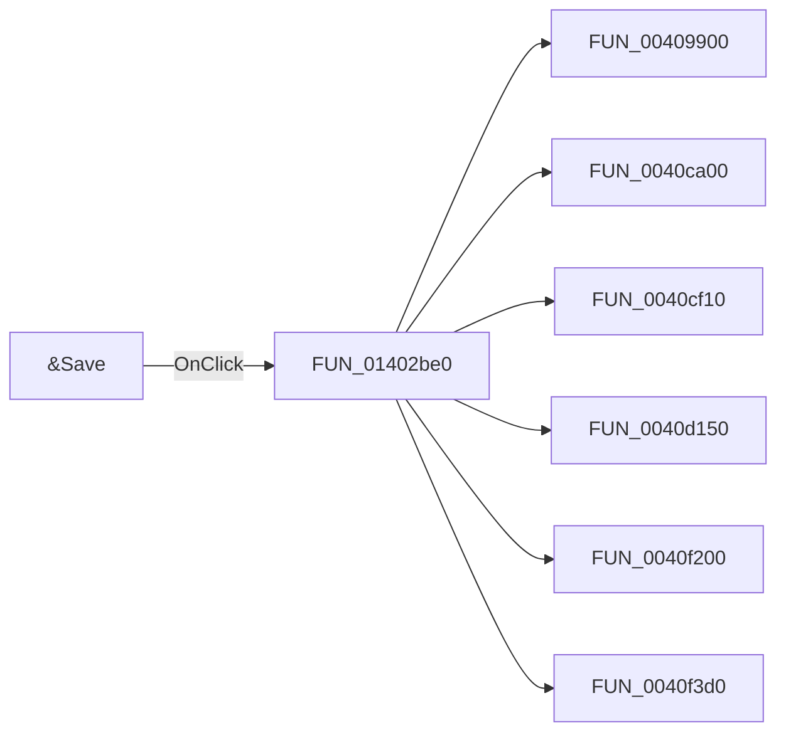

# &Save

> Analysis status: Pending individual source review.

## Control

| Property | Recovered value |
| --- | --- |
| Form | CspEditorDlg |
| Component path | CspEditorDlg.pctrlMode.tshTable.btnSave |
| Control class | TButton |
| Caption | &Save |
| Hint | Not present in the recovered resource. |
| Text | Not present in the recovered resource. |
| Handler name | btnSaveClick |
| Handler address | 01402be0 |
| Graph node | `resource:dfm:CspEditorDlg/CspEditorDlg.pctrlMode.tshTable.btnSave` |
| Handler node | `function:01402be0` |
| Graph layer | UI |

## What happens when clicked

Pending individual analysis. An agent must read the recovered handler source and its relevant callees before it replaces this text.

## Click flow

## Handler evidence

- Source: [DecompiledSources/Tina16/functions/0000000001402BE0__FUN_01402be0.c](../../../DecompiledSources/Tina16/functions/0000000001402BE0__FUN_01402be0.c)
- Recovered role: Not present in the recovered resource.
- Current graph summary: Handles 1 Delphi UI event: CspEditorDlg.pctrlMode.tshTable.btnSave.OnClick.
- Current graph behavior: Not present in the recovered resource.
- Current graph evidence: Not present in the recovered resource.
- Complexity: complex
- Distinct outgoing calls: 14

## Direct calls

- `function:00409900` — FUN_00409900
- `function:0040ca00` — FUN_0040ca00
- `function:0040cf10` — FUN_0040cf10
- `function:0040d150` — FUN_0040d150
- `function:0040f200` — FUN_0040f200
- `function:0040f3d0` — FUN_0040f3d0
- `function:0040f590` — FUN_0040f590
- `function:00414480` — Delphi UnicodeString clear and finalization helper
- `function:00414560` — Delphi UnicodeString array finalization helper
- `function:00441920` — FUN_00441920
- `function:00724270` — FUN_00724270
- `function:00724380` — FUN_00724380
- `function:00b0a890` — FUN_00b0a890
- `function:00b8fd60` — FUN_00b8fd60

## Resource evidence

- Kind: Not present in the recovered resource.
- Modal result: Not present in the recovered resource.
- Checked state: Not present in the recovered resource.
- List items: Not present in the recovered resource.
- Image reference: Not present in the recovered resource.
- Extracted glyph: None.

## Nearby label candidates

Nearby labels are layout candidates only. They are not proof of behavior.

- Rank 1: Inputs at distance 322.
- Rank 2: Expression at distance 484.

## Analysis limits

- Do not infer behavior from the control class, caption, hint, glyph, or nearby label alone.
- Do not replace the pending status until the handler source and relevant call path provide enough evidence.
