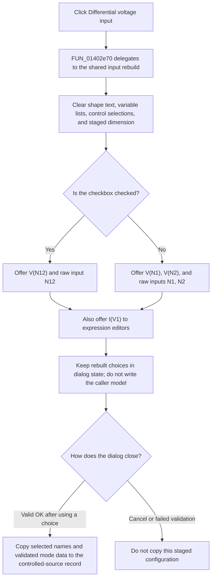

# Differential voltage input

> Analysis status: Reviewed from recovered source, form-resource, call-graph, and model copy-back evidence.

## Control

| Property | Recovered value |
| --- | --- |
| Form | CspEditorDlg |
| Form caption | Controlled Source Editor |
| Component path | CspEditorDlg.pnlButtons.cbxDiffVoltInput |
| Control class | TCheckBox |
| Caption | Differential voltage input |
| Initial visibility | False |
| Hint | Not present in the recovered resource. |
| Handler name | cbxDiffVoltInputClick |
| Handler address | 01402e70 |
| Graph node | `resource:dfm:CspEditorDlg/CspEditorDlg.pnlButtons.cbxDiffVoltInput` |
| Handler node | `function:01402e70` |
| Graph layer | UI |

## What happens when clicked

`cbxDiffVoltInputClick` delegates to the common controlled-source input-list rebuild. The rebuild reads the checkbox state and changes the voltage-control vocabulary used by the dialog:

| Checkbox state | Voltage tokens offered to VALUE and TABLE expressions | Raw control-input names offered to the linear and polynomial selectors |
| --- | --- | --- |
| Checked | `V(N12)` | `N12` |
| Clear | `V(N1)` and `V(N2)` | `N1` and `N2` |

Thus checked mode represents one differential voltage input. Clear mode exposes two separate node-voltage inputs. The literal strings come from the recovered helper, not only from the checkbox caption.

The rebuild also keeps `I(V1)` in the VALUE and TABLE variable insertion lists. The raw name `V1` is offered to the linear and polynomial control-input selectors only for the dialog's current-controlled input class. The differential-voltage checkbox is hidden for that class, so a normal click on this control affects the `N1`/`N2` versus `N12` branch only.

## UI reset and selection effects

The handler is not a one-field toggle. Before it repopulates the names, the shared rebuild:

- clears the shape-file edit;
- clears the VALUE and TABLE variable combo boxes;
- clears the linear controlling-component combo box and sets its item index to `-1`;
- clears the polynomial controlling-components list;
- sets the staged polynomial dimension edit to `0`.

It then appends the names for the current input configuration. It does not restore the previous combo or list selections, rewrite the VALUE memo, rewrite the TABLE expression, clear either expression, or change the table or polynomial grids.

For LINEAR mode, the common idle-state check requires a nonnegative controlling-component item index before it enables acceptance. Because this click resets the index to `-1`, the user must select a rebuilt input name before a linear edit can be accepted. Other modes retain their own validation rules.

## Visibility and output-mode interaction

The DFM stores this checkbox with `Visible = false`. `FormCreate` makes it visible only when the controlled-source type code is `0x12` or `0x14`. The same initialization path classifies both codes as voltage-controlled inputs and reconstructs the checkbox state by scanning the existing model input-name list for `N12`.

The two visible type codes can have different output behavior, but they use the same differential-input rebuild. This click does not select the `Voltage` or `Current` output radio button, change the output-differential checkbox, enable or hide any input control, or change a label. Output-control clicks call the same general rebuild for their own configurations, but the differential-input handler itself only delegates after the VCL has changed this checkbox's checked state.

## Staging, OK, and Cancel

The checkbox state is not copied to the caller as a separate Boolean field. The click changes dialog controls and candidate names only.

On a successful OK path, the selected input names and validated expression or table data are copied into the controlled-source record for the active mode. In LINEAR mode, OK stores the selected raw control-input name from the rebuilt combo box. In nonlinear modes, the rebuilt names are available for selection or insertion into the staged expression data. `FormCreate` later infers checked mode from a stored `N12` name when the dialog opens again.

The resource-defined Cancel button has no application OnClick handler. Cancel performs no copy-back, and form destruction releases the dialog's private buffers. Therefore a click on this checkbox has no persistent model effect unless the user uses the rebuilt names and completes a valid OK path.

## Downstream controlled-source behavior

The recovered source proves the input identifiers and the dialog-to-model boundary. It does not show this click directly generating or executing a solver equation. Downstream controlled-source compilation or evaluation can observe `N12` instead of `N1` and `N2` only after the changed input selection or expression is accepted through OK.

The handler does not translate an existing expression from `V(N1)` and `V(N2)` to `V(N12)`, or in the opposite direction. Existing expression text can therefore retain an old token until the user edits or validates it. The expression-check and OK paths, not this click handler, report parser or unresolved-name failures.

## Click flow

## Handler evidence

- Primary handler: [FUN_01402e70](../../../DecompiledSources/Tina16/functions/0000000001402E70__FUN_01402e70.c) contains one call to the shared rebuild and no independent state write or branch.
- Event wrapper and shared route: [FUN_01402e30](../../../DecompiledSources/Tina16/functions/0000000001402E30__FUN_01402e30.c) forwards the event to the input-choice builder.
- Input-choice builder: [FUN_01400490](../../../DecompiledSources/Tina16/functions/0000000001400490__FUN_01400490.c) clears the related controls, reads the differential-input checked state, and constructs the exact `N1`, `N2`, `N12`, `V(N1)`, `V(N2)`, `V(N12)`, `V1`, and `I(V1)` strings.
- Form initialization: [FUN_01400ee0](../../../DecompiledSources/Tina16/functions/0000000001400EE0__FUN_01400ee0.c) controls visibility for type codes `0x12` and `0x14`, recovers checked state from `N12`, populates the initial choices, and owns the private edit buffers.
- VALUE insertion: [FUN_01401ff0](../../../DecompiledSources/Tina16/functions/0000000001401FF0__FUN_01401ff0.c) inserts the selected rebuilt token into the VALUE memo at the stored caret position.
- TABLE insertion: [FUN_01402200](../../../DecompiledSources/Tina16/functions/0000000001402200__FUN_01402200.c) inserts the selected rebuilt token into the TABLE expression at the stored caret position.
- OK boundary: [FUN_01403320](../../../DecompiledSources/Tina16/functions/0000000001403320__FUN_01403320.c) validates the active mode and copies its selected names and staged data to the caller record only on success.
- Staging cleanup: [FUN_01401ac0](../../../DecompiledSources/Tina16/functions/0000000001401AC0__FUN_01401ac0.c) frees the dialog-owned buffers on destruction.
- Complexity: simple; the wrapper has one distinct outgoing call.

## Resource evidence

- The recovered caption is `Differential voltage input`.
- The checkbox is under the dialog's bottom button panel, not inside the input group box, and its resource visibility is false.
- The input group contains `Number of voltages` and `Number of currents` labels plus integer edits. Their change handlers use the same rebuild route.
- The output group contains separate `Voltage`, `Current`, and `Differential` controls. They corroborate that input and output configuration are separate.
- This checkbox has no hint, action, image reference, or extracted glyph.

## No-op, error, and partial-state behavior

- There is no unchanged-state guard in the application handler. If an event is delivered without a different checked value, the code still clears and rebuilds the UI choices.
- There is no validation, confirmation, message, or local exception handler in the wrapper or rebuild.
- Clears happen before repopulation. An allocation or VCL exception can leave only some choices rebuilt, while the caller's controlled-source record remains unchanged because OK has not copied it.
- The click can leave an old VALUE or TABLE expression that refers to names no longer offered by the rebuilt selector. Later validation must detect whether that expression is still valid.

## Analysis limits

- The recovered code establishes that `N12` is the persisted marker for the differential-input choice. It does not expose the solver's internal electrical interpretation of that name.
- The source does not identify friendly names for type codes `0x12` and `0x14`; it proves only that both use voltage-control input naming and show this checkbox.
- The VCL changes `Checked` before it invokes OnClick. The recovered event wrapper does not itself toggle the Boolean.
