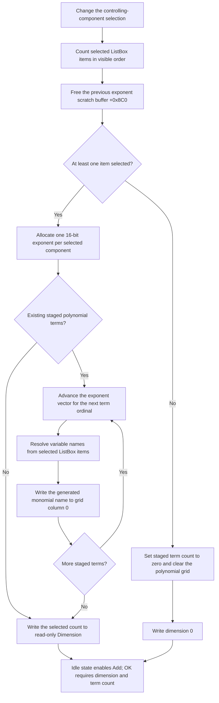

# Select controlling components for the polynomial

> Analysis status: Source reviewed and behavior traced.

## Control

| Property | Recovered value |
| --- | --- |
| Form | CspEditorDlg |
| Form caption | Controlled Source Editor |
| Tab | Nonlinear/(POLY) |
| Component path | CspEditorDlg.pctrlMode.tshPoly.lbxCtrlComps |
| Control class | TListBox |
| Caption | Not present in the recovered resource. |
| Hint | Not present in the recovered resource. |
| Handler name | lbxCtrlCompsClick |
| Handler address | 01401b00 |
| Graph node | `resource:dfm:CspEditorDlg/CspEditorDlg.pctrlMode.tshPoly.lbxCtrlComps` |
| Handler node | `function:01401b00` |
| Graph layer | UI |

The nearby label `Controlling components` identifies the list's subject. The
handler and OK path confirm the label: the ListBox is treated as a multi-select
set of polynomial input variables. It does not select the controlled output
component.

## What happens when the selection changes

`FUN_01401b00` counts all selected ListBox items. It uses that count as the
polynomial dimension and updates the staged polynomial display:

1. Enumerate `lbxCtrlComps.Items` and call the bounds-checked ListBox selected
   accessor for each item.
2. Count the selected entries.
3. Free the old exponent-enumeration scratch buffer at form offset `+0x8C0`
   and set its pointer to zero.
4. If no item is selected, invoke the same handler as the `Clear` button.
5. If one or more items are selected, allocate two bytes per selected item for
   a new exponent vector.
6. For each existing staged polynomial term from row 0 through term count
   `+0x890 - 1`, generate the monomial name for ordinal `row + 1` and the new
   dimension. Write that name to grid column 0.
7. Write the selected-item count to the read-only `iedDimension` control.

For a positive selection count, this handler does not change term count, grid
row count, coefficient values, or coefficient column 1. It relabels the
existing staged coefficients so they describe the monomial sequence for the
new set of controlling variables.

## Polynomial names and the selected-component order

The shared monomial formatter `FUN_014002c0` owns the exponent sequence. The new
`+0x8C0` buffer contains one 16-bit exponent for each selected component. The
formatter advances that vector for each term ordinal and builds a product from
the variables whose exponent is nonzero. Exponents greater than one receive an
exponent suffix. The first term uses the recovered fixed constant label.

`FUN_01400210` resolves each variable name. It walks ListBox items in their
visible order, counts only selected items, and returns the item text for the
requested zero-based selected ordinal. Therefore:

- the ListBox item order defines polynomial variable order;
- changing only which items are selected can change every generated monomial
  label;
- the coefficient values remain at their existing row indexes and are
  reinterpreted against the newly generated labels.

The grid's column 0 is the only recovered polynomial-expression preview that
this click updates. The handler does not evaluate the polynomial, draw a plot,
update a simulation result, or call a separate preview control.

## Selection flow

## No-selection behavior

When the selected count is zero, the handler calls `FUN_01401f60`, the
`btnClearPolyClick` handler. That function:

- sets staged polynomial term count `+0x890` to zero;
- resets `grPoly`, including its active editor, tracked coordinates, cell
  values, and column state;
- normally zeroes the exponent buffer when it exists.

In this selection path, the old exponent buffer was already freed and set to
zero before Clear runs. Clear therefore has no exponent buffer to fill. The
selection handler then writes dimension 0.

Clear does not free or overwrite the staged coefficient backing buffer at
`+0x8B0`; it makes those bytes inactive by setting term count to zero and
removing their grid bindings. A later successful OK copies only the number of
coefficients recorded in `+0x890`, so the old bytes are not committed while the
count remains zero.

There is no confirmation step. Clearing the last ListBox selection immediately
discards the staged term list and visible coefficient grid. Selecting an item
again does not restore the former term count or rows.

## Positive-selection grid behavior

With one or more selections, existing terms stay present:

- `+0x890` remains unchanged.
- The coefficient backing array at `+0x8B0` remains unchanged.
- Column 1 and its bound numeric editors remain unchanged.
- Only generated labels in column 0 are rewritten.
- Grid row count and the current row are not explicitly changed.

This path does not call the active-cell validation helper. If a coefficient
editor is active, the handler does not explicitly commit or reject its text,
hide it, restore its caret, or move focus. Any visual effect caused by rewriting
column 0 while column 1 is being edited belongs to the grid implementation and
is not established by this source.

## Enabled controls after selection

The selection handler does not directly enable buttons. The form's application
idle handler `FUN_01403b60` reads the new state and applies these rules on the
POLY tab:

- `btnAddPoly` is enabled when `iedDimension` is greater than zero.
- `btnRemovePoly` is enabled when staged term count `+0x890` is greater than
  zero.
- `btnClearPoly` copies the enabled state of `btnRemovePoly`.
- `btnOK` is enabled for the POLY mode only when dimension and staged term
  count are both greater than zero.

Thus, a positive selection with no terms enables Add but keeps Remove, Clear,
and OK disabled. No selection disables all four for the POLY state. The update
occurs on the later idle callback, not inside this click handler.

## Staged state and the OK boundary

`FormCreate` loads an existing polynomial into form-owned state:

- coefficients are copied to the working double buffer at `+0x8B0`;
- coefficient count is stored at `+0x890`;
- existing controlling-component names are matched to ListBox items and marked
  selected;
- dimension is loaded into `iedDimension`;
- the exponent scratch buffer at `+0x8C0` is allocated for label generation.

The ListBox click changes only form-owned selection, dimension, exponent
scratch, term labels, and, on the zero-selection path, staged term count and
grid state. It does not update the controlled-source record at `+0x880`.

`FUN_01403320` is the OK commit boundary for POLY mode. It first validates and
commits the active `grPoly` editor. On success, it writes mode 1, copies the
dimension, replaces the model's coefficient array with exactly `+0x890`
staged doubles from `+0x8B0`, clears the model's controlling-component string
list, and appends the text of every currently selected ListBox item.

The resource-defined `bkCancel` button has no application `OnClick` handler.
Cancel closes the modal editor without running this POLY copy-back block.
`FormDestroy` frees the form-owned coefficient, table, and exponent buffers.
Therefore, Cancel discards all selection and relabeling changes made by this
handler.

## Invalid selection and failure behavior

- Normal enumeration uses the current `Items.Count`, so every selected-state
  query is in range. `FUN_0068bca0` raises a ListBox index exception if that
  invariant is broken; there is no local catch.
- `FUN_01400210` expects a selected ordinal smaller than the selected-item
  count. The monomial formatter supplies ordinals derived from the same
  dimension. An inconsistent selection during generation can make the item
  text lookup fail through the ListBox collection.
- The old exponent buffer is freed before the new allocation. If allocation
  fails, `+0x8C0` remains zero and the former polynomial labels and dimension
  can remain visible.
- An exception during term-name generation or a grid write can leave only a
  prefix of column 0 relabeled. The new dimension is written after the loop, so
  it can still show the old value after such a partial failure.
- The handler has no rollback or error-message branch. Exceptions propagate to
  the surrounding Delphi/VCL exception path.

## Evidence

- [ListBox handler `FUN_01401b00`](../../../DecompiledSources/Tina16/functions/0000000001401B00__FUN_01401b00.c)
  counts selected items, replaces the exponent buffer, chooses clear or
  relabel behavior, writes grid column 0, and updates dimension.
- [Selected-variable name resolver `FUN_01400210`](../../../DecompiledSources/Tina16/functions/0000000001400210__FUN_01400210.c)
  maps one selected ordinal to the corresponding ListBox item text.
- [Monomial label formatter `FUN_014002c0`](../../../DecompiledSources/Tina16/functions/00000000014002C0__FUN_014002c0.c)
  advances the exponent vector and builds a label from selected variable names.
- [Exponent-vector iterator `FUN_00dff7c0`](../../../DecompiledSources/Tina16/functions/0000000000DFF7C0__FUN_00dff7c0.c)
  advances the 16-bit exponent distribution for the next polynomial term.
- [Clear handler `FUN_01401f60`](../../../DecompiledSources/Tina16/functions/0000000001401F60__FUN_01401f60.c)
  sets term count to zero, resets the polynomial grid, and zeroes an existing
  exponent buffer.
- [Add handler `FUN_01401c80`](../../../DecompiledSources/Tina16/functions/0000000001401C80__FUN_01401c80.c)
  uses current dimension and exponent state to append the next staged monomial
  and coefficient editor.
- [Remove handler `FUN_01401de0`](../../../DecompiledSources/Tina16/functions/0000000001401DE0__FUN_01401de0.c)
  removes the last term and regenerates remaining monomial names from a zeroed
  exponent vector.
- [Idle-state handler `FUN_01403b60`](../../../DecompiledSources/Tina16/functions/0000000001403B60__FUN_01403b60.c)
  updates Add, Remove, Clear, and OK enabled states from dimension and term
  count.
- [Form initialization `FUN_01400ee0`](../../../DecompiledSources/Tina16/functions/0000000001400EE0__FUN_01400ee0.c)
  loads the polynomial working buffers, grid, selected names, dimension, and
  exponent scratch from the source record.
- [OK handler `FUN_01403320`](../../../DecompiledSources/Tina16/functions/0000000001403320__FUN_01403320.c)
  validates the polynomial grid and copies staged dimension, coefficients, and
  selected component names to the controlled-source record.
- [Form destroy handler `FUN_01401ac0`](../../../DecompiledSources/Tina16/functions/0000000001401AC0__FUN_01401ac0.c)
  frees the form-owned coefficient, table, and exponent buffers.
- [ListBox selected accessor `FUN_0068bca0`](../../../DecompiledSources/Tina16/functions/000000000068BCA0__FUN_0068bca0.c)
  reads the selected state and raises through the VCL list-error path for an
  invalid item index.
- [Dimension setter `FUN_00f04fa0`](../../../DecompiledSources/Tina16/functions/0000000000F04FA0__FUN_00f04fa0.c)
  stores the integer and updates the `TIntEdit` text.
- [Recovered UI evidence](../../../DecompiledSources/Tina16/resources/dfm/ui-evidence.json)
  identifies the POLY tab, controlling-component ListBox, Dimension edit,
  coefficient grid, Add/Remove/Clear controls, and built-in OK and Cancel.

## Resource evidence and limits

- The ListBox has no caption, hint, action, image, or extracted glyph. Its
  nearby `Controlling components` label is confirmed by the selection and OK
  source paths, not by proximity alone.
- `iedDimension` is a read-only `TIntEdit`. This handler derives its value from
  selected count; the user does not type the dimension directly.
- The exact fixed label and separator characters used by the monomial formatter
  are not recovered as named resources. The article describes their observed
  role without inventing text.
- No separate preview or evaluation control is present in the recovered POLY
  tab. Column 0 monomial labels are the only preview-like output of this click.

## Annotation scope

The fragment owns the unique ListBox handler `FUN_01401b00` and selected-name
resolver `FUN_01400210`. `TIARA-diz.6.7.209` owns the shared monomial formatter
and exponent iterator. `TIARA-diz.6.7.210` owns the Clear handler. Common grid,
integer-edit, allocation, and VCL helpers remain documented by source links
without duplicate annotations.
