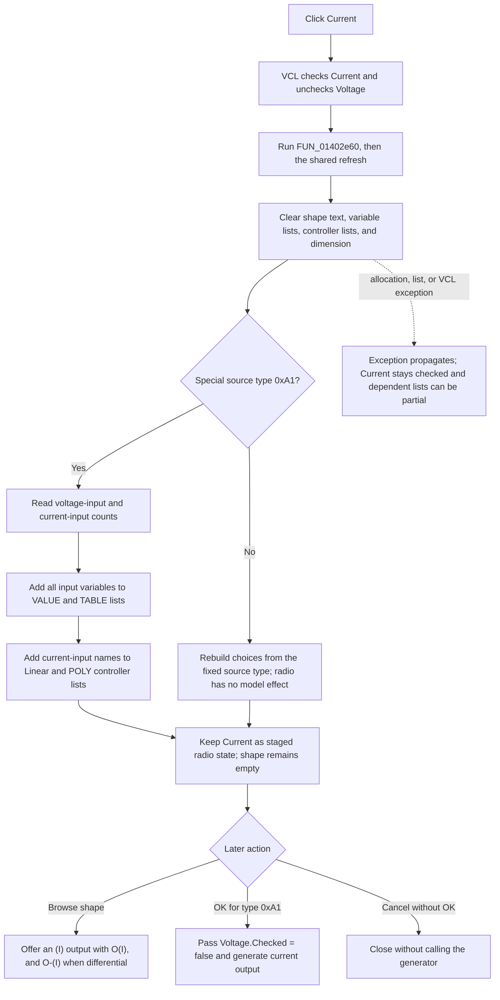

# Select current output

`Current` selects current, instead of voltage, as the output kind for the Controlled Source Editor. The click uses VCL radio-button exclusivity, then rebuilds the dependent variable and controlling-component lists. It clears the selected shape text because the previous shape can have the wrong output kind. For the special controlled-source type, a later OK uses the radio state to generate an `(I)` output.

## Control

| Property | Recovered value |
| --- | --- |
| Form | `CspEditorDlg` (`Controlled Source Editor`) |
| Component path | `CspEditorDlg.pnlIO.gbxOutput.rbtnCurrent` |
| Parent group | `Output` |
| Control class | `TRadioButton` |
| Caption | `Current` |
| Initial resource state | Not checked; sibling `Voltage` is checked. |
| Hint | Not present in the recovered resource. |
| Handler | `rbtnCurrentClick` at `01402e60` |
| Resource node | `resource:dfm:CspEditorDlg/CspEditorDlg.pnlIO.gbxOutput.rbtnCurrent` |
| Handler node | `function:01402e60` |
| Graph layer | UI |

The radio button has no glyph, image, action, or custom hint.

## VCL radio state and event wrapper

`Current` and `Voltage` are sibling `TRadioButton` controls under the same `Output` group box. VCL checks Current and unchecks Voltage as one exclusive group before the application click handler runs. `FUN_01402e60` does not write either Checked property itself. It delegates to `FUN_01402e30`, which delegates to the shared dependent-control refresh at `FUN_01400490`.

The recovered form uses `rbtnVoltage.Checked` as the Boolean representation of output kind. Therefore:

- Voltage selected means the Boolean is true.
- Current selected means the Boolean is false.

There is no separate current flag written by this click. The checked radio controls are the dialog's staged output-kind state.

## Dependent control refresh

The shared refresh starts by clearing state that depends on input and output configuration:

- It clears the read-only `edShape` text.
- It clears the item lists for the VALUE and TABLE variable combo boxes.
- It clears the Linear controlling-component combo and resets its selection to no item.
- It clears the POLY controlling-component list.
- It resets the polynomial dimension control to zero.

It then rebuilds those lists. For the special controlled-source type, identified by recovered type code `0xA1`, it reads the configured voltage-input and current-input counts:

- All recovered voltage and current variables are added to the VALUE and TABLE expression-variable lists.
- Because Current is checked, only current-input component names are added to the Linear and POLY controlling-component lists.
- If the current-input count is zero, those controlling-component lists have no current entry after the refresh.

The click does not clear the VALUE expression text, TABLE expression text, polynomial coefficient buffer, or input/output table. It does not change the voltage-input count, current-input count, or Differential checkbox. Label captions also stay unchanged.

For non-`0xA1` controlled-source types, the shared refresh derives controlling-component choices from the fixed source type and differential-input state. The Current radio is not read in that branch. Selecting Current still performs the clear-and-rebuild operation, but the recovered OK path does not use it as a model flag for those types.

## Shape effect

The click clears `edShape` but does not open the shape browser. If the user opens the browser later, `FUN_01402f10` reads `rbtnVoltage.Checked`:

- false, which represents Current, selects the recovered `(I)` output suffix;
- one output uses `O(I)`;
- a checked Differential option also provides `O-(I)`.

Voltage provides the contrast. Its sibling handler runs the same refresh, but VCL leaves `rbtnVoltage.Checked` true. The shape browser then uses `(V)`, and the special-source generator receives a true voltage-output Boolean.

## Staging, OK, and downstream generation

The Current click changes only dialog controls and their derived lists. It does not call the source generator, replace the edited source object, or set a modal result.

When OK runs for special type `0xA1`, it passes these values to `FUN_013ff530`:

- the voltage-input count;
- the current-input count;
- `rbtnVoltage.Checked` as the output-kind Boolean;
- the Differential state;
- the shape text and selected shape metadata.

With Current selected, the output-kind Boolean is false. If the shape text is empty, the generator creates a controlled-source representation with an `(I)` output and one or two output terminals. It then updates the source's connector count. If the user selected a compatible custom shape after the Current click, the generator uses that selected shape instead of constructing the default graphic.

The OK handler's final special-source generation block is outside its earlier page-specific validation branches. Thus the recovered code calls the generator whenever this special OK handler runs, even if an earlier branch reset the modal result to zero. The dialog can stay open after a validation failure, but the source-generation call has still occurred. The recovered code does not show a rollback for that call.

## Cancel boundary

The Cancel button is the built-in `bkCancel` control and has no custom click handler. A direct Current click followed by Cancel does not call `FUN_013ff530`.

The new-source caller adds the generated source to the circuit only after the modal result is OK. It abandons the new-source path on the Cancel result. For an existing source, the recovered constructor receives the caller's source context directly. Because the OK generator can run before final modal success, a Cancel after a failed OK attempt cannot be proven to restore all earlier source-generation changes.

## Repeated clicks and errors

- There is no application guard that tests whether Current was already selected. If VCL dispatches the event again, the handler clears the shape and rebuilds all dependent lists again.
- The handler does not validate expressions, polynomial coefficients, table values, or input counts.
- There is no confirmation, error message, success message, or status text.
- The shared refresh clears the dependent controls before it repopulates them. It has no local exception handler or rollback.
- If string allocation, list insertion, or a VCL operation raises an exception, Current remains selected while the shape and variable/component lists can be only partly rebuilt.

## Click flow

## Evidence

- [Current wrapper](../../../DecompiledSources/Tina16/functions/0000000001402E60__FUN_01402e60.c): delegates to the shared change path without writing another field.
- [Shared event wrapper](../../../DecompiledSources/Tina16/functions/0000000001402E30__FUN_01402e30.c) and [dependent-control refresh](../../../DecompiledSources/Tina16/functions/0000000001400490__FUN_01400490.c): clear shape and list state, repopulate expression variables, and read the Current checked state for special-source controlling-component choices.
- [Voltage wrapper](../../../DecompiledSources/Tina16/functions/0000000001402E50__FUN_01402e50.c): provides the symmetric radio-button path and calls the same refresh.
- [Form initialization](../../../DecompiledSources/Tina16/functions/0000000001400EE0__FUN_01400ee0.c): recognizes special type `0xA1`, restores Voltage from a recovered `(V)` output marker or selects Current otherwise, and restores Differential from the output-terminal count.
- [Shape browser](../../../DecompiledSources/Tina16/functions/0000000001402F10__FUN_01402f10.c): chooses `(V)` when Voltage is checked and `(I)` otherwise, then provides `O` and optional `O-` output terminals.
- [OK handler](../../../DecompiledSources/Tina16/functions/0000000001403320__FUN_01403320.c): reads Voltage and Differential and passes them with input counts and shape state to the special-source generator.
- [Special-source generator](../../../DecompiledSources/Tina16/functions/00000000013FF530__FUN_013ff530.c): maps a false output-kind Boolean to `(I)`, constructs output terminal names, installs or generates the source representation, and updates connector count.
- [Dialog constructor](../../../DecompiledSources/Tina16/functions/00000000014000E0__FUN_014000e0.c): stores the caller's source context and resolves the edited source object.
- [New-source caller](../../../DecompiledSources/Tina16/functions/0000000001C6EC30__FUN_01c6ec30.c): inserts the new special source only after modal result OK and abandons the path on Cancel.
- [Recovered Delphi UI evidence](../../../DecompiledSources/Tina16/resources/dfm/ui-evidence.json): identifies the Output group, Current and Voltage sibling radio buttons, Voltage's initial checked state, Differential, shape control, and built-in OK/Cancel buttons.

## Shared-helper coordination

`FUN_01402e30` and `FUN_01400490` are shared by voltage-count, current-count, Voltage, Current, and differential-input events. This Bead documents their Current-specific data flow but leaves their canonical annotations to the sibling Voltage analysis. The annotation fragment contains only the unique Current click wrapper.

## Analysis limits

- The original Delphi name for the Boolean passed to `FUN_013ff530` is not recovered. The `(V)` and `(I)` branches establish its voltage-true/current-false meaning.
- The source proves radio use only for special type `0xA1`. Other source-type behavior must not be inferred from the caption.
- Global exception presentation is outside this handler.
