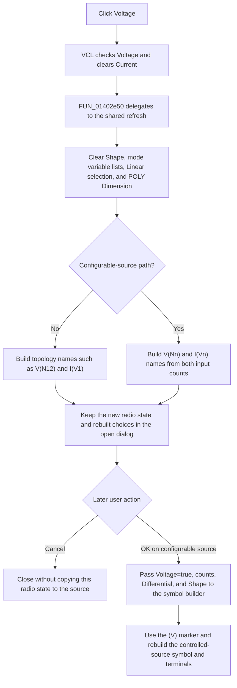

# Voltage

> Analysis status: Source reviewed.

## Control

| Property | Recovered value |
| --- | --- |
| Form | CspEditorDlg |
| Component path | CspEditorDlg.pnlIO.gbxOutput.rbtnVoltage |
| Control class | TRadioButton |
| Caption | Voltage |
| Hint | Not present in the recovered resource. |
| Text | Not present in the recovered resource. |
| Handler name | rbtnVoltageClick |
| Handler address | 01402e50 |
| Graph node | `resource:dfm:CspEditorDlg/CspEditorDlg.pnlIO.gbxOutput.rbtnVoltage` |
| Handler node | `function:01402e50` |
| Graph layer | UI |

## What happens when clicked

`Voltage` selects voltage as the controlled source's output type. It is one of two `TRadioButton` controls in the `Output` group. The other control is `Current`. The recovered DFM sets `Voltage.Checked` to `true` initially. VCL performs the mutually exclusive radio-state change before the application event code runs, so the click checks `Voltage` and clears `Current` without an explicit state write in `FUN_01402e50`.

The application handler is a one-call wrapper. It calls the shared refresh entry `FUN_01402e30`, which calls `FUN_01400490`. The same refresh chain is also used after a voltage-count change, a current-count change, a Current click, and a `Differential voltage input` click.

The refresh is destructive to the dialog's current UI choices. It clears the read-only `Shape` edit, clears the variable lists for the Linear, POLY, VALUE, and TABLE modes, clears the current Linear selection, resets the POLY `Dimension` edit to zero, and then rebuilds the lists from the input counts and output state. In the normal topology path, a checked Voltage radio gives the expression lists `V(N12)` and `I(V1)`. The Current alternative gives them `V(N1)`, `V(N2)`, and `I(V1)`. In the configurable-source path, the helper builds `V(Nn)` names from `Number of voltages` and `I(Vn)` names from `Number of currents`; it uses the Voltage and Current radio states when it fills the controlling-component choices. Thus, the click changes which names can be selected by the later expression and coefficient editors. It does not change the input-count edits or the `Differential` checkbox.

The handler does not validate an expression, redraw a preview, close the dialog, or write the controlled-source object. Its immediate changes are VCL control state and dialog-local lists and text. A repeated click is not a no-op: the refresh runs again and can discard a selected Shape and current list selections even when Voltage was already checked.

The selected output type reaches the controlled-source object through the OK handler. For the configurable-source path, `FUN_01403320` reads `rbtnVoltage.Checked` and passes it, the voltage and current input counts, the output `Differential` state, and the Shape text to `FUN_013ff530`. A true Voltage argument makes that helper use the `(V)` output marker. A false argument, which corresponds to Current, uses `(I)`. The helper creates a default source symbol when Shape is empty or copies the named shape when one is present. It also updates the terminal count from the input counts and differential-output state.

This model update happens only when OK runs, not on the Voltage click. However, the configurable-source update in the recovered OK handler is not guarded by the earlier page-validation result. If page validation resets the modal result to keep the dialog open, the symbol update can still run. Cancel has no application click handler. Cancel without a prior OK does not copy the Voltage state to the source, but it also does not restore a symbol change made by a prior failed OK attempt.

There is no local error handler in the Voltage wrapper or the shared refresh. String construction, list updates, and control property calls can therefore fail through their called Delphi or VCL routines. The recovered click path has no rollback for a partly rebuilt set of dialog controls.

## Click flow

## Handler evidence

- Handler: [FUN_01402e50](../../../DecompiledSources/Tina16/functions/0000000001402E50__FUN_01402e50.c)
- Shared event entry: [FUN_01402e30](../../../DecompiledSources/Tina16/functions/0000000001402E30__FUN_01402e30.c)
- I/O-dependent list refresh: [FUN_01400490](../../../DecompiledSources/Tina16/functions/0000000001400490__FUN_01400490.c)
- Form initialization: [FUN_01400ee0](../../../DecompiledSources/Tina16/functions/0000000001400EE0__FUN_01400ee0.c)
- OK processing: [FUN_01403320](../../../DecompiledSources/Tina16/functions/0000000001403320__FUN_01403320.c)
- Controlled-source symbol builder: [FUN_013ff530](../../../DecompiledSources/Tina16/functions/00000000013FF530__FUN_013ff530.c)
- Recovered role: Selects voltage output and requests an I/O-dependent refresh of the Controlled Source Editor.
- Current graph summary: Handles 1 Delphi UI event: CspEditorDlg.pnlIO.gbxOutput.rbtnVoltage.OnClick.
- Complexity: simple
- Distinct outgoing calls: 1

## Direct calls

- `function:01402e30` - Shared event entry that delegates to the full I/O-dependent control refresh.

## Resource evidence

- The containing form is `Controlled Source Editor`, and the containing group is `Output`.
- The control is a `TRadioButton` with caption `Voltage` and recovered default `Checked=true`.
- Its mutually exclusive sibling is the `Current` radio button. The group also contains the independent `Differential` checkbox.
- `Number of voltages`, `Number of currents`, and `Shape` label the dependent input-count and shape controls elsewhere in `pnlIO`.
- The control has no hint, text, image, glyph, action, button kind, or modal result.

## Analysis limits

- The exact control-field mapping is supported by the Delphi field RTTI: `rbtnVoltage` is form offset `0x808`, `rbtnCurrent` is `0x810`, `cbxDifferential` is `0x818`, the voltage and current count edits are `0x7e0` and `0x7e8`, and `edShape` is `0x838`.
- The recovered click code does not call a renderer. The visible effect is the VCL radio change and the refresh of editor controls.
- The ordinary, fixed-source OK branches do not copy `rbtnVoltage.Checked` as a separate model field. The explicit voltage-output argument is proven for the configurable-source branch only.
- The failed-OK partial-update risk follows from recovered control flow: the call to `FUN_013ff530` is after page validation and has no test of the reset modal result.
