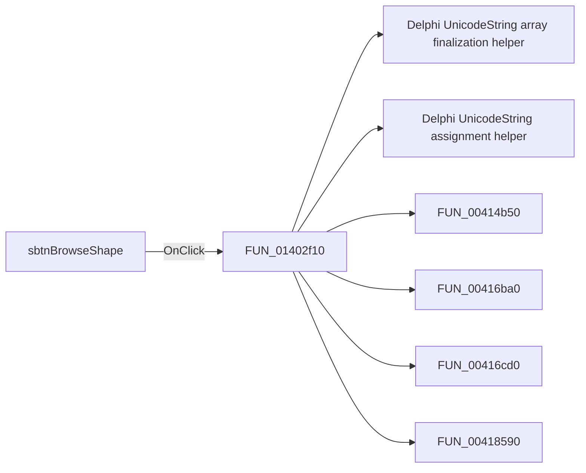

# sbtnBrowseShape

> Analysis status: Pending individual source review.

## Control

| Property | Recovered value |
| --- | --- |
| Form | CspEditorDlg |
| Component path | CspEditorDlg.pnlIO.sbtnBrowseShape |
| Control class | TSpeedButton |
| Caption | Not present in the recovered resource. |
| Hint | Not present in the recovered resource. |
| Text | Not present in the recovered resource. |
| Handler name | sbtnBrowseShapeClick |
| Handler address | 01402f10 |
| Graph node | `resource:dfm:CspEditorDlg/CspEditorDlg.pnlIO.sbtnBrowseShape` |
| Handler node | `function:01402f10` |
| Graph layer | UI |

## What happens when clicked

Pending individual analysis. An agent must read the recovered handler source and its relevant callees before it replaces this text.

## Click flow

## Handler evidence

- Source: [DecompiledSources/Tina16/functions/0000000001402F10__FUN_01402f10.c](../../../DecompiledSources/Tina16/functions/0000000001402F10__FUN_01402f10.c)
- Recovered role: Not present in the recovered resource.
- Current graph summary: Handles 1 Delphi UI event: CspEditorDlg.pnlIO.sbtnBrowseShape.OnClick.
- Current graph behavior: Not present in the recovered resource.
- Current graph evidence: Not present in the recovered resource.
- Complexity: complex
- Distinct outgoing calls: 12

## Direct calls

- `function:00414560` — Delphi UnicodeString array finalization helper
- `function:00414ad0` — Delphi UnicodeString assignment helper
- `function:00414b50` — FUN_00414b50
- `function:00416ba0` — FUN_00416ba0
- `function:00416cd0` — FUN_00416cd0
- `function:00418590` — FUN_00418590
- `function:0043f750` — FUN_0043f750
- `function:0064de00` — VCL control text setter with change suppression
- `function:00c86a90` — FUN_00c86a90
- `function:00f04d50` — FUN_00f04d50
- `function:01402e80` — FUN_01402e80
- `function:0198b200` — FUN_0198b200

## Resource evidence

- Kind: Not present in the recovered resource.
- Modal result: Not present in the recovered resource.
- Checked state: Not present in the recovered resource.
- List items: Not present in the recovered resource.
- Image reference: Not present in the recovered resource.
- Extracted glyph: [`0040_CspEditorDlg_CspEditorDlg_pnlIO_sbtnBrowseShape_Glyph_Data.png`](../../../glyph/0040_CspEditorDlg_CspEditorDlg_pnlIO_sbtnBrowseShape_Glyph_Data.png)

## Nearby label candidates

Nearby labels are layout candidates only. They are not proof of behavior.

- Rank 1: &Shape: at distance 197.

## Analysis limits

- Do not infer behavior from the control class, caption, hint, glyph, or nearby label alone.
- Do not replace the pending status until the handler source and relevant call path provide enough evidence.
