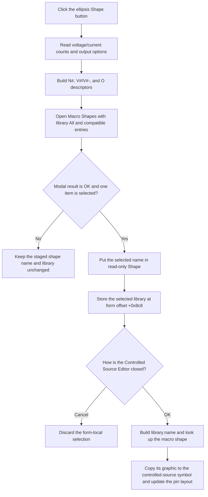

# sbtnBrowseShape

> Analysis status: Evidence-backed source review complete.

## Control

| Property | Recovered value |
| --- | --- |
| Form | CspEditorDlg |
| Form caption | Controlled Source Editor |
| Component path | CspEditorDlg.pnlIO.sbtnBrowseShape |
| Control class | TSpeedButton |
| Caption | Not present in the recovered resource. |
| Hint | Not present in the recovered resource. |
| Nearby label | &Shape: |
| Handler name | sbtnBrowseShapeClick |
| Handler address | 01402f10 |
| Graph node | `resource:dfm:CspEditorDlg/CspEditorDlg.pnlIO.sbtnBrowseShape` |
| Handler node | `function:01402f10` |
| Graph layer | UI |

## What happens when clicked

This button opens the custom **Macro Shapes** selector. It does not open a file browser. The handler first builds a compatibility filter from the values that are currently staged in the Controlled Source Editor:

- For each value in **Number of voltages**, it adds the recovered descriptor `N1`, `N2`, and so on.
- For each value in **Number of currents**, it adds a pair of recovered descriptors, such as `V1` and `V1-`.
- It adds `O(V)` when **Voltage** is selected, or `O(I)` when **Current** is selected.
- If **Differential** is selected, it also adds `O-(V)` or `O-(I)`.

The descriptor letters are recovered program strings. Their original Delphi field names are not available, so this article does not assign a wider meaning to `N` or `V`.

The handler passes this list to `frmDeviceList`. That dialog filters the global macro-shape catalog with the list and shows only compatible entries. Its library selector starts at item 0, **All**. The displayed shape list starts with no selection, and the search edit is reset to `Search`. The handler does not pass the current Shape value to the selector, so it does not preselect the shape that is already staged.

If the user accepts the selector and a list item is selected, the handler makes two form-local updates:

1. It writes the selected display name to the read-only **Shape** edit.
2. It copies the selected catalog entry's library string to a hidden form string at offset `+0x8c8`.

The first update is the only immediate visible feedback. The handler does not update a separate preview, change the controlled-source model, or close the editor. A later accepted selection replaces both staged values.

If the user cancels the selector, or accepts it with no selected item, the handler leaves both values unchanged.

## Click flow

## Staging, validation, and persistence

- `edShape` is read-only. This browse path sets its text programmatically.
- The click handler reads the bounded integer-edit controls when it builds the filter. The integer reader can report a range or format error. The handler has no local exception handler.
- The shape selector applies its compatibility test while it builds the displayed list. There is no file path, initial directory, file filter, or file-system validation in this path.
- The handler sets the visible name before it stores the hidden library value. It has no local rollback if a later assignment raises an exception. The recovered code does not show that such a failure occurred.
- The selector has no local preview. Its owner-draw list is the selection view, and `edShape` is the editor's visible staged result.
- The editor's built-in **Cancel** button has no application event handler. It closes the modal form without calling `btnOKClick`, so the staged shape does not reach the controlled-source model.
- On editor **OK**, `FUN_01403320` reads the staged shape name and hidden library value and calls `FUN_013ff530`. A non-empty name becomes `library:name`; the catalog lookup supplies the macro graphic that is copied to the source symbol. The same operation updates the source pin count and layout.
- If Shape is empty on editor **OK**, `FUN_013ff530` generates the default controlled-source graphic from the current counts and output options instead of using a catalog shape.
- The downstream lookup has no explicit stale-selection check before it reads the returned catalog entry. Under normal use, the selector provides an entry from the same global catalog.

## Handler evidence

- Primary source: [FUN_01402f10](../../../DecompiledSources/Tina16/functions/0000000001402F10__FUN_01402f10.c)
- Filter-item helper: [FUN_01402e80](../../../DecompiledSources/Tina16/functions/0000000001402E80__FUN_01402e80.c)
- Selector constructor: [FUN_00c86a90](../../../DecompiledSources/Tina16/functions/0000000000C86A90__FUN_00c86a90.c)
- Selector initialization: [FUN_00c86cb0](../../../DecompiledSources/Tina16/functions/0000000000C86CB0__FUN_00c86cb0.c)
- Catalog filtering: [FUN_00c86f80](../../../DecompiledSources/Tina16/functions/0000000000C86F80__FUN_00c86f80.c)
- Search reset: [FUN_00c86f20](../../../DecompiledSources/Tina16/functions/0000000000C86F20__FUN_00c86f20.c)
- Editor OK handler: [FUN_01403320](../../../DecompiledSources/Tina16/functions/0000000001403320__FUN_01403320.c)
- Symbol-shape application: [FUN_013ff530](../../../DecompiledSources/Tina16/functions/00000000013FF530__FUN_013ff530.c)
- UI resource evidence: [ui-evidence.json](../../../DecompiledSources/Tina16/resources/dfm/ui-evidence.json)
- Complexity: complex; 12 distinct outgoing calls.

## Resource and image evidence

- The same panel contains a read-only `edShape` control and the nearby label **&Shape:**.
- The extracted 9 x 9 glyph is an ellipsis. It supports a browse or more action, while the handler proves that the target is the Macro Shapes selector.
- Extracted glyph: [0040_CspEditorDlg_CspEditorDlg_pnlIO_sbtnBrowseShape_Glyph_Data.png](../../../glyph/0040_CspEditorDlg_CspEditorDlg_pnlIO_sbtnBrowseShape_Glyph_Data.png)
- The selector resource has caption **Macro Shapes**, an owner-draw device list, a **Library** selector with **All**, a search edit, and built-in OK and Cancel buttons.

## Analysis limits

- Recovered object fields do not retain their original Delphi names. The form offsets in this article identify fields only where component access or later use proves their role.
- The recovered source proves the selector's filter, accepted-selection updates, and later model application. It does not prove an error message or recovery path for allocation, modal creation, catalog changes, or string-assignment failures.
