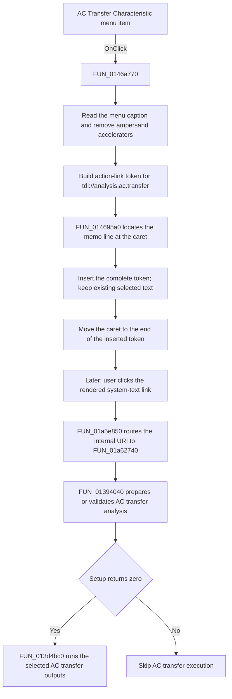

# AC Transfer Characteristic

> Analysis status: Source reviewed. The handler, shared insertion routine, and
> later internal-link dispatcher support the documented behavior.

## Control

| Property | Recovered value |
| --- | --- |
| Form | CSysTextDlg |
| Component path | CSysTextDlg.DeepLinkPopUpMnu.ACAnalysisMnu.ACTransferCharacteristicMnu |
| Control class | TMenuItem |
| Caption | AC Transfer Characteristic |
| Hint | Not present in the recovered resource. |
| Text | Not present in the recovered resource. |
| Handler name | ACTransferCharacteristicMnuClick |
| Handler address | 0146a770 |
| Graph node | `resource:dfm:CSysTextDlg/CSysTextDlg.DeepLinkPopUpMnu.ACAnalysisMnu.ACTransferCharacteristicMnu` |
| Handler node | `function:0146a770` |
| Graph layer | UI |

## What happens when clicked

This command inserts an AC transfer action link into the system-text memo. It
does not start AC transfer analysis during this click.

`FUN_0146a770` reads the caption of this menu item from the form field at
offset `0x8a8`. It removes every `&` accelerator marker from that caption. The
recovered resource caption has no accelerator marker, so the display label is
`AC Transfer Characteristic`. The handler then joins three strings:

```text
\a( + AC Transfer Characteristic + ,tdl://analysis.ac.transfer)
```

The exact inserted text is therefore:

```text
\a(AC Transfer Characteristic,tdl://analysis.ac.transfer)
```

The runtime data at `0146a898` is the one-character string `&`. The data at
`0146a8a8` is `\a(`. The visible source also contains the fixed suffix
`,tdl://analysis.ac.transfer)`. This evidence establishes both the link label
and the internal target.

The handler passes the complete token to `FUN_014695a0`. This shared routine
uses the memo at form offset `0x6e8`:

1. It reads the absolute caret position.
2. It walks the memo lines and counts each line length plus two characters for
   CRLF until it finds the line that contains the caret.
3. It inserts the complete token into that line at the caret position.
4. It writes the changed line back to the memo line collection.
5. It sets the caret to the old absolute position plus the token length.

The token is inserted before the character at the caret. The routine does not
read a selection length and does not delete selected text. It therefore does
not implement replace-selection behavior. After insertion, the caret is after
the new action-link token.

The later action is separate from this menu click. When a user clicks the
rendered system text in the schematic editor, `FUN_01c70d20` calls
`FUN_01a5e850` with the current circuit context. That function extracts the
clicked link target. A target that contains `tdl://` goes to
`FUN_01a62740`, not to the operating-system URL opener. The internal dispatcher
removes the `tdl://` prefix, splits multiple commands at `;`, recognizes
`analysis.ac.transfer`, and calls the AC transfer setup path. It runs
`FUN_013d4bc0` only when `FUN_01394040` returns zero. The output mask is the
configured global AC-result mask, or `0x1f` when that mask is zero.

## Click flow



## State, persistence, and no-op paths

- The immediate state change is limited to the memo line collection and its
  caret position. The handler does not change analysis settings, run an
  analysis, close the form, or write a file.
- `MemoExit` (`FUN_0146b040`) copies the memo lines into the form's text and
  preview model. `FormClose` (`FUN_0146ab60`) also copies the memo lines and
  related text state into that model. These are in-memory transfer boundaries;
  the recovered code does not prove durable storage at either point.
- `SaveMnuClick` and `SaveAsMnuClick` use `FUN_0146c470`. That routine opens a
  file dialog for `Tina equation (*.teq)|*.teq` and writes the memo lines only
  after the user accepts a non-empty file name. This explicit save command is
  the proven disk-persistence boundary.
- The menu handler has no validation branch, no error message, and no
  recovered no-op branch in a valid form state. It always builds the non-empty
  token and calls the insertion routine.
- On the later navigation path, an empty extracted target does not dispatch an
  action. A missing circuit context makes the internal dispatcher return
  without action. For `analysis.ac.transfer`, a nonzero result from the AC
  transfer setup path prevents analysis execution. Any setup error reporting
  is owned by that setup path, not by this menu handler.

## Handler evidence

- Source: [FUN_0146a770](../../../DecompiledSources/Tina16/functions/000000000146A770__FUN_0146a770.c)
- Recovered role: Insert an AC transfer action link at the current system-text
  memo caret.
- Current graph summary: Handles 1 Delphi UI event:
  `CSysTextDlg.DeepLinkPopUpMnu.ACAnalysisMnu.ACTransferCharacteristicMnu.OnClick`.
- Current graph behavior: The checked-in graph does not yet contain a curated
  behavior description for this function.
- Complexity: complex
- Distinct outgoing calls: 6

The handler reads the caption string through form field `0x8a8` and its string
field `0x78`. Its sibling analysis-link handlers use the same caption field,
the same `\a(` prefix, and the same insertion helper, but they supply different
`tdl://analysis.*` targets. This repeated data flow confirms that the caption
is the visible link label and that the URI is the action target.

## Direct and later calls

Direct calls from `FUN_0146a770`:

- `function:005b84f0` forwards to the Delphi string-replacement routine. This
  call removes `&` from the menu caption.
- `function:00414b50` assigns the cleaned UnicodeString.
- `function:00416cd0` joins `\a(`, the cleaned caption, and the fixed URI
  suffix.
- `function:014695a0` inserts the joined string at the memo caret.
- `function:00414480` and `function:00414560` finalize temporary
  UnicodeStrings.

Relevant insertion and navigation sources:

- [FUN_014695a0](../../../DecompiledSources/Tina16/functions/00000000014695A0__FUN_014695a0.c)
  maps an absolute memo caret to one line, inserts the token, and advances the
  caret.
- [FUN_00416ea0](../../../DecompiledSources/Tina16/functions/0000000000416EA0__FUN_00416ea0.c)
  inserts a UnicodeString into another UnicodeString at a one-based position.
- [FUN_01c70d20](../../../DecompiledSources/Tina16/functions/0000000001C70D20__FUN_01c70d20.c)
  is the schematic editor mouse-down path that passes a clicked text link and
  the current circuit context to the link router.
- [FUN_01a5e850](../../../DecompiledSources/Tina16/functions/0000000001A5E850__FUN_01a5e850.c)
  extracts the clicked target and routes an internal `tdl://` target to the
  internal dispatcher.
- [FUN_01a62740](../../../DecompiledSources/Tina16/functions/0000000001A62740__FUN_01a62740.c)
  recognizes the `analysis.ac.transfer` command and gates execution on the AC
  transfer setup result.
- [FUN_01394040](../../../DecompiledSources/Tina16/functions/0000000001394040__FUN_01394040.c)
  is the AC transfer setup and validation path used before execution.
- [FUN_013d4bc0](../../../DecompiledSources/Tina16/functions/00000000013D4BC0__FUN_013d4bc0.c)
  creates the selected AC transfer result outputs.

## Resource evidence

- Parent menu: `DeepLinkPopUpMnu.ACAnalysisMnu`.
- Caption: `AC Transfer Characteristic`.
- Kind: Not present in the recovered resource.
- Modal result: Not present in the recovered resource.
- Checked state: Not present in the recovered resource.
- Hint: Not present in the recovered resource.
- List items: Not present in the recovered resource.
- Image reference: Not present in the recovered resource.
- Extracted glyph: None.

The caption is functional input for this handler. It becomes the visible label
inside the inserted action-link markup after accelerator removal.

## Nearby label candidates

Nearby labels are layout candidates only. They are not proof of behavior.

- No same-parent label candidate is available.

## Analysis limits

- The recovered code identifies the editor fields by offsets. It does not
  recover their original Delphi field names.
- The click handler inserts markup only. The rendered link must later be
  clicked in a circuit context before it can start the AC transfer path.
- `FUN_01394040` owns setup, validation, and any related error UI. This article
  does not infer a specific error message that is not present in this menu
  handler or its resource.
- The close and memo-exit handlers prove an in-memory copy to the form's text
  model. Only the explicit `.teq` save path proves disk persistence.
