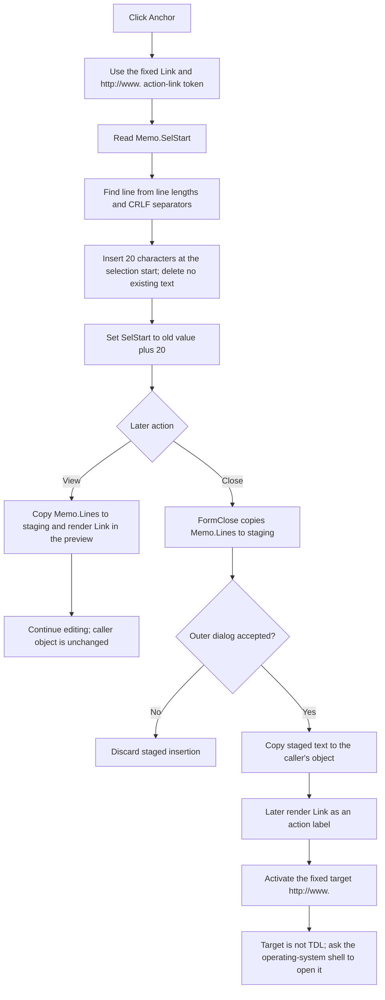

# Insert an external-link anchor template

> Analysis status: Complete. The recovered handler supplies the exact action-link token, and the shared insertion, preview, link-activation, and modal-owner paths establish its editor and persistence effects.

## Control

| Property | Recovered value |
| --- | --- |
| Form | CSysTextDlg |
| Component path | CSysTextDlg.ToolsPanel.ToolsNB.Edit.AnchorBtn |
| Control class | TSpeedButton |
| Caption | Not present in the recovered resource. |
| Hint | Anchor |
| Handler name | AnchorBtnClick |
| Handler address | 014698a0 |
| Graph node | `resource:dfm:CSysTextDlg/CSysTextDlg.ToolsPanel.ToolsNB.Edit.AnchorBtn` |
| Handler node | `function:014698a0` |
| Graph layer | UI |

## What happens when clicked

`FUN_014698a0` passes one fixed 20-character Unicode string to the form's common memo-insertion helper:

`\a(Link,http://www.)`

The handler does not read the button, the current document, or a dialog result before it acts. It does not open a URL during this click. Its direct effect is to insert this editable markup into `CSysTextDlg.MainNB.TPage.Memo`.

The recovered text system uses `\a(display,target)` as action-link markup. For this template:

| Part | Inserted value |
| --- | --- |
| Display text | `Link` |
| Target | `http://www.` |

The literal target ends after the final dot. The handler does not append a host name, select the target, or move the caret into it. A user must edit the memo text if a more specific URL is required.

## Selection, insertion, and caret behavior

`FUN_014695a0` performs the insertion:

1. It reads `Memo.SelStart`, the absolute start of the current selection.
2. It walks `Memo.Lines`, adding each line length and two characters for its CRLF separator, until it finds the line that contains that position.
3. It converts the absolute selection start to a one-based position within that line.
4. It inserts the complete 20-character token at that position and writes the changed line back to `Memo.Lines`.
5. It sets `Memo.SelStart` to the old value plus 20.

For a zero-length selection, the caret therefore ends immediately after the closing parenthesis. The helper never reads `Memo.SelLength`, never calls a selected-text replacement operation, and never deletes the characters that follow the insertion point. If text was selected, the token is inserted at the selection start and the original selected characters remain in the memo.

The recovered code does not establish what the VCL line assignment and later `SelStart` setter do to a nonzero `SelLength`. It proves the new selection-start position, but it does not prove whether an existing selection highlight is cleared or retained.

## Rendering and later activation

The click itself stays on the edit page and does not call the preview renderer. If the user later changes to the View page, `ViewBtnClick` calls `FUN_0146af40`. That paint path copies the current memo lines into the staged formatted-text record, measures and resizes the preview, and renders the formatted text. In the rendered form, the `\a(...)` markup supplies the visible action label `Link` and the target `http://www.`.

Activation is separate from insertion. `FUN_01a5e850` extracts the target at an activated formatted-text position. It sends targets containing `tdl://` to the internal TDL dispatcher. The inserted `http://www.` target does not contain that scheme, so it follows the external shell-open path with the verb `open`.

If the token is not edited, later activation attempts to open exactly `http://www.`. The activation routine does not inspect the shell-open return value and does not provide a control-specific error message when the operating system cannot resolve that target.

## Staging, OK, and Cancel

The insertion first changes only `Memo.Lines`. It reaches the dialog's private staged system-text object through any of these recovered synchronization paths:

- `Memo.OnExit`, recovered as `FUN_0146b040`, copies the memo lines into the staged formatted-text record.
- `DrawRectangle.OnPaint`, recovered as `FUN_0146af40`, performs the same copy before preview measurement and rendering.
- `CSysTextDlg.OnClose`, recovered as `FUN_0146ab60`, copies the final memo lines and font into the staged object before the modal caller handles the result.

The click does not copy this staged value into a caller-owned object and does not save a document or file. A recovered existing-object owner, `FUN_0149e8d0`, copies the staged object back only when `ShowModal` returns `1` (`mrOK`). Its Cancel path destroys the dialog without that copy. A recovered new-object path, `FUN_01a7a4a0`, rejects modal result `2` (`mrCancel`) and also requires non-empty staged lines before it keeps the new object.

Therefore, OK can preserve the inserted anchor in the caller's in-memory system-text object. Cancel can run the close-time synchronization, but the owner still discards that staged insertion. Later document persistence is outside this control's path.

## Click, commit, and activation flow

## Handler evidence

- Anchor handler: [FUN_014698a0](../../../DecompiledSources/Tina16/functions/00000000014698A0__FUN_014698a0.c)
- Shared memo insertion: [FUN_014695a0](../../../DecompiledSources/Tina16/functions/00000000014695A0__FUN_014695a0.c)
- Unicode insertion primitive: [FUN_00416ea0](../../../DecompiledSources/Tina16/functions/0000000000416EA0__FUN_00416ea0.c)
- Memo exit synchronization: [FUN_0146b040](../../../DecompiledSources/Tina16/functions/000000000146B040__FUN_0146b040.c)
- View-page and preview entry: [FUN_0146a6e0](../../../DecompiledSources/Tina16/functions/000000000146A6E0__FUN_0146a6e0.c)
- Preview rendering: [FUN_0146af40](../../../DecompiledSources/Tina16/functions/000000000146AF40__FUN_0146af40.c)
- Form close synchronization: [FUN_0146ab60](../../../DecompiledSources/Tina16/functions/000000000146AB60__FUN_0146ab60.c)
- Existing-object modal owner: [FUN_0149e8d0](../../../DecompiledSources/Tina16/functions/000000000149E8D0__FUN_0149e8d0.c)
- New-object modal owner: [FUN_01a7a4a0](../../../DecompiledSources/Tina16/functions/0000000001A7A4A0__FUN_01a7a4a0.c)
- Rendered-link target extraction: [FUN_01a5e7d0](../../../DecompiledSources/Tina16/functions/0000000001A5E7D0__FUN_01a5e7d0.c)
- Rendered-link routing: [FUN_01a5e850](../../../DecompiledSources/Tina16/functions/0000000001A5E850__FUN_01a5e850.c)
- Recovered role: Inserts an editable external-link anchor template at the memo's selection start.
- Input: The CSysTextDlg instance and the fixed literal `\a(Link,http://www.)`.
- Decision: The handler has no branch. The insertion helper derives a line and in-line position from `Memo.SelStart`.
- State change: Changes one memo line and advances `Memo.SelStart` by 20.
- Direct output: Editable action-link markup in the memo. No navigation, preview, owner-object commit, or file save occurs during the click.
- Complexity: simple
- Distinct outgoing calls: 1

## Direct calls

- `function:014695a0` - Inserts a supplied string into `Memo.Lines` at `SelStart` and then advances `SelStart`. This shared function is documented by its existing canonical annotation and is not duplicated in this control's annotation fragment.

## Resource evidence

- The control is a 25 by 25 `TSpeedButton` on the Edit tools page.
- Its recovered hint is `Anchor`; it has no caption, text, action, or image-list index.
- Extracted glyph: [`0049_CSysTextDlg_CSysTextDlg_ToolsPanel_ToolsNB_Edit_AnchorBtn_Glyph_Data.png`](../../../glyph/0049_CSysTextDlg_CSysTextDlg_ToolsPanel_ToolsNB_Edit_AnchorBtn_Glyph_Data.png)
- The glyph is a 21 by 21 chain-link image. It came from a 374-byte Delphi BMP and was extracted as a 242-byte PNG. The glyph supports the link meaning, while the fixed `\a(...)` literal and activation path establish the behavior.
- No same-parent label candidate is available.

## Error, no-op, and evidence limits

- The handler has no intentional no-op path. Its fixed source token is non-empty, so every click attempts an insertion.
- It does not validate `SelStart`, the line index, the markup, or the external target. The helper assumes that the VCL selection start maps to a valid memo line.
- The handler and insertion helper have no local exception handler. A Unicode allocation, line access, line assignment, or selection update exception propagates through the Delphi runtime. Because the line write occurs before the `SelStart` update, a failure in the final setter can leave the text inserted without the requested selection-start move.
- The source proves that selected document characters are not deleted. It does not prove the final nonzero `SelLength` state after the VCL operations.
- The source establishes an external shell-open attempt for the literal target. It does not establish that `http://www.` resolves successfully on a specific system.
- Cancel is a no-op only for the caller-owned object; the memo and staged copy can change before the dialog is discarded.
