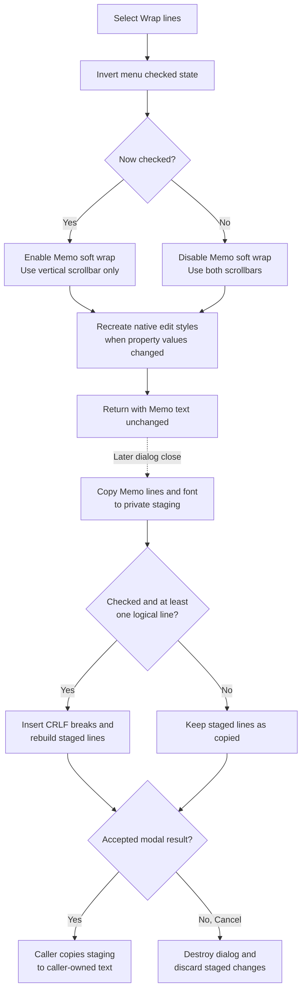

# Toggle display wrapping and optional close-time reflow

> Analysis status: Complete. The menu item toggles soft wrapping in the Memo and changes its scrollbars immediately. If it remains checked when the dialog closes, the form also rebuilds the staged text with real line breaks.

## Control

| Property | Recovered value |
| --- | --- |
| Form | CSysTextDlg |
| Form caption | Text |
| Component path | CSysTextDlg.TTPopupMnu.AutoWrapMnu |
| Control class | TMenuItem |
| Caption | Wrap lines |
| Hint | Not present in the recovered resource. |
| Handler name | AutoWrapMnuClick |
| Handler address | 0146c620 |
| Graph node | `resource:dfm:CSysTextDlg/CSysTextDlg.TTPopupMnu.AutoWrapMnu` |
| Handler node | `function:0146c620` |
| Graph layer | UI |

## What happens when clicked

`FUN_0146c620` reads the menu item's checked byte at offset `+0x80` and writes
its inverse through the VCL menu-item checked setter. It then uses the new
checked state for two Memo properties:

- Checked sets the Memo word-wrap Boolean to true and its scrollbar mode to
  value `2`, which is vertical scrolling only.
- Unchecked sets word wrap to false and the scrollbar mode to value `3`, which
  is both horizontal and vertical scrolling.

The recovered native-style tables confirm these meanings. Scrollbar mode `2`
adds `WS_VSCROLL` (`0x00200000`), while mode `3` adds both `WS_HSCROLL`
(`0x00100000`) and `WS_VSCROLL`. The word-wrap Boolean removes
`ES_AUTOHSCROLL` (`0x80`) when true and keeps it when false.

Each Memo setter compares the requested value with its current field. If the
value changes and the Memo has a native handle, it sends Delphi control message
`0xB033` to recreate the native edit window with the new styles. This produces
the immediate visual reflow and scrollbar change. The click handler does not
change `Memo.Lines`, the staged text object, or the caller-owned object.

## Repeated clicks

Every click inverts the menu check and then aligns both Memo properties with
that new state. Thus, consecutive clicks alternate between:

- checked, soft wrapping enabled, vertical scrollbar only; and
- unchecked, soft wrapping disabled, horizontal and vertical scrollbars.

If the Memo already has one of the requested property values, that individual
setter does not recreate the control. The handler still applies the other
property and leaves the menu and both property targets aligned. Turning the
option on and then off does not itself add or remove text characters because
both changes are display-style operations.

## Close-time conversion and ownership

The checked state also guards a later, separate operation in `FormClose`.
First, `FormClose` copies the current Memo lines and font into the dialog's
private staged system-text object. If **Wrap lines** is checked and the Memo has
at least one logical line, it then rebuilds the staged line collection:

1. It estimates a maximum character count from the Memo width, current font,
   and measured width of the first line.
2. If the first line is empty, it measures the seven-character literal
   `History` as a non-empty width sample.
3. It passes each original line to `FUN_004511f0`. The underlying wrapper
   inserts CRLF sequences at whitespace boundaries to keep segments near the
   estimated count.
4. It replaces the staged line collection with the resulting wrapped lines.

This is a hard line-break conversion in the staged object. It is distinct from
the click handler's immediate soft display wrapping.

No recovered path copies a wrap Boolean from the supplied system-text object
into this menu item, and `FormClose` does not store the menu check as a model
field. The check is form-local. Its durable effect is only the line breaks that
the close handler can add to staged text.

The built-in OK button returns modal result `1`. The inspected existing-object
caller copies the staged object to its caller-owned object only for that result.
Cancel returns result `2`. `FormClose` still runs and can wrap the private
staging object, but the caller then destroys the dialog without copying it
back. Therefore, Cancel discards the close-time conversion.

The separate Save command writes the current `Memo.Lines` directly to a `.teq`
file. It does not serialize this menu check or call the close-time conversion.
Soft wrapping alone therefore does not add saved line breaks through that
command.

## Click and commit flow

## No-op and error paths

- The handler has no cancel or validation branch. Each click always toggles the
  menu check.
- The Memo property setters are no-ops only when their target values already
  equal the requested values.
- `FormClose` skips hard wrapping when the item is unchecked or the Memo line
  count is zero.
- Neither the handler nor the close-time wrapper catches exceptions or restores
  earlier state. A failure after the menu check changes can leave that check
  updated while a later Memo style or staging operation is incomplete.
- The recovered handler does not explicitly restore the caret, selection, or
  scroll position after native-window recreation. Any preservation is VCL
  behavior outside this application handler.

## Evidence

- [Wrap-lines handler `FUN_0146c620`](../../../DecompiledSources/Tina16/functions/000000000146C620__FUN_0146c620.c) inverts the menu check, assigns the result to the Memo wrap property, and selects scrollbar mode `2` or `3`.
- [Menu checked setter `FUN_007e2d20`](../../../DecompiledSources/Tina16/functions/00000000007E2D20__FUN_007e2d20.c) updates the checked byte only when it changes and synchronizes an existing native menu item.
- [Memo word-wrap setter `FUN_00682f00`](../../../DecompiledSources/Tina16/functions/0000000000682F00__FUN_00682f00.c) stores the Boolean at `+0x4E1` and requests native-window recreation when it changes.
- [Memo scrollbar setter `FUN_00682ee0`](../../../DecompiledSources/Tina16/functions/0000000000682EE0__FUN_00682ee0.c) stores the mode at `+0x4E0` and requests the same recreation when it changes.
- [Memo create-parameters builder `FUN_00682ae0`](../../../DecompiledSources/Tina16/functions/0000000000682AE0__FUN_00682ae0.c) applies the recovered word-wrap and scrollbar style tables to the native `EDIT` control.
- [Recreation request `FUN_00655b90`](../../../DecompiledSources/Tina16/functions/0000000000655B90__FUN_00655b90.c) sends message `0xB033` only when the control has a native handle.
- [Form close handler `FUN_0146ab60`](../../../DecompiledSources/Tina16/functions/000000000146AB60__FUN_0146ab60.c) copies Memo content into staging and uses this menu item's checked byte as the close-time wrap guard.
- [Line-wrap entry `FUN_004511f0`](../../../DecompiledSources/Tina16/functions/00000000004511F0__FUN_004511f0.c) supplies CRLF and whitespace-boundary data to the recovered wrapping routine.
- [Line-wrap routine `FUN_00450d60`](../../../DecompiledSources/Tina16/functions/0000000000450D60__FUN_00450d60.c) splits text near the supplied maximum count and inserts the supplied CRLF delimiter.
- [Model-to-form loader `FUN_0146a9a0`](../../../DecompiledSources/Tina16/functions/000000000146A9A0__FUN_0146a9a0.c) loads the staged text, font, background, border, and popup-text state but does not set the wrap menu item.
- [Save As handler `FUN_0146c470`](../../../DecompiledSources/Tina16/functions/000000000146C470__FUN_0146c470.c) writes `Memo.Lines` directly after an accepted file dialog.
- [Existing-object caller `FUN_0149e8d0`](../../../DecompiledSources/Tina16/functions/000000000149E8D0__FUN_0149e8d0.c) copies staging back only after modal result `1`.

## Resource and image evidence

- The recovered caption is **Wrap lines**. The item is in the text-tool popup
  with file, clipboard, popup-text, background, border, and properties commands.
- The resource has no stored `Checked` property. The handler owns its runtime
  checked state.
- The item has no hint, action, glyph, picture, image-list reference, or nearby
  label. Its behavior is established by the handler, native-style tables, and
  close-time state consumer rather than by image evidence.

## Analysis limits

- Original Delphi field and property names are absent. Native style values and
  repeated use in the `EDIT` create-parameters path establish the word-wrap and
  scrollbar interpretations.
- Native control recreation can have VCL-managed effects not visible in this
  handler. The recovered application source does not prove final selection or
  scroll-position preservation.
- The resource and inspected loader do not persist the check state. An
  unobserved external writer could still alter the menu item while the form is
  open.
