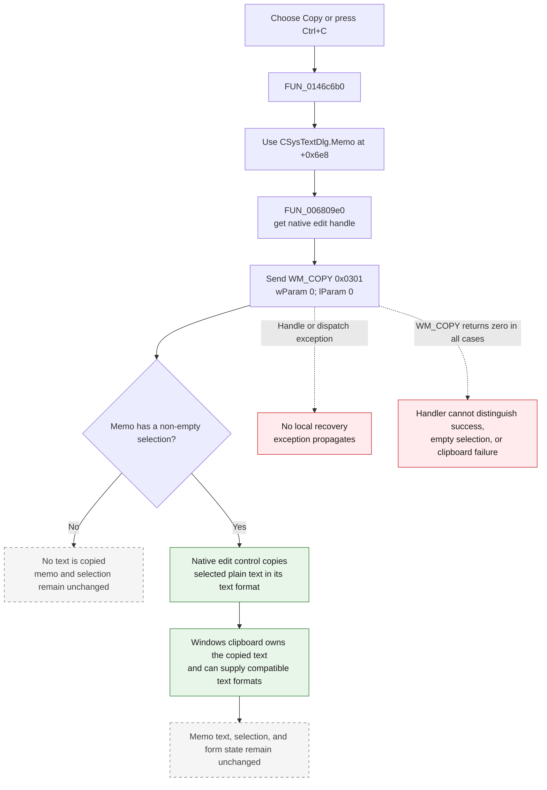

# Copy selected text

> Analysis status: Complete. The recovered menu handler, shared VCL edit helper, native edit message, memo field usage, paired Cut and Paste handlers, Select all command, and whole-text copy button establish the behavior.

## Control

| Property | Recovered value |
| --- | --- |
| Form | CSysTextDlg |
| Form caption | Text |
| Component path | CSysTextDlg.TTPopupMnu.CopyMnu |
| Parent menu | TTPopupMnu |
| Control class | TMenuItem |
| Caption | Copy |
| Shortcut | Ctrl+C (`16451`) |
| Hint | Not present in the recovered resource. |
| Handler name | CopyMnuClick |
| Handler address | 0146c6b0 |
| Graph node | `resource:dfm:CSysTextDlg/CSysTextDlg.TTPopupMnu.CopyMnu` |
| Handler node | `function:0146c6b0` |
| Graph layer | UI |

## What happens when selected

The command asks the form's `Memo` control to copy its current text selection to the Windows clipboard. It does not select text first and does not copy the complete memo unless the user has already selected all of it.

`FUN_0146c6b0` passes form field `+0x6e8` to `FUN_006809e0`. Other form functions identify this field as `CSysTextDlg.MainNB.TPage.Memo`, a `TMemo` multiline text box. The shared helper gets or creates the memo's native window handle and sends message `0x0301` with zero for both message parameters. `0x0301` is `WM_COPY`.

The standard edit-control contract copies the current selection, if present, without deleting it. The recovered handler does not read the selection, transform its text, or use a TINA-specific clipboard object.

## Selection and clipboard data

| Aspect | Proven behavior |
| --- | --- |
| Source | The current selected range in `Memo` at form field `+0x6e8`. |
| Selection scope | Only the existing selection. The handler sends no `EM_SETSEL` or other selection-changing message. |
| Clipboard message | `WM_COPY` (`0x0301`) with `wParam = 0` and `lParam = 0`. |
| Clipboard format contract | Microsoft documents `WM_COPY` as placing the selected text on the clipboard in `CF_TEXT`. The recovered TINA code does not select a clipboard format itself. |
| Unicode control behavior | `Memo` is a Delphi Unicode `TMemo`. Compatible Unicode edit-control implementations publish `CF_UNICODETEXT`; the recovered application code cannot establish which primary text format the target Windows edit control uses. |
| Data | Plain selected text. Standard clipboard text formats contain line breaks and a terminating null character. |
| Converted formats | Windows can synthesize compatible text formats for a consumer. This conversion is controlled by Windows, not this handler. |
| Not copied | Unselected memo text, font, colors, paragraph settings, rendered drawing data, and TINA object metadata. |
| Memo text | Unchanged. `WM_COPY` copies without deleting or replacing the selection. |
| Form state | No application field, modified flag, save flag, or dialog result is changed by this handler. |

The source does not call `OpenClipboard`, `EmptyClipboard`, `SetClipboardData`, or a rich-text clipboard API directly. The native edit control owns those details after it receives `WM_COPY`. Therefore, the binary proves a native plain-text copy request, but it does not prove whether the control publishes `CF_TEXT` or `CF_UNICODETEXT` as its primary format.

## Copy flow

## Relationship to Select all and whole-text copy

The popup command does not select the entire memo. Two neighboring handlers prove the distinction:

- `Selectall1Click` calls `FUN_00680ad0`, which sends `EM_SETSEL` (`0x00b1`) with start `0` and end `-1`. This selects all memo text but does not copy it.
- `TDCopyBtnClick`, whose button hint is **Copy to Clipboard**, first calls the same select-all helper and then calls `FUN_006809e0`. That toolbar action copies the complete memo because it explicitly selects all first.

`CopyMnuClick` calls only the copy helper. Therefore, Copy uses the selection that existed when the popup command ran.

## Relationship to Cut and Paste

The three popup commands target the same memo and use adjacent shared VCL edit helpers:

| Command | Handler | Native message | Text effect |
| --- | --- | --- | --- |
| Cut | `FUN_0146c690` | `WM_CUT` (`0x0300`) | Copies the current selection by native edit-control rules and deletes it from the memo. |
| Copy | `FUN_0146c6b0` | `WM_COPY` (`0x0301`) | Copies the current selection without changing memo text. |
| Paste | `FUN_0146c6d0` | `WM_PASTE` (`0x0302`) | Inserts clipboard text at the edit control's insertion point and can replace a selection. |

Their resource shortcuts are Ctrl+X, Ctrl+C, and Ctrl+V. Copy is the only one of the three that transfers selected text out without changing the memo.

## Handler and platform evidence

- Copy menu handler: [FUN_0146c6b0](../../../DecompiledSources/Tina16/functions/000000000146C6B0__FUN_0146c6b0.c)
- Shared edit-copy helper: [FUN_006809e0](../../../DecompiledSources/Tina16/functions/00000000006809E0__FUN_006809e0.c)
- Native-handle getter: [FUN_0065b870](../../../DecompiledSources/Tina16/functions/000000000065B870__FUN_0065b870.c)
- Cut menu handler and helper: [FUN_0146c690](../../../DecompiledSources/Tina16/functions/000000000146C690__FUN_0146c690.c), [FUN_00680a10](../../../DecompiledSources/Tina16/functions/0000000000680A10__FUN_00680a10.c)
- Paste menu handler and helper: [FUN_0146c6d0](../../../DecompiledSources/Tina16/functions/000000000146C6D0__FUN_0146c6d0.c), [FUN_00680a40](../../../DecompiledSources/Tina16/functions/0000000000680A40__FUN_00680a40.c)
- Select-all menu handler and helper: [FUN_0146ca10](../../../DecompiledSources/Tina16/functions/000000000146CA10__FUN_0146ca10.c), [FUN_00680ad0](../../../DecompiledSources/Tina16/functions/0000000000680AD0__FUN_00680ad0.c)
- Whole-memo toolbar copy: [FUN_0146c5f0](../../../DecompiledSources/Tina16/functions/000000000146C5F0__FUN_0146c5f0.c)
- Microsoft `WM_COPY` contract: [WM_COPY message](https://learn.microsoft.com/en-us/windows/win32/dataxchg/wm-copy)
- Microsoft edit selection behavior: [Edit Control Text Operations](https://learn.microsoft.com/en-us/windows/win32/controls/edit-controls-text-operations)
- Microsoft text-format definitions: [Standard Clipboard Formats](https://learn.microsoft.com/en-us/windows/win32/dataxchg/standard-clipboard-formats)
- Compatible Unicode edit implementation: [ReactOS edit control](https://doxygen.reactos.org/d0/dbb/win32ss_2user_2user32_2controls_2edit_8c.html)
- Recovered role: Copy the current CSysTextDlg memo selection to the Windows clipboard.
- Likely Delphi method: `TCSysTextDlg.CopyMnuClick`.
- Complexity: simple
- Distinct outgoing calls: 1

## Empty selection and error behavior

- Empty selection: the standard edit control has no selected text to copy. The command does not select a word, a line, or the complete memo. It makes no memo or form-state change and does not explicitly clear the clipboard.
- Non-empty selection: the clipboard receives the selected plain text. The memo retains the same text and selected range.
- Clipboard status: `WM_COPY` always returns zero. The helper ignores the message result, so the handler cannot report whether data changed, the selection was empty, or the clipboard operation failed.
- Clipboard contention or allocation failure: the application has no retry, fallback format, or error dialog in this path. Native edit-control behavior decides the result.
- Handle creation: the shared helper obtains the memo handle before it sends the message. The handler has no local exception block, so a Delphi exception during handle creation or dispatch propagates out of the click handler.
- Password restriction: `Memo` is a multiline `TMemo`, not a recovered password edit. The source contains no password-specific branch.

## Analysis limits

- The recovered code proves a native `WM_COPY` request. The Windows edit control, not application code, implements the final clipboard write.
- Microsoft documents `CF_TEXT` in the public `WM_COPY` contract. Compatible Unicode edit-control source uses `CF_UNICODETEXT`. Because TINA delegates the operation to its native edit control, this article does not choose between those primary formats or claim a byte representation for non-ASCII characters.
- The source contains no direct clipboard readback. It cannot prove which synthesized formats a later clipboard consumer requests.
