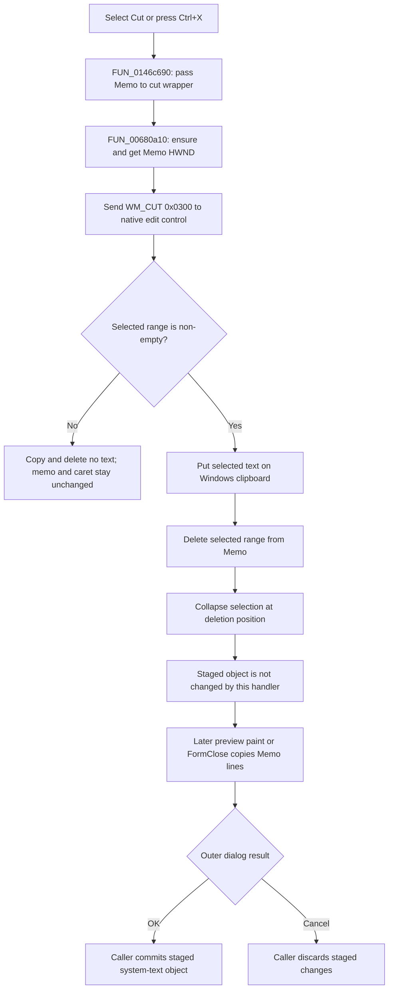

# Cut selected memo text

This menu command sends the native `WM_CUT` edit command to CSysTextDlg's memo. The native edit control copies its current selection to the Windows clipboard and deletes the selected range.

## Control

| Property | Recovered value |
| --- | --- |
| Form | CSysTextDlg |
| Component path | CSysTextDlg.TTPopupMnu.CutMnu |
| Control class | TMenuItem |
| Caption | Cut |
| Shortcut | Ctrl+X (`16472`, or `0x4058`) |
| Hint | Not present in the recovered resource. |
| Text | Not present in the recovered resource. |
| Handler name | CutMnuClick |
| Handler address | 0146c690 |
| Graph node | `resource:dfm:CSysTextDlg/CSysTextDlg.TTPopupMnu.CutMnu` |
| Handler node | `function:0146c690` |
| Graph layer | UI |

## What happens when selected

`FUN_0146c690` reads the `Memo` component from form field `+0x6e8` and passes it to `FUN_00680a10`. It does not read the selected text, selection bounds, or clipboard itself.

`FUN_00680a10` is the recovered Delphi VCL `TCustomEdit.CutToClipboard` wrapper. It calls `FUN_0065b870` to ensure that the edit control has a native window handle. It then sends message `0x0300` with zero `wParam` and `lParam` values through the recovered synchronous window-message thunk. `0x0300` is the Win32 [`WM_CUT`](https://learn.microsoft.com/en-us/windows/win32/dataxchg/wm-cut) message.

The native edit control performs the selection operation:

- It takes the current selected range from the memo.
- It publishes the selected text as standard text data on the Windows clipboard. The recovered wrapper does not select a clipboard format or create an application-specific clipboard object.
- It removes that range from the memo.
- It collapses the selection at the deletion position, which becomes the insertion point for later typing or pasting.

The text change is immediate in the memo control. The handler does not call the system-text preview paint function and does not copy the changed memo lines into the staged system-text object directly.

## Empty selection

There is no selection-length test in `CutMnuClick` or `FUN_00680a10`. The resource also has no popup event that disables `CutMnu` according to selection state. Therefore, the command can send `WM_CUT` when the selection is empty. In that case, the native control has no range to copy or delete, so the memo text and caret position do not change. The wrapper does not clear the clipboard before it sends the message and does not report a result to the form.

## Relationship to Copy and Paste

The adjacent commands use the same native edit-control path and the same `Memo` component:

- `CopyMnuClick` calls `FUN_006809e0`. That wrapper gets the edit handle and sends [`WM_COPY`](https://learn.microsoft.com/en-us/windows/win32/dataxchg/wm-copy) (`0x0301`). It copies the selection but does not delete it.
- `PasteMnuClick` calls `FUN_00680a40`. That wrapper gets the edit handle and sends [`WM_PASTE`](https://learn.microsoft.com/en-us/windows/win32/dataxchg/wm-paste) (`0x0302`). The native control inserts compatible clipboard text at the caret or replaces the current selection.

The DFM assigns the standard Ctrl+X, Ctrl+C, and Ctrl+V shortcuts to Cut, Copy, and Paste. All three operations use the Windows clipboard. They do not use a private CSysTextDlg buffer.

## Staged and committed state

CSysTextDlg edits a staged system-text object at form field `+0x8e0`. `FUN_0146a9a0` initializes this object from the caller's source and loads its text into `Memo`. Cutting text changes `Memo` first.

`FUN_0146af40`, the preview paint handler, copies the current memo lines into the staged object when a preview paint occurs. `FUN_0146ab60`, the form's `OnClose` handler, also copies the final memo lines into the staged object. The Cut handler does not call either function, so it does not force an immediate preview refresh.

The caller commits the staged object only after an accepted outer dialog result. For example, `FUN_0149e8d0` calls the system-text copy routine only when `ShowModal` returns `mrOK`. If the user later selects the outer `bkCancel` button, the caller discards the staged object. The caller's original system-text object remains unchanged. The Windows clipboard can still contain the cut selection until another clipboard operation replaces it.

## Cut flow

## Handler evidence

- Source: [FUN_0146c690](../../../DecompiledSources/Tina16/functions/000000000146C690__FUN_0146c690.c)
- Recovered role: Sends the native Cut command to CSysTextDlg's memo.
- Input: The `TMemo` component at form field `+0x6e8` and its native current selection.
- Decision: The application handler has no branch. The native edit control decides whether the current selection contains text.
- State change: A non-empty selection is copied to the Windows clipboard, removed from the memo, and collapsed to an insertion point.
- Output: Updated memo text and clipboard text, or no text change for an empty selection.
- Complexity: simple
- Distinct outgoing calls: 1

## Direct and related calls

- `function:00680a10` — [FUN_00680a10](../../../DecompiledSources/Tina16/functions/0000000000680A10__FUN_00680a10.c), the VCL edit wrapper that gets the native handle and sends `WM_CUT`.
- [FUN_0065b870](../../../DecompiledSources/Tina16/functions/000000000065B870__FUN_0065b870.c) ensures that the control has a native handle and returns that handle.
- [FUN_006809e0](../../../DecompiledSources/Tina16/functions/00000000006809E0__FUN_006809e0.c) is the paired `WM_COPY` wrapper used by [CopyMnuClick](../../../DecompiledSources/Tina16/functions/000000000146C6B0__FUN_0146c6b0.c).
- [FUN_00680a40](../../../DecompiledSources/Tina16/functions/0000000000680A40__FUN_00680a40.c) is the paired `WM_PASTE` wrapper used by [PasteMnuClick](../../../DecompiledSources/Tina16/functions/000000000146C6D0__FUN_0146c6d0.c).
- [FUN_0146af40](../../../DecompiledSources/Tina16/functions/000000000146AF40__FUN_0146af40.c) synchronizes memo lines and draws the preview when it runs.
- [FUN_0146ab60](../../../DecompiledSources/Tina16/functions/000000000146AB60__FUN_0146ab60.c) copies the final memo text into the staged object when the form closes.
- [FUN_0149e8d0](../../../DecompiledSources/Tina16/functions/000000000149E8D0__FUN_0149e8d0.c) is a representative caller that commits only an `mrOK` result.

## Resource evidence

- Caption: **Cut**.
- Shortcut: `16472`, the Delphi encoding for Ctrl+X.
- `Memo` is a writable `TMemo` multiline edit control. The DFM does not set `ReadOnly`.
- `CopyMnu` and `PasteMnu` have the matching Ctrl+C and Ctrl+V shortcuts.
- Extracted glyph: None.
- Nearby label candidate: None.

## Error and evidence limits

- `FUN_00680a10` does not inspect the window-message return value. It has no retry, error dialog, or clipboard-busy branch. Native edit-control and clipboard failures are not reported to CSysTextDlg through this path.
- `FUN_0065b870` can create the control or parent handle when it does not exist. The Cut handler has no local exception handling for a VCL handle-creation failure.
- The recovered code proves the `WM_CUT` message and selected text payload. It does not expose the clipboard format negotiation performed by the native edit control.
- The Cut handler does not prove when Windows will next repaint `DrawRectangle`. The final synchronization is proven by `FormClose`, while a preview update occurs only when its paint handler runs.
