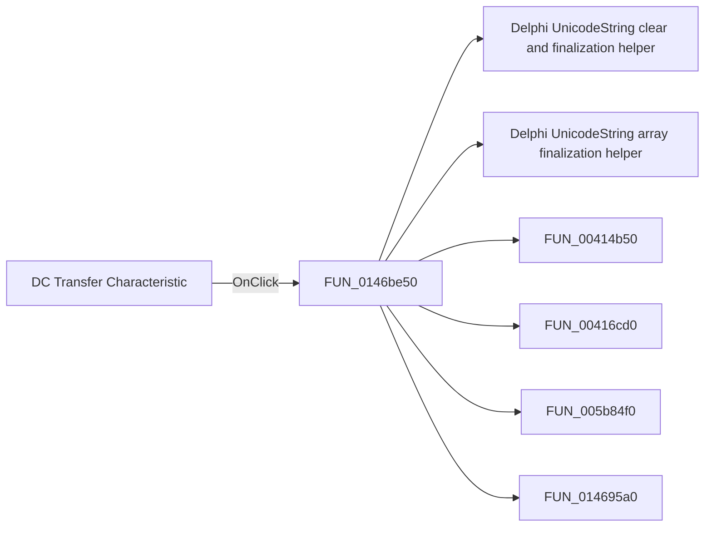

# DC Transfer Characteristic

> Analysis status: Pending individual source review.

## Control

| Property | Recovered value |
| --- | --- |
| Form | CSysTextDlg |
| Component path | CSysTextDlg.DeepLinkPopUpMnu.DCAnalysisMnu.DCTransferCharacteristicMnu |
| Control class | TMenuItem |
| Caption | DC Transfer Characteristic |
| Hint | Not present in the recovered resource. |
| Text | Not present in the recovered resource. |
| Handler name | DCTransferCharacteristicMnuClick |
| Handler address | 0146be50 |
| Graph node | `resource:dfm:CSysTextDlg/CSysTextDlg.DeepLinkPopUpMnu.DCAnalysisMnu.DCTransferCharacteristicMnu` |
| Handler node | `function:0146be50` |
| Graph layer | UI |

## What happens when clicked

Pending individual analysis. An agent must read the recovered handler source and its relevant callees before it replaces this text.

## Click flow

## Handler evidence

- Source: [DecompiledSources/Tina16/functions/000000000146BE50__FUN_0146be50.c](../../../DecompiledSources/Tina16/functions/000000000146BE50__FUN_0146be50.c)
- Recovered role: Not present in the recovered resource.
- Current graph summary: Handles 1 Delphi UI event: CSysTextDlg.DeepLinkPopUpMnu.DCAnalysisMnu.DCTransferCharacteristicMnu.OnClick.
- Current graph behavior: Not present in the recovered resource.
- Current graph evidence: Not present in the recovered resource.
- Complexity: complex
- Distinct outgoing calls: 6

## Direct calls

- `function:00414480` — Delphi UnicodeString clear and finalization helper
- `function:00414560` — Delphi UnicodeString array finalization helper
- `function:00414b50` — FUN_00414b50
- `function:00416cd0` — FUN_00416cd0
- `function:005b84f0` — FUN_005b84f0
- `function:014695a0` — FUN_014695a0

## Resource evidence

- Kind: Not present in the recovered resource.
- Modal result: Not present in the recovered resource.
- Checked state: Not present in the recovered resource.
- List items: Not present in the recovered resource.
- Image reference: Not present in the recovered resource.
- Extracted glyph: None.

## Nearby label candidates

Nearby labels are layout candidates only. They are not proof of behavior.

- No same-parent label candidate is available.

## Analysis limits

- Do not infer behavior from the control class, caption, hint, glyph, or nearby label alone.
- Do not replace the pending status until the handler source and relevant call path provide enough evidence.
