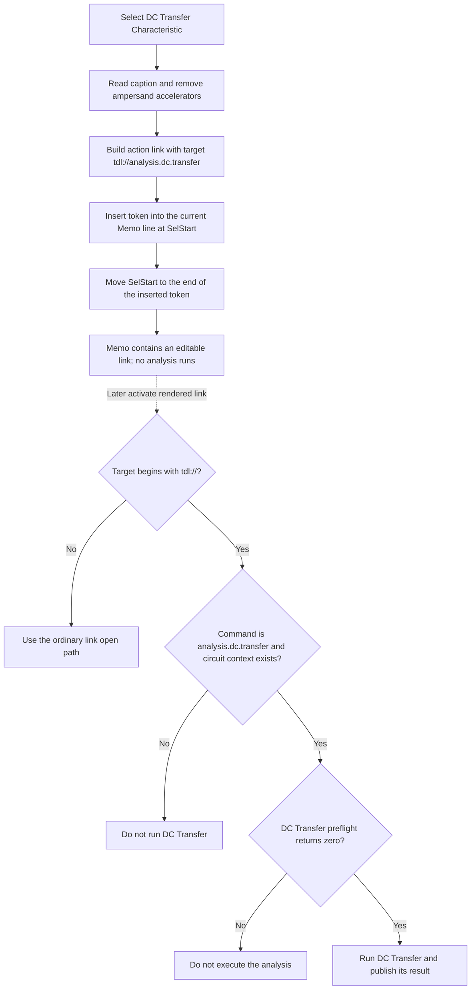

# DC Transfer Characteristic

> Analysis status: Complete. The recovered menu handler, memo insertion helper, dialog commit path, and TDL command dispatcher establish the edit and later navigation behavior.

## Control

| Property | Recovered value |
| --- | --- |
| Form | CSysTextDlg |
| Component path | CSysTextDlg.DeepLinkPopUpMnu.DCAnalysisMnu.DCTransferCharacteristicMnu |
| Control class | TMenuItem |
| Parent menu | DC Analysis |
| Caption | DC Transfer Characteristic |
| Handler name | DCTransferCharacteristicMnuClick |
| Handler address | 0146be50 |
| Graph node | `resource:dfm:CSysTextDlg/CSysTextDlg.DeepLinkPopUpMnu.DCAnalysisMnu.DCTransferCharacteristicMnu` |
| Handler node | `function:0146be50` |
| Graph layer | UI |

## What happens when clicked

`FUN_0146be50` inserts an action-link markup token into the `CSysTextDlg` edit memo. It does not navigate and does not run a DC analysis during this menu click.

The handler reads the menu item's current caption, passes it through a Unicode string replacement that removes `&` accelerator markers, and joins three strings:

```text
\a(DC Transfer Characteristic,tdl://analysis.dc.transfer)
```

The recovered runtime constants establish that the prefix is `\a(`, the removed character is `&`, and the fixed suffix is `,tdl://analysis.dc.transfer)`. The DFM caption contains no accelerator marker, so the visible link text remains `DC Transfer Characteristic` for this control.

The `\a(display,target)` form is the application's action-link markup. Here, the displayed text and target are separate:

| Part | Value |
| --- | --- |
| Display text | `DC Transfer Characteristic` |
| Target | `tdl://analysis.dc.transfer` |

## Memo insertion and caret state

`FUN_014695a0` performs the insertion:

1. It reads the memo's absolute selection start.
2. It walks `Memo.Lines` and counts each previous line plus two CR/LF characters. This maps the absolute position to a line index and a position in that line.
3. It inserts the complete markup into the current line without removing the text before or after that position.
4. It writes the changed line back to `Memo.Lines`.
5. It sets the memo selection start to the old absolute position plus the inserted markup length. This places the caret after the new link.

The helper does not read `SelLength` or selected text. It therefore does not explicitly replace a selection. The recovered source does not establish whether the memo control retains a nonzero selection length after its selection-start setter runs.

## Menu context

The item belongs to `DeepLinkPopUpMnu`, under its `DC Analysis` submenu. The `Action link` speed button opens this popup next to the toolbar button. Selecting this item then inserts the DC Transfer Characteristic action-link template into the edit-page `TMemo`.

The popup and insertion path do not inspect the current circuit. They only edit the text markup.

## Later interpretation

The inserted target is interpreted only when a user later activates the rendered action link:

- `FUN_01a5e850` extracts the link target. It sends ordinary links to the shell-open path but sends a target beginning with `tdl://` to `FUN_01a62740`.
- `FUN_01a62740` removes the scheme, recognizes the `analysis.` command group, and matches `dc.transfer`.
- With a circuit context present, it calls `FUN_01324990` as the DC Transfer preflight or setup step.
- It calls `FUN_013d3ef0` to execute the DC Transfer analysis only when the preflight returns zero.

This later activation uses the circuit context supplied to the TDL dispatcher. It is separate from the menu click that creates the markup.

## Click and later-activation flow



## Persistence boundary

This handler changes only the edit memo. It does not write a file, update a circuit, or copy the text back to the caller's original object.

`Memo.OnExit`, recovered as `FUN_0146b040`, copies `Memo.Lines` into the dialog's working text object. `CSysTextDlg.OnClose`, recovered as `FUN_0146ab60`, also performs that copy before the modal call returns. A recovered owner path, `FUN_0149e8d0`, initializes the dialog from an existing text object and copies the dialog's working object back only when `ShowModal` returns the OK result `1`. On Cancel, that owner destroys the dialog without copying the working text back.

Therefore, insertion is immediate in the editor, but persistence to the owner is outside this menu handler and depends on an accepted dialog close.

## Error and no-op paths

- The menu handler has no validation branch, confirmation dialog, or intentional no-op path. It always attempts to build and insert the fixed action link.
- It does not require a circuit context because it does not execute the target.
- It has no local exception handler. A string-allocation or memo-operation exception propagates through the normal Delphi exception path; later insertion and caret updates then do not complete.
- If the text dialog is canceled, the recovered `FUN_0149e8d0` owner path discards the dialog's working copy.
- During later link activation, a missing circuit context, an unrecognized TDL command, or a nonzero DC preflight result prevents DC Transfer execution.
- The insertion does not replace selected text explicitly because it never reads the selection length.

## Handler evidence

- Menu handler: [FUN_0146be50](../../../DecompiledSources/Tina16/functions/000000000146BE50__FUN_0146be50.c)
- Memo insertion helper: [FUN_014695a0](../../../DecompiledSources/Tina16/functions/00000000014695A0__FUN_014695a0.c)
- Unicode insertion helper: [FUN_00416ea0](../../../DecompiledSources/Tina16/functions/0000000000416EA0__FUN_00416ea0.c)
- Unicode replacement implementation: [FUN_00450070](../../../DecompiledSources/Tina16/functions/0000000000450070__FUN_00450070.c)
- Action-link popup opener: [FUN_0146bfe0](../../../DecompiledSources/Tina16/functions/000000000146BFE0__FUN_0146bfe0.c)
- Memo exit synchronization: [FUN_0146b040](../../../DecompiledSources/Tina16/functions/000000000146B040__FUN_0146b040.c)
- Form close synchronization: [FUN_0146ab60](../../../DecompiledSources/Tina16/functions/000000000146AB60__FUN_0146ab60.c)
- Accepted-dialog owner path: [FUN_0149e8d0](../../../DecompiledSources/Tina16/functions/000000000149E8D0__FUN_0149e8d0.c)
- Link target router: [FUN_01a5e850](../../../DecompiledSources/Tina16/functions/0000000001A5E850__FUN_01a5e850.c)
- TDL command dispatcher: [FUN_01a62740](../../../DecompiledSources/Tina16/functions/0000000001A62740__FUN_01a62740.c)
- DC Transfer preflight: [FUN_01324990](../../../DecompiledSources/Tina16/functions/0000000001324990__FUN_01324990.c)
- DC Transfer execution: [FUN_013d3ef0](../../../DecompiledSources/Tina16/functions/00000000013D3EF0__FUN_013d3ef0.c)
- Recovered role: Inserts a DC Transfer Characteristic TDL action link into the text memo at the caret.
- Complexity: complex
- Distinct outgoing calls: 6

## Direct calls

- `function:005b84f0` - Removes accelerator markers from the menu caption through the Unicode replacement implementation.
- `function:00416cd0` - Concatenates the action-link prefix, display text, and fixed TDL target suffix.
- `function:014695a0` - Inserts the completed action-link markup into the memo and advances its selection start.
- `function:00414b50`, `function:00414480`, and `function:00414560` - Manage temporary Delphi UnicodeString values.

## Resource evidence

- The menu caption is `DC Transfer Characteristic`.
- Its parent submenu caption is `DC Analysis`.
- The popup is opened by the `Action link` speed button on the Edit tools page.
- The text editor is `CSysTextDlg.MainNB.TPage.Memo`, a `TMemo` on the `Edit` page.
- This menu item has no hint, image, shortcut, checked state, or separate glyph in the recovered DFM.

## Evidence limits

- The recovered source proves the token format and later command branch. It does not provide a user-facing specification for every supported TDL command.
- The source does not establish the internal selection-length behavior of the memo's selection-start setter.
- The preflight routine can present or handle its own validation outcomes. This article states only the zero-result execution gate visible in the TDL dispatcher.
