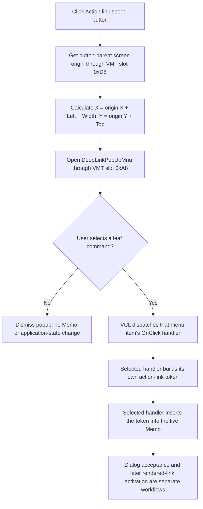

# Open the Action link command menu

> Analysis status: Source reviewed. Popup position, menu state, command dispatch, dismissal, glyph evidence, and error boundaries are documented.

## Control

| Property | Recovered value |
| --- | --- |
| Form | CSysTextDlg |
| Component path | CSysTextDlg.ToolsPanel.ToolsNB.Edit.DeepLinkBtn |
| Control class | TSpeedButton |
| Caption | Not present in the recovered resource. |
| Hint | Action link |
| Position and size | Left 150, Top 0, Width 25, Height 25 |
| Text | Not present in the recovered resource. |
| Handler name | DeepLinkBtnClick |
| Handler address | 0146bfe0 |
| Graph node | `resource:dfm:CSysTextDlg/CSysTextDlg.ToolsPanel.ToolsNB.Edit.DeepLinkBtn` |
| Handler node | `function:0146bfe0` |
| Graph layer | UI |

## What happens when clicked

`FUN_0146bfe0` opens `DeepLinkPopUpMnu`. It does not insert text, create an
action-link token, navigate to a target, or start an analysis.

The form field at `+0x858` is the `DeepLinkBtn`. The handler reads the button's
parent from control field `+0x78` and calls the parent's virtual method at VMT
slot `0xD8` twice. The first result supplies the parent screen X coordinate;
the second supplies the parent screen Y coordinate. It then calculates the
requested popup point:

- X = parent screen X + button Left + button Width.
- Y = parent screen Y + button Top.

The resource values make the unscaled parent-local point `(175, 0)`. The
actual call uses screen coordinates after it adds the parent origin. This is
the button's top-right edge. The handler calls VMT slot `0xA8` on the popup
menu at form field `+0x860` with that point.

The handler does not use the button Height, so it does not request a position
below the button. VCL or the operating system can adjust the final position to
keep the menu on the screen. The source proves the requested anchor point, not
such a later adjustment.

## Menu state and command boundary

`DeepLinkPopUpMnu` has no recovered `OnPopup` handler. `FUN_0146bfe0` does not
set a check mark, caption, enabled state, or visible state before it opens the
menu. The recovered resource also does not set `Enabled = false`,
`Visible = false`, or a checked state on these commands. The popup therefore
uses the state that already exists when the click occurs; no state preparation
is proven in this path.

The `DC Analysis` and `AC Analysis` items are submenu containers. They have no
`OnClick` handler. The two items with caption `-` are separators. Only a later
selection of a leaf command causes VCL to dispatch a separate handler:

| Menu path | Handler | Text operation owned by that handler |
| --- | --- | --- |
| DC Analysis > DC Transfer Characteristic | `FUN_0146be50` | Inserts `\a(DC Transfer Characteristic,tdl://analysis.dc.transfer)`. |
| DC Analysis > Temperature Analysis | `FUN_014698f0` | Inserts `\a(Temperature Analysis,tdl://analysis.dc.temperature)`. |
| AC Analysis > AC Transfer Characteristic | `FUN_0146a770` | Inserts `\a(AC Transfer Characteristic,tdl://analysis.ac.transfer)`. |
| AC Analysis > Network Analysis | `FUN_0146baa0` | Inserts `\a(Network Analysis,tdl://analysis.ac.network)`. |
| Transient | `FUN_0146b840` | Inserts `\a(Transient,tdl://analysis.tr)`. |
| Digital | `FUN_0146c070` | Inserts `\a(Digital,tdl://analysis.dig)`. |
| Fourier Spectrum | `FUN_0146c880` | Inserts `\a(Fourier Spectrum,tdl://analysis.fourier.spectrum)`. |
| Noise Analysis | `FUN_0146bc30` | Inserts `\a(Noise Analysis,tdl://analysis.noise)`. |
| Set main parameter | `FUN_0146a010` | Inserts `\a(Set main parameter,tdl://set:{component_label\|TEMP\|global_par}:{value})`. The placeholders stay literal. |
| Set config file | `FUN_01469e60` | Inserts `\a(Set config file,tdl://component.config:<label>:<cnf file path>)`. The placeholders stay literal. |

These handlers build their token from the menu caption and a fixed target.
They then call the common Memo insertion helper. The menu opener does not call
that helper. The inserted target is interpreted only after the dialog result
is accepted, the text is rendered, and a user later activates the rendered
action link.

If the user dismisses the popup, VCL dispatches no leaf-item handler.
`FUN_0146bfe0` has no statement after the popup call, so this path makes no
application-state change. Opening the popup also does not commit the dialog's
working text object.

## Click flow

## Handler evidence

- Source: [FUN_0146bfe0](../../../DecompiledSources/Tina16/functions/000000000146BFE0__FUN_0146bfe0.c)
- Recovered role: Open the system-text Action link popup at the button's
  top-right screen position.
- Behavior: Converts the button position relative to its parent into a screen
  anchor and invokes the popup menu. It leaves text insertion and later action
  execution to selected menu-item handlers.
- Evidence: The DFM binds `DeepLinkBtn.OnClick` to `DeepLinkBtnClick` at
  `0146bfe0`. The handler reads the button at form field `+0x858`, uses its
  parent and geometry fields, and invokes the menu at form field `+0x860`.
- Complexity: simple
- Distinct outgoing calls: 0

## Direct calls

- No direct call edge is present. The coordinate conversion and popup display
  are recovered as virtual calls.
- [FUN_0064d1f0](../../../DecompiledSources/Tina16/functions/000000000064D1F0__FUN_0064d1f0.c)
  is supporting VCL evidence for VMT slot `0xD8`: it uses the same slot to get
  a control's screen origin and adds a local point.

## Selected-command evidence

- [DC Transfer Characteristic](../../../DecompiledSources/Tina16/functions/000000000146BE50__FUN_0146be50.c)
- [Temperature Analysis](../../../DecompiledSources/Tina16/functions/00000000014698F0__FUN_014698f0.c)
- [AC Transfer Characteristic](../../../DecompiledSources/Tina16/functions/000000000146A770__FUN_0146a770.c)
- [Network Analysis](../../../DecompiledSources/Tina16/functions/000000000146BAA0__FUN_0146baa0.c)
- [Transient](../../../DecompiledSources/Tina16/functions/000000000146B840__FUN_0146b840.c)
- [Digital](../../../DecompiledSources/Tina16/functions/000000000146C070__FUN_0146c070.c)
- [Fourier Spectrum](../../../DecompiledSources/Tina16/functions/000000000146C880__FUN_0146c880.c)
- [Noise Analysis](../../../DecompiledSources/Tina16/functions/000000000146BC30__FUN_0146bc30.c)
- [Set main parameter](../../../DecompiledSources/Tina16/functions/000000000146A010__FUN_0146a010.c)
- [Set config file](../../../DecompiledSources/Tina16/functions/0000000001469E60__FUN_01469e60.c)

Each source reads its own menu caption, builds a fixed `\a(display,target)`
form, and calls [FUN_014695a0](../../../DecompiledSources/Tina16/functions/00000000014695A0__FUN_014695a0.c)
to insert it into the Memo.

## Resource and glyph evidence

- [Recovered UI evidence](../../../DecompiledSources/Tina16/resources/dfm/ui-evidence.json)
  identifies the 25 by 25 `TSpeedButton`, hint `Action link`, handler address,
  popup component tree, command captions, and leaf handlers.
- The button has one 23 by 23 embedded BMP glyph, extracted as
  [`0050_CSysTextDlg_CSysTextDlg_ToolsPanel_ToolsNB_Edit_DeepLinkBtn_Glyph_Data.png`](../../../glyph/0050_CSysTextDlg_CSysTextDlg_ToolsPanel_ToolsNB_Edit_DeepLinkBtn_Glyph_Data.png).
  It shows a black running-person symbol. This supports an action or launch
  affordance. The hint and source establish the popup behavior; the glyph
  alone does not identify the menu or its targets.
- The button has no caption, text, action binding, image index, or same-parent
  label candidate.

## Error and no-op boundaries

- The opener has no validation branch, return-value check, error dialog, or
  local exception handler. A popup-display failure stays at the VCL virtual
  call boundary.
- Dismissing the popup is the normal no-op path. It inserts no text and changes
  no menu or dialog state in this handler.
- A submenu container or separator has no command handler. It cannot insert an
  action-link token through this click path.
- Validation, missing schematic context, command errors, and analysis errors
  belong to later token insertion or rendered-link activation paths. They do
  not occur while `FUN_0146bfe0` opens the popup.

## Analysis limits

- No recovered `OnPopup` event prepares menu state. Other indirect runtime
  code could still change a menu-item property before this click; no such
  change is proven here.
- The source establishes the requested screen anchor. It does not expose any
  VCL or operating-system adjustment of the final popup rectangle.
- The knowledge-graph JSON export was absent during review. The canonical
  DuckDB database was temporarily locked by another DuckDB process, so the
  graph identity in this generated article was corroborated with the recovered
  event evidence and source instead of a live database query.
