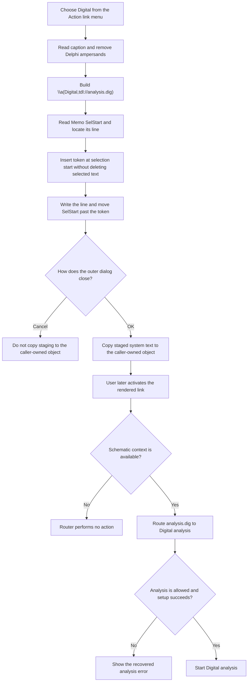

# Insert a Digital analysis action link

> Analysis status: Complete. This menu command inserts the exact TINA action-link markup `\a(Digital,tdl://analysis.dig)` at the Memo's current selection start. It does not run Digital analysis when the menu item is clicked.

## Control

| Property | Recovered value |
| --- | --- |
| Form | CSysTextDlg |
| Form caption | Text |
| Component path | CSysTextDlg.DeepLinkPopUpMnu.DigitalMnu |
| Control class | TMenuItem |
| Caption | Digital |
| Parent menu | DeepLinkPopUpMnu |
| Menu launcher | DeepLinkBtn, hint **Action link** |
| Handler name | DigitalMnuClick |
| Handler address | 0146c070 |
| Graph node | `resource:dfm:CSysTextDlg/CSysTextDlg.DeepLinkPopUpMnu.DigitalMnu` |
| Handler node | `function:0146c070` |
| Graph layer | UI |

## What happens when clicked

`FUN_0146c070` reads the `DigitalMnu` caption through form field `+0x890`.
It removes `&` characters, which are Delphi menu accelerator markers. The
recovered caption has no accelerator marker, so the visible link text remains
`Digital`. The handler then joins the control character and opening bracket
`\a(`, the cleaned caption, and the literal suffix
`,tdl://analysis.dig)`. The result is:

`\a(Digital,tdl://analysis.dig)`

The `\a(...)` text is TINA's action-link markup. The first value is the visible
label. The second value is the action target. The **Action link** speed button
opens `DeepLinkPopUpMnu`; choosing **Digital** is one command in that menu.

The handler passes the completed markup to `FUN_014695a0`. This helper reads
the Memo's zero-based `SelStart`, finds the line that contains that position,
and converts the position to the one-based index used by the recovered Delphi
string insertion helper. It inserts the markup into that one line, writes the
changed line back to `Memo.Lines`, and sets `SelStart` to its old value plus the
markup length. The caret is therefore placed immediately after the inserted
link.

The helper does not read `SelLength` and does not delete text. If text is
selected, the link is inserted at the selection start; it does not replace the
selected characters. If no text is selected, the result is a normal insertion
at the caret.

## Later link activation

This menu click only edits the text. It does not navigate and does not start an
analysis. A later activation of the rendered link follows a separate path.
`FUN_01a5e850` obtains the link target and routes targets that contain the
`tdl://` prefix to `FUN_01a62740`. That router removes the prefix and the
`analysis.` namespace. Its exact `dig` branch calls `FUN_01603f40` with the
active schematic context, `0`, and `1`. This call starts the recovered Digital
analysis path.

The router performs no action when it has no schematic context. The Digital
analysis routine also checks whether analysis is allowed. If it is not, it
loads `Sched_c.sAnaNotAllowedTxt` and shows the resulting message. Later setup
and execution checks can also show their own errors. These checks belong to
link activation, not to `DigitalMnuClick`.

## Edit and persistence boundary

The immediate state change is limited to `Memo.Lines` and `Memo.SelStart`.
`DigitalMnuClick` does not write a file, update the caller-owned system-text
object, close the dialog, or set a modal result.

When CSysTextDlg closes, `FUN_0146ab60` copies the current Memo lines and font
into the dialog's private staged system-text object. The inspected
existing-object caller `FUN_0149e8d0` copies that staged object back to the
caller-owned object only when `ShowModal` returns `mrOK` (`1`). An outer Cancel
therefore discards the inserted link even though the close handler refreshed
the dialog-local staging object. This caller copy-back is the proven commit
boundary. The separate **Save** and **Save As** menu commands are not part of
this click path.

## Click flow

## No-op and error behavior

- The insertion path has no validation branch, confirmation dialog, or
  explicit no-op result. It always constructs the fixed Digital target and
  calls the insertion helper.
- The handler does not validate the action target. The later link router
  recognizes the exact `analysis.dig` target.
- The insertion helper assumes that the Memo, its line collection, and the
  recovered `SelStart` are valid. Neither the handler nor the helper has a
  local exception handler or rollback. A failure propagates through the
  Delphi runtime and can leave the edit incomplete.
- An empty selection is not an error. Existing selected text is also not an
  error because the helper inserts before it.
- A later link activation without a non-null schematic context is a no-op in
  the recovered router. Analysis availability and setup failures are reported
  only after a valid context reaches the Digital analysis routine.

## Evidence

- [Digital menu handler `FUN_0146c070`](../../../DecompiledSources/Tina16/functions/000000000146C070__FUN_0146c070.c) reads the menu caption, removes accelerator markers, appends the literal `tdl://analysis.dig` suffix, and calls the common editor insertion helper.
- [Editor insertion helper `FUN_014695a0`](../../../DecompiledSources/Tina16/functions/00000000014695A0__FUN_014695a0.c) maps `SelStart` to a Memo line, inserts without reading `SelLength`, writes the line, and advances `SelStart` by the token length.
- [Delphi string insertion `FUN_00416ea0`](../../../DecompiledSources/Tina16/functions/0000000000416EA0__FUN_00416ea0.c) expands the destination string and moves the existing suffix before it copies the inserted text into the one-based position.
- [Action-link menu launcher `FUN_0146bfe0`](../../../DecompiledSources/Tina16/functions/000000000146BFE0__FUN_0146bfe0.c) opens `DeepLinkPopUpMnu` beside the control whose resource hint is **Action link**.
- [Rendered-link dispatcher `FUN_01a5e850`](../../../DecompiledSources/Tina16/functions/0000000001A5E850__FUN_01a5e850.c) sends `tdl://` targets to the TDL command router instead of the external shell-open path.
- [TDL command router `FUN_01a62740`](../../../DecompiledSources/Tina16/functions/0000000001A62740__FUN_01a62740.c) recognizes the `analysis.` namespace and routes its `dig` target to `FUN_01603f40` when a schematic context is present.
- [Digital analysis path `FUN_01603f40`](../../../DecompiledSources/Tina16/functions/0000000001603F40__FUN_01603f40.c) checks whether analysis is allowed and begins Digital analysis setup or displays a recovered error.
- [Form close `FUN_0146ab60`](../../../DecompiledSources/Tina16/functions/000000000146AB60__FUN_0146ab60.c) copies Memo lines and font into the dialog-local staged object.
- [Existing-object caller `FUN_0149e8d0`](../../../DecompiledSources/Tina16/functions/000000000149E8D0__FUN_0149e8d0.c) copies that staged object back only after modal result `1`.

## Direct calls

- `function:005b84f0` - removes all `&` accelerator markers from the menu caption through the recovered Delphi string-replace implementation.
- `function:00416cd0` - concatenates the three markup parts.
- `function:014695a0` - inserts the completed action link into the Memo and advances its selection start.
- `function:00414480`, `function:00414560`, and `function:00414b50` - manage temporary Delphi UnicodeString values.

## Resource evidence

- `DigitalMnu` is a `TMenuItem` with caption **Digital** under
  `DeepLinkPopUpMnu`. It has no hint, glyph, image index, checked state, or
  shortcut in the recovered form resource.
- `DeepLinkBtn` is a `TSpeedButton` with hint **Action link** and opens this
  popup menu. This provides the menu context but does not by itself prove the
  inserted target.
- The exact target comes from the handler literal and the decoded recovered
  constants. Parallel items in the same popup use the same `\a(label,target)`
  construction with different analysis targets.
- No same-parent label candidate provides additional evidence.

## Analysis limits

- The original Delphi field and type names are absent. Memo behavior is
  identified from its line collection and recovered `SelStart` virtual access.
- The recovered source does not expose a named constant for the `\a` markup.
  Its use as an action link is established by the launcher hint, the parallel
  menu handlers, and the later TDL dispatcher.
- The article separates the existing-object caller's proven `mrOK` copy-back
  from other possible callers. It does not claim that all callers use the same
  acceptance rule.
