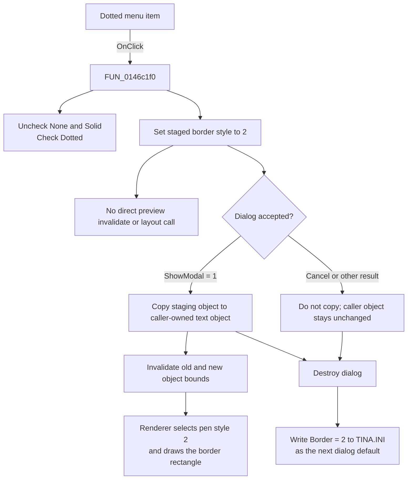

# Dotted

> Analysis status: Complete. Recovered source proves the selected menu state, border-style value, commit boundary, and later rendering behavior.

## Control

| Property | Recovered value |
| --- | --- |
| Form | CSysTextDlg |
| Component path | CSysTextDlg.TTPopupMnu.Border1.DottedMnu |
| Control class | TMenuItem |
| Parent menu | Border (`B&order` in the recovered resource) |
| Caption | Dotted |
| Hint | Not present in the recovered resource. |
| Text | Not present in the recovered resource. |
| Handler name | DottedMnuClick |
| Handler address | 0146c1f0 |
| Graph node | `resource:dfm:CSysTextDlg/CSysTextDlg.TTPopupMnu.Border1.DottedMnu` |
| Handler node | `function:0146c1f0` |
| Graph layer | UI |

## What happens when clicked

`FUN_0146c1f0` selects the dotted border mode for the text object being edited. It calls the VCL menu-item checked-state setter three times: `NoneMnu` and `SolidMnu` become unchecked, and `DottedMnu` becomes checked. It then writes byte value `2` to offset `+0xA0` of the dialog-owned staging object at form offset `+0x8E0`.

The exact value is not inferred from the caption alone. The sibling handlers write `0` for **None** and `1` for **Solid**, while the Dotted handler writes `2`. Dialog initialization and existing-object loading use the same three values to restore the matching check mark. The recovered text renderer also distinguishes values `1` and `2`: value `1` selects pen-style argument `0`, while value `2` selects pen-style argument `2`, then draws the text object's border rectangle.

The three sibling menu items do not have recovered `RadioItem`, `GroupIndex`, or `AutoCheck` properties. The click handlers implement exclusivity themselves. A repeated Dotted click reasserts the same states. The checked-state helper skips its menu notification when a requested state is already present, but the handler still writes border value `2`.

## Staging, preview, and commit boundaries

- **Immediate state:** The checked marks change, and the private staging object's border byte becomes `2`.
- **Dialog preview:** This handler does not call an invalidate, paint, or layout function. The dialog's recovered `DrawRectanglePaint` handler copies the Memo text, sizes the paint box, and renders the inner text layout, but it does not read the staging object's top-level border byte at `+0xA0`. Therefore, the recovered path does not prove an immediate dotted-border preview.
- **Accepted existing-object edit:** The recovered caller copies the complete staging object back to the caller-owned text object only when `ShowModal` returns `1`. The copy includes border byte `+0xA0`. The caller then invalidates the old and new object rectangles. The normal text renderer uses value `2` to select the dotted pen style and draw the border.
- **Cancel:** A modal result other than `1`, including the recovered Cancel result `2`, skips the copy and the old/new invalidations. The caller-owned text object keeps its previous border style.
- **Dialog default persistence:** Form destruction writes the current staging value to `TINA.INI`, section `Text Dialog Setup`, key `Border`. This happens outside the caller's accepted-result branch. Thus, Cancel protects the caller-owned object but does not undo the selected border as the next dialog default. Loading an existing text object later replaces that default with the object's own border value for that edit session.

The click handler contains no validation, confirmation, error message, close, or rollback branch. It does not catch failures from the VCL checked-state calls or the later INI write.

## Click flow

## Handler evidence

- [DottedMnuClick source](../../../DecompiledSources/Tina16/functions/000000000146C1F0__FUN_0146c1f0.c) contains the three explicit checked-state calls and the byte write `staging + 0xA0 = 2`.
- [NoneMnuClick source](../../../DecompiledSources/Tina16/functions/000000000146BDB0__FUN_0146bdb0.c) writes `0`, and [SolidMnuClick source](../../../DecompiledSources/Tina16/functions/000000000146BE00__FUN_0146be00.c) writes `1`.
- [Dialog creation source](../../../DecompiledSources/Tina16/functions/000000000146A2A0__FUN_0146a2a0.c) restores the three check marks from values `0`, `1`, and `2` after it loads the default.
- [Existing-object load source](../../../DecompiledSources/Tina16/functions/000000000146A9A0__FUN_0146a9a0.c) copies the source object into staging and restores the same exclusive check-state mapping.
- [Text-object copy source](../../../DecompiledSources/Tina16/functions/0000000001A5EB60__FUN_01a5eb60.c) copies source border byte `+0xA0` to the destination.
- [Existing-object caller source](../../../DecompiledSources/Tina16/functions/000000000149E8D0__FUN_0149e8d0.c) performs that copy and invalidates old and new rectangles only for modal result `1`.
- [Text renderer source](../../../DecompiledSources/Tina16/functions/0000000001A5DAF0__FUN_01a5daf0.c) maps border value `2` to pen-style argument `2` and draws the rectangle.
- [Preview paint source](../../../DecompiledSources/Tina16/functions/000000000146AF40__FUN_0146af40.c) resizes and paints the inner text layout without reading the top-level border byte.
- [Dialog destruction source](../../../DecompiledSources/Tina16/functions/000000000146A540__FUN_0146a540.c) passes the staging border byte to the INI writer, and [the INI writer](../../../DecompiledSources/Tina16/functions/0000000001469B20__FUN_01469b20.c) stores it as `Text Dialog Setup/Border` in `TINA.INI`.
- Current graph summary: Handles `CSysTextDlg.TTPopupMnu.Border1.DottedMnu.OnClick`.
- Complexity: simple; one distinct outgoing call.

## Direct calls

- `function:007e2d20` — Changes a VCL menu item's checked state when the requested state differs. This shared helper is documented by its canonical control-analysis owner.

## Resource evidence

- The recovered component is a `TMenuItem` below the `B&order` menu.
- Its caption is `Dotted`, and its event is `OnClick = DottedMnuClick` at `0146c1f0`.
- The sibling captions are `None` and `Solid`.
- No hint, text, checked state, group index, radio-item property, action, image reference, or glyph is present in the recovered resource.

## Analysis limits

- The symbolic Delphi field name for staging offset `+0xA0` was not recovered. Its border-style role is established by the `Border` INI key, the sibling value mapping, the copy path, and the renderer.
- The recovered code proves the numeric renderer argument for the dotted mode. It does not recover the original Delphi enumeration name.
- No immediate border preview path is present in the recovered handler or preview-paint function.
