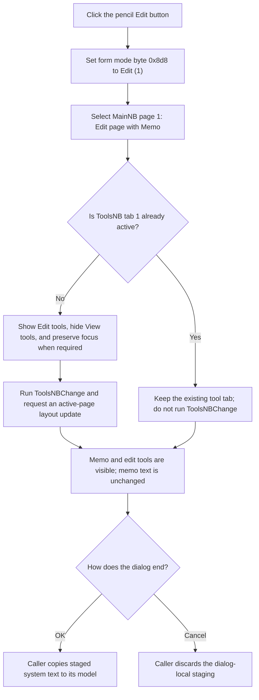

# Edit

> Analysis status: Source reviewed. The recovered handler, paired View
> handler, page-selection helpers, DFM page structure, and pencil glyph support
> the documented Edit-mode transition.

## Control

| Property | Recovered value |
| --- | --- |
| Form | CSysTextDlg |
| Component path | CSysTextDlg.ToolsPanel.EditBtn |
| Control class | TSpeedButton |
| Caption | Not present in the recovered resource. |
| Hint | Edit |
| Text | Not present in the recovered resource. |
| Handler name | EditBtnClick |
| Handler address | 0146a730 |
| Graph node | `resource:dfm:CSysTextDlg/CSysTextDlg.ToolsPanel.EditBtn` |
| Handler node | `function:0146a730` |
| Graph layer | UI |

## What happens when clicked

This button changes `CSysTextDlg` from its rendered View mode to its editable
mode. `FUN_0146a730` performs three operations in this order:

1. It writes `1` to form byte `0x8d8`. The paired View handler writes `0` to
   this byte, and other form code tests it before it refreshes the preview.
   Therefore, this byte is the dialog's Edit/View mode flag. It is not a dirty
   flag.
2. It selects page index `1` in `MainNB`. The DFM identifies this page as
   `Edit`; it contains the `Memo` editor. Page index `0` is `View`; it contains
   the scroll box and the `DrawRectangle` preview.
3. It selects tab index `1` in `ToolsNB`. The DFM identifies this tab as
   `Edit`; it contains the Fraction, Exponent, Special character, Index,
   Symbol, Anchor, and Action link tools. Tab index `0` is `View`; it contains
   the Copy to Clipboard button.

The page helpers show the selected page and hide the prior page. They preserve
a usable focus path only when focus belonged to the page that is being hidden.
The handler does not call `Memo.SetFocus`, and the recovered helper can select
a page or a focusable child. Therefore, the final focused control is not
proven to be `Memo`.

When the ToolsNB tab really changes, its `OnChange` handler requests a width of
150 pixels for the active `MainNB` page. This is a layout update; the active
main page is aligned to the dialog client area, so the recovered call does not
prove that its final displayed width stays at 150 pixels.

## Text synchronization and ownership

The Edit click does not read, copy, clear, or replace text. The `Memo` control
remains allocated while its page is hidden, so entering Edit mode reveals its
existing lines. It does not copy the rendered preview back into the memo.

Synchronization occurs at other boundaries:

- The paired View handler selects the View pages and calls the preview
  renderer. That renderer first copies `Memo.Lines` into the dialog's staged
  system-text object, then measures and paints the preview.
- `MemoExit` also copies `Memo.Lines` into the staged object.
- Form-close synchronization copies editor values into the staged object.
- A caller copies that staged object to the caller-owned system-text object
  only after the modal dialog returns `mrOK`. Cancel discards the staged
  changes.

Thus, EditBtn changes only form-local mode, page visibility, and related focus
or layout state. It does not commit text and does not change the acceptance
result.

## Click flow

## Repeated clicks, validation, and errors

- Every click writes mode value `1` and requests both page index values again.
- If `MainNB` already shows its Edit page, the inner notebook page setter skips
  its hide, show, and focus transition. Its wrapper still reissues the current
  page index through a virtual method.
- If `ToolsNB` already shows its Edit tab, the page-control setter skips the
  visibility, focus, index, and `OnChange` operations. The active-page layout
  update is therefore not repeated through `ToolsNBChange`.
- The fixed index is valid for both recovered two-page controls. The handler
  has no validation prompt, disabled-state branch, or application-level error
  message.
- The handler has no local exception handler or rollback. Its writes occur in
  order: mode flag, main page, then tools page. An unexpected VCL exception can
  leave a partial local transition. It does not alter caller-owned text before
  such an exception.

## Handler evidence

- [FUN_0146a730](../../../DecompiledSources/Tina16/functions/000000000146A730__FUN_0146a730.c)
  writes mode byte `0x8d8`, selects index `1` in `MainNB` at form field
  `0x7f0`, and selects index `1` in `ToolsNB` at form field `0x6e0`.
- [FUN_0146a6e0](../../../DecompiledSources/Tina16/functions/000000000146A6E0__FUN_0146a6e0.c)
  is the paired View handler. It writes mode `0`, selects both index-0 View
  pages, and calls the preview renderer.
- [FUN_006d8180](../../../DecompiledSources/Tina16/functions/00000000006D8180__FUN_006d8180.c)
  validates and resolves a `TNotebook` page index before it selects that page.
- [FUN_006d70c0](../../../DecompiledSources/Tina16/functions/00000000006D70C0__FUN_006d70c0.c)
  shows that the notebook skips visibility and focus work when the requested
  page object is already active.
- [FUN_0074a520](../../../DecompiledSources/Tina16/functions/000000000074A520__FUN_0074a520.c)
  validates the `TPageControl` index, performs the visibility and conditional
  focus transition, and calls `OnChange` only for a different active tab.
- [FUN_0146c720](../../../DecompiledSources/Tina16/functions/000000000146C720__FUN_0146c720.c)
  is `ToolsNBChange`; it passes `0x96` (150) to the recovered width setter for
  the active `MainNB` page.
- [FUN_0146b040](../../../DecompiledSources/Tina16/functions/000000000146B040__FUN_0146b040.c)
  is `MemoExit`; it copies the memo line collection to the staged object's
  text collection.
- [FUN_0146af40](../../../DecompiledSources/Tina16/functions/000000000146AF40__FUN_0146af40.c)
  copies memo lines into staging and renders the View preview.
- [FUN_0149e8d0](../../../DecompiledSources/Tina16/functions/000000000149E8D0__FUN_0149e8d0.c)
  demonstrates the outer commit boundary: it copies staging back only after
  modal result `1` (`mrOK`).

Recovered role: Switch the system-text dialog from preview to editing mode.

The current graph reports two distinct direct calls from the handler. Both are
the page-selection operations documented above.

## Resource evidence

- `EditBtn` has hint `Edit`, `GroupIndex = 1`, and an extracted 16-by-16 pencil
  glyph. The glyph supports the edit affordance, but the handler and page tree
  establish the behavior.
- `ViewBtn` has hint `View`, the same group index, and a document glyph. The
  shared group presents the two buttons as a mode pair. The recovered
  application state is still the form mode byte and selected pages.
- `ToolsNB.ActivePage` and `MainNB.PageIndex` both default to Edit/index `1` in
  the recovered DFM.
- Extracted glyph:
  [`0042_CSysTextDlg_CSysTextDlg_ToolsPanel_EditBtn_Glyph_Data.png`](../../../glyph/0042_CSysTextDlg_CSysTextDlg_ToolsPanel_EditBtn_Glyph_Data.png)

## Analysis limits

- The recovered symbols do not expose a Delphi field name for byte `0x8d8`.
  Its Edit/View meaning is established by opposing writes and later consumers.
- The VCL focus helpers do not prove which child receives focus after a page
  switch. This article does not claim that the click focuses `Memo`.
- The group index supports a paired-button interpretation, but this article
  does not infer application behavior from the speed-button glyph or grouping
  alone.
- The generic notebook and page-control helpers are evidence only. Their graph
  annotations belong to their shared owners.
