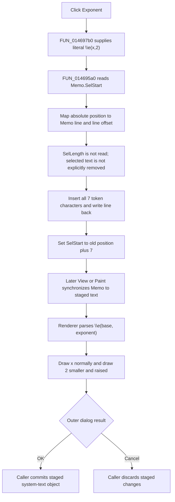

# Insert an exponent template

This button inserts the exact formatted-text token `\e(x,2)` into CSysTextDlg's memo at the current selection start. In the rendered preview, the token appears as a normal `x` followed by a smaller, raised `2`.

## Control

| Property | Recovered value |
| --- | --- |
| Form | CSysTextDlg |
| Component path | CSysTextDlg.ToolsPanel.ToolsNB.Edit.ExpBtn |
| Control class | TSpeedButton |
| Caption | Not present in the recovered resource. |
| Hint | Exponent |
| Text | Not present in the recovered resource. |
| Handler name | ExpBtnClick |
| Handler address | 014697b0 |
| Graph node | `resource:dfm:CSysTextDlg/CSysTextDlg.ToolsPanel.ToolsNB.Edit.ExpBtn` |
| Handler node | `function:014697b0` |
| Graph layer | UI |

## What happens when clicked

`FUN_014697b0` has one operation. It passes the fixed Unicode string `\e(x,2)` to `FUN_014695a0`, the common CSysTextDlg memo-insertion helper. The token is seven characters long:

- `\e` identifies the exponent markup.
- The first argument, `x`, is the base.
- The second argument, `2`, is the exponent.

The click does not calculate a power, read a selected expression, ask for an exponent, or open another dialog. It inserts editable markup with literal `x` and `2` placeholders.

## Insertion, selection, and caret

`FUN_014695a0` reads `Memo.SelStart`, a zero-based absolute text position. It walks `Memo.Lines` and adds each line length plus two characters for the CR/LF boundary until it finds the line that contains the selection start. It then converts the position to the one-based index used by the Delphi UnicodeString insertion routine.

The helper inserts all seven characters into that line and writes the changed line back to `Memo.Lines`. It finally sets `Memo.SelStart` to the original value plus seven. The caret start is therefore immediately after the inserted token.

The helper does not read `Memo.SelLength`. A non-empty selection is not explicitly deleted, replaced, or wrapped in exponent markup. Insertion starts at the selection start in the same way as an empty caret insertion. The recovered source does not prove the final nonzero selection length after the line setter and `SelStart` setter run.

## Preview interpretation

The memo shows the raw `\e(x,2)` text while the dialog is in edit mode. The formatted preview uses the staged system-text renderer:

1. `FUN_0146af40` copies the current memo lines to the staged formatted-text object, measures the result, resizes `DrawRectangle`, and calls the renderer.
2. `FUN_01d166e0` recognizes the `\e` command and calls `FUN_01d12460` to split its two arguments.
3. It draws the first argument at the normal font size.
4. It scales the font for the second argument and moves that argument above the base line before it draws it.

The formatted-text object initializes the exponent font scale at `0.75` in `FUN_01d11b00`. That scale is an object field and can be copied with the rest of the formatted-text settings. The renderer therefore uses the object's current scale, whose recovered default is 75 percent.

The click handler does not call the preview paint function. `ViewBtnClick` calls it when the user changes to the rendered view, and `DrawRectangle.OnPaint` calls it when the preview repaints.

## Staged and committed state

CSysTextDlg edits a private staged system-text object at form field `+0x8e0`. The immediate click changes only `Memo.Lines` and `Memo.SelStart`.

`MemoExit`, `DrawRectangle.OnPaint`, and `CSysTextDlg.OnClose` are recovered synchronization points that copy the memo text into the staged object. The form-close handler runs for both accepted and canceled closes, but the caller owns the commit boundary. For example, `FUN_0149e8d0` copies the staged object back to its original object only when `ShowModal` returns `mrOK`. The outer `bkCancel` path discards the staged object, so it also discards the inserted exponent template from the caller-owned text.

## Click and preview flow

## Handler evidence

- Source: [FUN_014697b0](../../../DecompiledSources/Tina16/functions/00000000014697B0__FUN_014697b0.c)
- Recovered role: Inserts the fixed exponent template `\e(x,2)` into the system-text memo.
- Input: The current `Memo.SelStart` that the shared helper reads.
- Decision: None. The handler always submits the same non-empty token.
- State change: Inserts seven characters into `Memo.Lines` and advances `Memo.SelStart` by seven.
- Output: Raw editable exponent markup. A later preview renders it as `x` with a reduced, raised `2`.
- Complexity: simple
- Distinct outgoing calls: 1

## Direct and related calls

- `function:014695a0` — [FUN_014695a0](../../../DecompiledSources/Tina16/functions/00000000014695A0__FUN_014695a0.c), the already documented common helper that maps `SelStart` to a memo line, inserts without reading `SelLength`, and advances `SelStart`.
- [FUN_00416ea0](../../../DecompiledSources/Tina16/functions/0000000000416EA0__FUN_00416ea0.c) is the Delphi UnicodeString insertion routine used by the common helper.
- [FUN_0146af40](../../../DecompiledSources/Tina16/functions/000000000146AF40__FUN_0146af40.c) synchronizes the memo, measures it, and draws the formatted preview.
- [FUN_01d166e0](../../../DecompiledSources/Tina16/functions/0000000001D166E0__FUN_01d166e0.c) recognizes `\e`, parses the two arguments, and draws the second argument with a smaller font at a raised position.
- [FUN_01d11b00](../../../DecompiledSources/Tina16/functions/0000000001D11B00__FUN_01d11b00.c) initializes the formatted-text settings, including the default exponent scale of `0.75` at offset `+0x18`.
- [FUN_0146a6e0](../../../DecompiledSources/Tina16/functions/000000000146A6E0__FUN_0146a6e0.c) is `ViewBtnClick`; it changes to the rendered view and calls the preview paint path.
- [FUN_0146ab60](../../../DecompiledSources/Tina16/functions/000000000146AB60__FUN_0146ab60.c) copies final memo text into the staged object on close.
- [FUN_0149e8d0](../../../DecompiledSources/Tina16/functions/000000000149E8D0__FUN_0149e8d0.c) is a representative owner that commits the staged object only for `mrOK`.

## Resource and parallel-control evidence

- Hint: **Exponent**.
- Extracted glyph: [`0045_CSysTextDlg_CSysTextDlg_ToolsPanel_ToolsNB_Edit_ExpBtn_Glyph_Data.png`](../../../glyph/0045_CSysTextDlg_CSysTextDlg_ToolsPanel_ToolsNB_Edit_ExpBtn_Glyph_Data.png)
- The 21 by 21 glyph shows `x` with a smaller `2` above and to its right. The source-proven `\e(x,2)` token and renderer establish that this image means exponent formatting.
- The embedded source is a 374-byte Delphi BMP. The extractor stored it as a 242-byte PNG.
- `EquEditor.EETPanel.EEExponBtn` has the same **Exponent** hint, the same glyph hash, and a parallel handler, [FUN_014643b0](../../../DecompiledSources/Tina16/functions/00000000014643B0__FUN_014643b0.c), that inserts the same `\e(x,2)` token through EquEditor's matching insertion helper.
- Nearby label candidate: None.

## No-op, error, and evidence limits

- There is no intentional no-op path. Each completed click attempts to insert the fixed seven-character token.
- An empty selection is a normal caret insertion. A non-empty selection is not a proven replacement because the common helper never reads `SelLength`.
- The handler and insertion helper have no local exception handler or rollback. A UnicodeString allocation, line lookup, line write, or memo selection operation can propagate through the Delphi exception path.
- The click does not validate later user edits to the markup. The fixed template itself follows the two-argument `\e` form that the recovered renderer recognizes.
- Preview timing is separate from insertion. The handler does not invalidate or repaint `DrawRectangle` itself.
