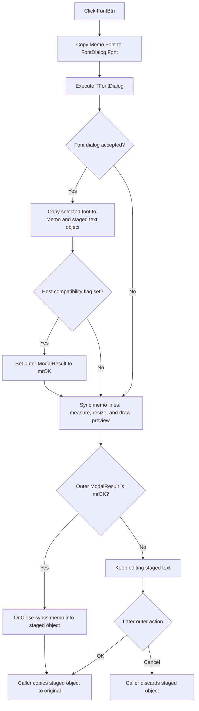

# Choose the system-text font

This button opens the form's `TFontDialog` with the current memo font. A font-dialog Cancel keeps the current font. An accepted selection updates the memo and the staged system-text object, then refreshes the rendered preview.

## Control

| Property | Recovered value |
| --- | --- |
| Form | CSysTextDlg |
| Component path | CSysTextDlg.ButtonsNB.TPage.FontBtn |
| Control class | TBitBtn |
| Caption | One space |
| Hint | Not present in the recovered resource. |
| Text | Not present in the recovered resource. |
| Handler name | FontBtnClick |
| Handler address | 0146a610 |
| Graph node | `resource:dfm:CSysTextDlg/CSysTextDlg.ButtonsNB.TPage.FontBtn` |
| Handler node | `function:0146a610` |
| Graph layer | UI |

## What happens when clicked

`FUN_0146a610` first assigns `Memo.Font` to `FontDialog.Font`. This resets the dialog to the font that the text editor currently shows each time the user clicks the button. The handler then executes the `TFontDialog` through its virtual `Execute` method and tests the Boolean result.

If the user accepts the font dialog, the handler assigns `FontDialog.Font` to two destinations:

- `Memo.Font`, so the editor text uses the selected font.
- The font at offset `+0x80` in the staged object's nested rendered-text record at `+0x90`, so the staged model uses the same font.

These assignments are inside the success branch. If the user cancels the font dialog, neither font is changed. The handler has no extra font validation and no control-specific error message.

The accepted branch also tests a global host-compatibility flag. `FUN_01d771e0` derives this flag while it probes Wine exports and examines the reported host version. When the flag is set, `FontBtnClick` writes `1` to the form's `ModalResult` field. This is `mrOK`, so the outer text dialog closes as accepted after the event returns. When the flag is clear, the outer dialog stays open and the selected font remains staged until the user chooses its built-in OK or Cancel button.

The final call to `FUN_0146af40` runs for both font-dialog results. It copies the current memo lines into the staged text object, measures the rendered text on `DrawRectangle.Canvas`, changes the paint box width and height to the measured bounds plus 10 pixels, invalidates the cached text measurements, and draws the preview. Therefore, font-dialog Cancel does not change the font, but it still synchronizes the current memo text and refreshes the preview with the unchanged font.

## Staged and committed state

The font selection does not normally write directly to the caller's original text object. `FUN_0146a9a0` initializes CSysTextDlg by copying the supplied object into the internal object at `+0x8e0`; it then loads that object's font and text into `Memo`. `FUN_0146ab60`, the form's `OnClose` handler, copies the final memo font and lines back into this internal object.

The caller controls the commit. For example, `FUN_0149e8d0` shows CSysTextDlg and calls `FUN_01a5eb60` to copy the internal result back to the original object only when `ShowModal` returns `mrOK`. Other recovered callers also reject `mrCancel` before they copy the staged object. The DFM uses `bkOK` and `bkCancel` for the outer buttons. Thus, a later outer Cancel discards a font that was previewed in the editor. The compatibility branch described above changes this sequence by setting the outer result to `mrOK` from `FontBtnClick`.

## Click flow

## Handler evidence

- Source: [FUN_0146a610](../../../DecompiledSources/Tina16/functions/000000000146A610__FUN_0146a610.c)
- Recovered role: Opens the font dialog for the current memo font and applies an accepted font to the system-text editor and its staged model.
- Input: `Memo.Font` at form component field `+0x6e8`, `FontDialog` at `+0x728`, and the internal system-text object at `+0x8e0`.
- Decisions: The `TFontDialog.Execute` result controls the two font assignments. A separate compatibility flag controls whether an accepted font also sets the outer dialog result to `mrOK`.
- State change: On acceptance, changes `Memo.Font` and the staged object's font. It can also set the outer form `ModalResult` to `1` on the compatibility path.
- Output: A refreshed preview in `DrawRectangle`; on the compatibility path, the outer dialog then returns an accepted result.
- Complexity: simple
- Distinct outgoing calls: 1 recovered direct call. The font assignments and dialog execution are virtual calls and do not appear as direct graph call edges.

## Direct and related calls

- `function:0146af40` — [FUN_0146af40](../../../DecompiledSources/Tina16/functions/000000000146AF40__FUN_0146af40.c), the `DrawRectangle.OnPaint` handler that synchronizes memo lines, measures the staged text, resizes the paint box, and renders it.
- [FUN_0146a9a0](../../../DecompiledSources/Tina16/functions/000000000146A9A0__FUN_0146a9a0.c) copies the supplied text object into the dialog's staging object and loads its font and lines into `Memo`.
- [FUN_0146ab60](../../../DecompiledSources/Tina16/functions/000000000146AB60__FUN_0146ab60.c) copies the memo font and lines back into the staging object when CSysTextDlg closes.
- [FUN_01a5eb60](../../../DecompiledSources/Tina16/functions/0000000001A5EB60__FUN_01a5eb60.c) is the system-text object copy routine used for both staging and accepted-result commit.
- [FUN_0149e8d0](../../../DecompiledSources/Tina16/functions/000000000149E8D0__FUN_0149e8d0.c) is a representative caller that commits the staged result only after `ShowModal` returns `mrOK`.
- [FUN_01d771e0](../../../DecompiledSources/Tina16/functions/0000000001D771E0__FUN_01d771e0.c) probes Wine exports and supplies the host-compatibility condition read by `FontBtnClick`.

## Resource evidence

- `FontDialog` is a nonvisual `TFontDialog` component on CSysTextDlg.
- `FontBtn` has no useful caption or hint. Its caption is one space.
- Extracted glyph: [`0051_CSysTextDlg_CSysTextDlg_ButtonsNB_TPage_FontBtn_Glyph_Data.png`](../../../glyph/0051_CSysTextDlg_CSysTextDlg_ButtonsNB_TPage_FontBtn_Glyph_Data.png)
- The 20 by 20 glyph is a black, slanted letter **F** on a gray button background. It supports the font meaning, while the handler's `TFontDialog` operations establish that meaning.
- The embedded source resource is a 362-byte Delphi BMP. The extractor stored it as a 229-byte PNG.
- The outer `OKBtn` and `CancelBtn` use the built-in `bkOK` and `bkCancel` kinds.

## Nearby label candidates

No same-parent label candidate is available. The glyph and source provide the useful evidence for this control.

## Error and evidence limits

- The handler does not catch exceptions from `TFont.Assign`, `TFontDialog.Execute`, measurement, or rendering. Such failures leave through the Delphi or VCL exception path; no local recovery or message is present.
- The recovered code does not expose the native font dialog's internal validation or the exact font attributes that a user selects.
- The data-backed host marker used to set the compatibility flag is not recovered as a readable symbol. The article identifies the flag by its proven Wine and host-version initialization, not by a guessed platform name.
