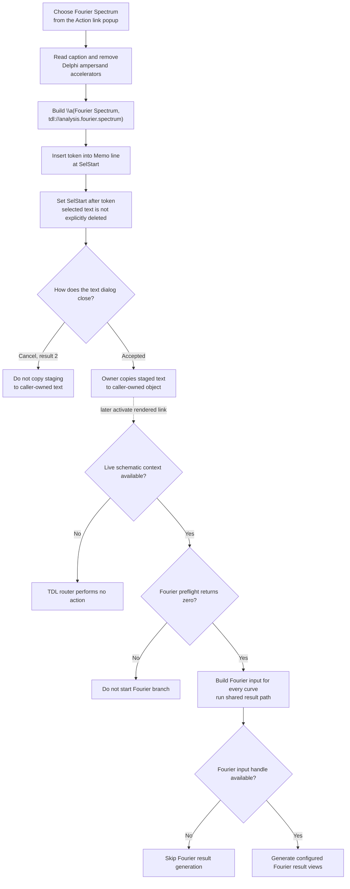

# Insert a Fourier Spectrum analysis action link

> Analysis status: Complete. This menu command inserts the exact markup `\a(Fourier Spectrum,tdl://analysis.fourier.spectrum)` into the text memo. It does not run Fourier analysis during the menu click.

## Control

| Property | Recovered value |
| --- | --- |
| Form | CSysTextDlg |
| Form caption | Text |
| Component path | CSysTextDlg.DeepLinkPopUpMnu.FourierSpectrumMnu |
| Control class | TMenuItem |
| Caption | Fourier Spectrum |
| Parent menu | DeepLinkPopUpMnu |
| Menu launcher | DeepLinkBtn, hint **Action link** |
| Handler name | FourierSpectrumMnuClick |
| Handler address | 0146c880 |
| Graph node | `resource:dfm:CSysTextDlg/CSysTextDlg.DeepLinkPopUpMnu.FourierSpectrumMnu` |
| Handler node | `function:0146c880` |
| Graph layer | UI |

## What happens when selected

`FUN_0146c880` reads the current `FourierSpectrumMnu` caption through form
field `+0x880`. It removes all `&` characters, which Delphi uses as menu
accelerator markers. The recovered caption has no ampersand, so its cleaned
display text remains `Fourier Spectrum`.

The handler joins the decoded prefix `\a(`, the cleaned caption, and the fixed
suffix `,tdl://analysis.fourier.spectrum)`. The exact inserted token is:

`\a(Fourier Spectrum,tdl://analysis.fourier.spectrum)`

The `\a(display,target)` form is TINA action-link markup. `Fourier Spectrum`
is the displayed label. `tdl://analysis.fourier.spectrum` is the internal
action target. The handler passes the completed token to `FUN_014695a0`; it
does not inspect a circuit or invoke an analysis function itself.

## Memo insertion, selection, and caret

`FUN_014695a0` reads `Memo.SelStart`, which is a zero-based absolute text
position. It walks `Memo.Lines` from the first line and adds each line length
plus two characters for CR/LF until it finds the line that contains that
position. It then converts the position in that line to the one-based index
used by the Delphi string insertion helper.

The helper inserts the complete token into that line and writes the changed
line back to `Memo.Lines`. It finally sets `Memo.SelStart` to the original
absolute position plus the token length. The new caret start is therefore
immediately after the inserted markup.

The helper does not read `Memo.SelLength`, selected text, or a replacement
range. It does not explicitly delete selected characters. When a selection is
present, insertion starts at its `SelStart`; the recovered source does not
prove whether the memo preserves or clears the previous nonzero selection
length after its line and selection-start setters run.

## Menu context

`FourierSpectrumMnu` is a direct item in `DeepLinkPopUpMnu`, beside action-link
templates for Transient, Noise, Digital, and nested AC and DC analyses. The
`DeepLinkBtn` speed button has the hint **Action link**. Its click handler opens
this popup next to that button. Selecting **Fourier Spectrum** is therefore an
editor command that inserts one action-link template. It is not the normal
Analysis menu command that runs Fourier Spectrum immediately.

## Later interpretation and analysis route

The target is interpreted only when a user later activates the rendered link.
`FUN_01a5e850` extracts the target at the activated text position. It routes a
`tdl://` target to `FUN_01a62740` instead of the external shell-open path.

`FUN_01a62740` requires a non-null schematic context. It removes the `tdl://`
scheme, recognizes the `analysis.` namespace, and matches the exact
`fourier.spectrum` command. Its Fourier branch then follows these steps:

1. Call the shared analysis preflight with analysis selector `2`. A nonzero
   result stops this branch.
2. On a zero result, request Fourier input data for `<EVERYCURVE>` from the
   active circuit result data.
3. Invoke the shared transient-analysis result path.
4. If the Fourier input handle is non-null, generate the configured Fourier
   result views. The branch uses the current global Fourier options, with
   `0x3F` as the recovered fallback output mask when the related option byte is
   zero.

The direct NetlistEditor and SchematicEditor Fourier Spectrum handlers use the
same preflight, `<EVERYCURVE>` data builder, shared result step, and Fourier
result generator. This parallel command path confirms the meaning of the TDL
branch independently of the action-link caption.

## Persistence boundary

The immediate state change is limited to `Memo.Lines` and `Memo.SelStart`.
`FourierSpectrumMnuClick` does not write a file, modify the caller-owned
system-text object, set a modal result, close the dialog, or change the active
circuit.

`MemoExit` and `CSysTextDlg.OnClose` copy the current memo lines into the
dialog's private staged system-text object. The close handler also copies the
font and applies its optional wrap-lines formatting. This staging update runs
when the form closes, including a canceled close.

The inspected existing-object owner `FUN_0149e8d0` copies the staged object
back to the caller-owned object only when `ShowModal` returns result `1`. The
adjacent `bkCancel` button returns result `2`, so that owner destroys the
dialog without copy-back. Other recovered creation owners also reject result
`2`, and some additionally require non-empty text. The caller copy-back is the
commit boundary. The separate **Save** and **Save As** text-menu commands are
not part of this action-link insertion path.

## Click and later-activation flow

## No-op and error behavior

- The menu handler has no validation, confirmation, or intentional no-op
  branch. It always attempts to construct and insert the fixed action target.
- Removing accelerator markers does not change this recovered caption because
  it contains no `&` character.
- An empty selection is a normal caret insertion. A non-empty selection is not
  an explicit replacement because neither handler reads `SelLength`.
- The handler and insertion helper have no local exception handler or rollback.
  A string-allocation, line-list, or memo-operation exception propagates
  through the Delphi runtime and can leave the edit incomplete.
- Cancel discards the edit in the inspected existing-object owner because no
  staged-object copy-back occurs.
- Later activation without a schematic context is a no-op in the TDL router.
  An unrecognized TDL command would also have no matching action, although this
  fixed token matches the recovered Fourier branch.
- A nonzero Fourier preflight result stops the branch. A null Fourier input
  handle skips the Fourier result generator after the shared result step. The
  insertion handler does not receive either later result.
- Analysis setup and result routines own any later user messages or errors.
  The insertion click has no analysis-error path because it does not run the
  target.

## Evidence

- [Fourier Spectrum menu handler `FUN_0146c880`](../../../DecompiledSources/Tina16/functions/000000000146C880__FUN_0146c880.c) reads the menu caption, removes ampersands, concatenates the recovered `\a(` prefix with the fixed Fourier target suffix, and calls the common insertion helper.
- [Memo insertion helper `FUN_014695a0`](../../../DecompiledSources/Tina16/functions/00000000014695A0__FUN_014695a0.c) maps `SelStart` to a line, inserts the token without reading `SelLength`, writes the line, and advances `SelStart` by the inserted length.
- [Delphi string insertion helper `FUN_00416ea0`](../../../DecompiledSources/Tina16/functions/0000000000416EA0__FUN_00416ea0.c) inserts the source at a one-based index while retaining the destination prefix and suffix.
- [Action-link popup opener `FUN_0146bfe0`](../../../DecompiledSources/Tina16/functions/000000000146BFE0__FUN_0146bfe0.c) opens `DeepLinkPopUpMnu` next to the speed button whose recovered hint is **Action link**.
- [Rendered-link dispatcher `FUN_01a5e850`](../../../DecompiledSources/Tina16/functions/0000000001A5E850__FUN_01a5e850.c) extracts an activated target, sends `tdl://` targets to the internal router, and uses the shell-open path for ordinary external targets.
- [TDL command router `FUN_01a62740`](../../../DecompiledSources/Tina16/functions/0000000001A62740__FUN_01a62740.c) requires a context, recognizes `analysis.fourier.spectrum`, gates it on preflight, requests `<EVERYCURVE>` data, and invokes the shared result and Fourier generation functions.
- [Fourier data builder `FUN_0114dc00`](../../../DecompiledSources/Tina16/functions/000000000114DC00__FUN_0114dc00.c) selects every matching curve for the `<EVERYCURVE>` input and calculates Fourier-series data from the circuit result source.
- [Shared result path `FUN_013d2f60`](../../../DecompiledSources/Tina16/functions/00000000013D2F60__FUN_013d2f60.c) creates and publishes the recovered Transient analysis result used in this command sequence.
- [Fourier result generator `FUN_013d99f0`](../../../DecompiledSources/Tina16/functions/00000000013D99F0__FUN_013d99f0.c) creates selected Fourier result views, including recovered real, imaginary, power, and amplitude paths.
- [Direct NetlistEditor command `FUN_01533720`](../../../DecompiledSources/Tina16/functions/0000000001533720__FUN_01533720.c) uses the same Fourier command sequence after its preflight.
- [Direct SchematicEditor command `FUN_01c92850`](../../../DecompiledSources/Tina16/functions/0000000001C92850__FUN_01c92850.c) uses the same sequence and explicitly records `FourierSpectrumClick` after dispatch.
- [Memo exit synchronization `FUN_0146b040`](../../../DecompiledSources/Tina16/functions/000000000146B040__FUN_0146b040.c) copies current memo lines into the dialog-local staged object.
- [Form close synchronization `FUN_0146ab60`](../../../DecompiledSources/Tina16/functions/000000000146AB60__FUN_0146ab60.c) copies memo lines and font into staging and performs optional line wrapping.
- [Existing-object owner `FUN_0149e8d0`](../../../DecompiledSources/Tina16/functions/000000000149E8D0__FUN_0149e8d0.c) copies staging back only for modal result `1` and otherwise destroys the dialog.

## Direct calls

- `function:005b84f0` - removes `&` accelerator markers from the menu caption through the recovered Unicode string-replace implementation.
- `function:00416cd0` - concatenates the three action-link markup parts.
- `function:014695a0` - inserts the complete token into the memo and advances its selection start.
- `function:00414b50`, `function:00414480`, and `function:00414560` - manage temporary Delphi UnicodeString values.

## Resource evidence

- `FourierSpectrumMnu` is a `TMenuItem` with caption **Fourier Spectrum**
  directly under `DeepLinkPopUpMnu`.
- `DeepLinkBtn` is a `TSpeedButton` with hint **Action link** and opens this
  popup menu. This establishes the editor-menu context but does not by itself
  prove the inserted target.
- The exact `tdl://analysis.fourier.spectrum` target comes from the handler
  literal and decoded recovered constants.
- The menu item has no hint, glyph, image index, checked state, shortcut, or
  same-parent label candidate in the recovered DFM.

## Analysis limits

- The original Delphi name of the common insertion helper is absent. Its memo
  and selection roles are established by the line collection and the paired
  recovered `SelStart` accessors.
- The source does not establish the memo's internal `SelLength` behavior after
  a line replacement followed by `SetSelStart`. This article states only that
  no selected-text deletion or `SelLength` call is present.
- The preflight and result functions contain broader analysis behavior. This
  article documents only the branches reached by the exact Fourier TDL target.
- The inspected owner proves one accepted copy-back rule. Other callers can
  apply additional acceptance and non-empty-text checks.
- The knowledge-graph JSON export was absent during review. Graph node, edge,
  layer, and resource checks used the canonical DuckDB database in read-only
  mode without changing it.
