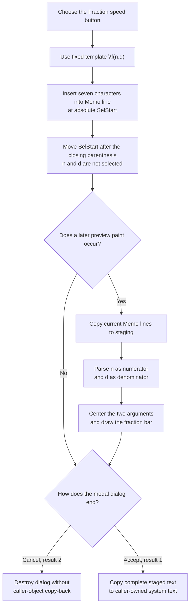

# Insert a numerator and denominator fraction template

> Analysis status: Complete. This button inserts the exact seven-character
> markup `\f(n,d)` into the text memo. It does not ask for values or render the
> fraction during the click.

## Control

| Property | Recovered value |
| --- | --- |
| Form | CSysTextDlg |
| Form caption | Text |
| Component path | CSysTextDlg.ToolsPanel.ToolsNB.Edit.FracBtn |
| Control class | TSpeedButton |
| Caption | Not present |
| Hint | Fraction |
| Handler name | FracBtnClick |
| Handler address | 01469770 |
| Graph node | `resource:dfm:CSysTextDlg/CSysTextDlg.ToolsPanel.ToolsNB.Edit.FracBtn` |
| Handler node | `function:01469770` |
| Graph layer | UI |

## What happens when selected

`FUN_01469770` passes one fixed Unicode string to the common CSysTextDlg memo
insertion helper:

`\f(n,d)`

The `\f` command identifies a formatted fraction. `n` and `d` are literal
placeholder text for the numerator and denominator. The handler does not read
the button, current text, selected text, or a dialog value before it inserts
the template.

The independent Equation Editor fraction button uses the identical `\f(n,d)`
literal and an equivalent editor insertion path. This repeated command and the
format renderer confirm that the token is application markup, not plain text
chosen only from the hint.

## Memo insertion, selection, and caret

`FUN_014695a0` reads the memo's zero-based absolute `SelStart`. It walks
`Memo.Lines`, adding each preceding line length plus two characters for CR/LF,
until it finds the line that contains that position. It converts the location
to the one-based index required by the Delphi string insertion helper, inserts
the complete template into that line, and writes the line back.

The helper then sets `SelStart` to the original position plus the inserted
string length. Because `\f(n,d)` has seven characters, the caret start moves
forward by seven and ends after the closing parenthesis. The click does not
select `n` or `d` for replacement.

The insertion helper does not read `SelLength`, selected text, or a replacement
range. It does not explicitly delete a current selection. If text is selected,
the insertion point is its `SelStart`; the recovered code does not establish
whether the memo preserves or clears the prior nonzero selection length after
the line write and `SetSelStart` call.

## Preview and fraction interpretation

The button does not call the preview paint handler or invalidate a control.
When the `DrawRectangle` paint box is painted later, `FUN_0146af40` first copies
the current memo lines into the staged formatted-text object. It measures that
object, resizes the paint box with a ten-pixel allowance, and calls the
formatted-text renderer.

The recovered renderer recognizes backslash command character `f` and calls
`FUN_01d12460` to split the parenthesized command at its top-level comma. The
parser tracks nested parentheses, so nested formatted expressions can remain
inside either argument. For the inserted template, it returns `n` as the first
argument and `d` as the second.

`FUN_01d166e0` measures both arguments recursively. It uses the larger width as
the fraction width, centers the numerator and denominator independently,
places the first argument above the fraction center, places the second below
it, and calls `FUN_01d16380` for the horizontal dividing line. The line helper
uses the drawing canvas in normal rendering and emits an equivalent black line
with the current stroke width in its recovered export path.

Preview is therefore event-driven. A later paint can show the fraction, but no
preview, measurement, or drawing result is returned to `FracBtnClick`.

## Staged and committed state

The immediate change is to the memo's line collection and `SelStart`. The
handler does not directly modify the caller-owned system-text object.

The current memo lines enter the dialog's private staged object through any of
these recovered paths:

- the `DrawRectangle` paint handler, before it renders a preview;
- `MemoExit`, when focus leaves the editor;
- `FormClose`, which also copies the memo font and applies optional line
  wrapping.

In the inspected existing-object owner `FUN_0149e8d0`, modal result `1` copies
the complete staged object back to the caller-owned object. The adjacent
`bkCancel` button returns result `2`; that path destroys the dialog without the
copy-back. Thus Cancel discards this insertion for that owner even if preview
or close synchronization already placed it in the private staged object.

The click does not set a modal result, close the dialog, write a file, or modify
a circuit. Dialog acceptance is the in-memory commit boundary. Normal object
serialization is a later owner operation.

## Insertion and later-preview flow

## No-op and error behavior

- The handler has no validation, confirmation, or intentional no-op branch. It
  always attempts to insert the fixed template.
- An empty selection is a normal caret insertion. A nonempty selection is not
  an explicit replacement because neither the handler nor insertion helper
  reads `SelLength`.
- Repeated clicks append another `\f(n,d)` template at the current caret each
  time; there is no duplicate suppression.
- The fixed template has the opening parenthesis, top-level comma, and closing
  parenthesis required by the recovered two-argument parser. Errors caused by
  later manual edits to malformed markup are outside this click path.
- The handler and insertion helper have no local exception handler, status
  result, or rollback. A string-allocation, line-list, or memo-operation
  exception propagates through the Delphi runtime and can leave the edit
  incomplete.
- No preview error occurs during this handler because it does not invoke the
  renderer. Later paint and layout routines own their own failures.
- Cancel is not an error. It prevents caller-object copy-back in the inspected
  modal owner.

## Evidence

- [Fraction click handler `FUN_01469770`](../../../DecompiledSources/Tina16/functions/0000000001469770__FUN_01469770.c) passes the exact literal `\f(n,d)` to the common memo insertion helper.
- [Memo insertion helper `FUN_014695a0`](../../../DecompiledSources/Tina16/functions/00000000014695A0__FUN_014695a0.c) maps absolute `SelStart` to a memo line, inserts the supplied text without reading `SelLength`, writes the line, and advances `SelStart` by the inserted length.
- [Delphi string insertion helper `FUN_00416ea0`](../../../DecompiledSources/Tina16/functions/0000000000416EA0__FUN_00416ea0.c) inserts source text at a one-based string index while preserving the destination prefix and suffix.
- [Equation Editor fraction handler `FUN_01464370`](../../../DecompiledSources/Tina16/functions/0000000001464370__FUN_01464370.c) uses the same `\f(n,d)` template in an independent fraction control.
- [Paint-box handler `FUN_0146af40`](../../../DecompiledSources/Tina16/functions/000000000146AF40__FUN_0146af40.c) copies current memo lines into staging, updates preview dimensions, and invokes formatted-text drawing.
- [Two-argument format parser `FUN_01d12460`](../../../DecompiledSources/Tina16/functions/0000000001D12460__FUN_01d12460.c) finds a top-level comma while tracking nested parentheses and returns the two argument substrings.
- [Formatted-text renderer `FUN_01d166e0`](../../../DecompiledSources/Tina16/functions/0000000001D166E0__FUN_01d166e0.c) recognizes `\f`, measures the two arguments, centers and vertically separates them, and requests the fraction line.
- [Fraction-line helper `FUN_01d16380`](../../../DecompiledSources/Tina16/functions/0000000001D16380__FUN_01d16380.c) draws the horizontal line or emits its recovered black-line export representation.
- [Memo exit synchronization `FUN_0146b040`](../../../DecompiledSources/Tina16/functions/000000000146B040__FUN_0146b040.c) copies the current memo lines into the private staged object.
- [Form close synchronization `FUN_0146ab60`](../../../DecompiledSources/Tina16/functions/000000000146AB60__FUN_0146ab60.c) copies memo lines and font into staging and performs optional line wrapping.
- [Existing-object modal owner `FUN_0149e8d0`](../../../DecompiledSources/Tina16/functions/000000000149E8D0__FUN_0149e8d0.c) copies the staged object back only for modal result `1`.
- [Extracted Fraction glyph](../../../glyph/0044_CSysTextDlg_CSysTextDlg_ToolsPanel_ToolsNB_Edit_FracBtn_Glyph_Data.png) shows `n` above `d` with a horizontal dividing line.

## Direct calls

- `function:014695a0` - inserts the fixed fraction markup into the memo and
  advances the caret start. Its canonical shared annotation is owned by
  `TIARA-diz.6.7.131` and is not duplicated in this control fragment.

## Resource and glyph evidence

- `FracBtn` is a 25 by 25 `TSpeedButton` with the hint **Fraction** and no
  caption.
- Its embedded Delphi BMP glyph was extracted as a 21 by 21 PNG. It depicts
  `n` above `d` with a horizontal fraction bar.
- The Equation Editor's independent **Fraction** button uses an extracted glyph
  with the same SHA-256 value and the same `\f(n,d)` handler literal. This is
  corroborating UI evidence for the numerator/denominator interpretation.
- The exact token and its effect come from handler and renderer code, not from
  the hint or glyph alone.

## Analysis limits

- The original Delphi name of the common insertion helper is absent. Its memo
  and selection behavior is established by the recovered line collection and
  `SelStart` accessors.
- The source does not establish the memo's internal `SelLength` behavior after
  a line replacement followed by `SetSelStart`. This article states only that
  no selected-text deletion or `SelLength` call is present.
- The parser and renderer support nested and other formatting commands. This
  article documents only the path required by the fixed `\f(n,d)` template.
- The inspected owner proves one accepted copy-back rule. Other dialog owners
  can add their own acceptance checks.
