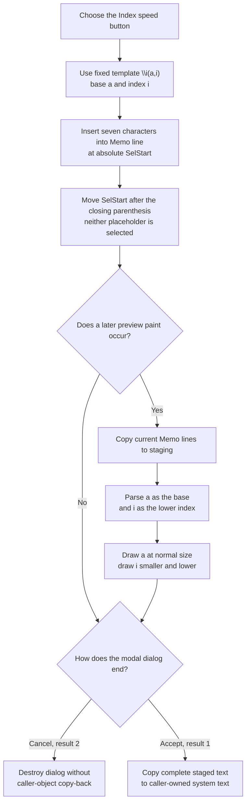

# Insert an index/subscript template

> Analysis status: Complete. This button inserts the exact seven-character
> markup `\i(a,i)` into the text memo. It does not ask for a base or index and
> does not render the expression during the click.

## Control

| Property | Recovered value |
| --- | --- |
| Form | CSysTextDlg |
| Form caption | Text |
| Component path | CSysTextDlg.ToolsPanel.ToolsNB.Edit.IndxBtn |
| Control class | TSpeedButton |
| Caption | Not present |
| Hint | Index |
| Handler name | IndxBtnClick |
| Handler address | 01469830 |
| Graph node | `resource:dfm:CSysTextDlg/CSysTextDlg.ToolsPanel.ToolsNB.Edit.IndxBtn` |
| Handler node | `function:01469830` |
| Graph layer | UI |

## What happens when selected

`FUN_01469830` passes one fixed Unicode string to the common CSysTextDlg memo
insertion helper:

`\i(a,i)`

The `\i` command identifies a two-part index expression. The first argument,
`a`, is the base. The second argument, `i`, is the lower index or subscript.
Both characters are literal placeholder text. The handler does not read the
button, current text, selected text, or another input before it inserts the
template.

This interpretation does not depend on the button hint alone. The recovered
formatted-text renderer has a dedicated branch for command character `i` and
parses two arguments. The independent Equation Editor **Index** button uses
the identical `\i(a,i)` literal and an equivalent memo insertion path. The
[official TINA Advanced Topics manual, page 84](https://www.tina.com/docs/v12/ADVANCED%20TOPICS%20MANUAL.pdf)
uses `\i(f,1)` for an equation displayed as `f` with a lower `1`.

## Memo insertion, selection, and caret

`FUN_014695a0` reads the memo's zero-based absolute `SelStart`. It walks
`Memo.Lines`, adding each preceding line length plus two characters for CR/LF,
until it finds the line that contains that position. It converts the location
to the one-based index required by the Delphi string insertion helper, inserts
the complete template into that line, and writes the line back.

The helper then sets `SelStart` to the original position plus the inserted
string length. Because `\i(a,i)` has seven characters, the caret start moves
forward by seven and ends after the closing parenthesis. The click does not
select either placeholder for replacement.

The insertion helper does not read `SelLength`, selected text, or a replacement
range. It does not explicitly delete a current selection. If text is selected,
the insertion point is its `SelStart`; the recovered code does not establish
whether the memo preserves or clears the previous nonzero selection length
after the line write and `SetSelStart` call.

## Preview and index interpretation

The click handler does not call the preview paint handler or invalidate a
control. The separate **View** button changes the notebook to the preview page
and calls `FUN_0146af40`. A later normal paint can call the same paint handler.

`FUN_0146af40` copies the current memo lines into the dialog's staged
formatted-text object. It measures that object, resizes the paint box with a
ten-pixel allowance, clears cached dimensions, and draws the formatted text.

The recovered measure and draw paths recognize backslash command character
`i`. `FUN_01d12460` splits its parenthesized body at the top-level comma while
tracking nested parentheses. For this template, it returns `a` as the first
argument and `i` as the second.

The renderer draws the first argument at the normal text size. It then changes
the font size by the configured **Index / Relative Size** factor, moves to the
right of the base, and draws the second argument lower. The vertical placement
also uses the configured **Index / Label overlap** factor. The original font
size is restored after the index is drawn. Thus the later preview renders an
`a` with a smaller, lowered `i`; it does not display the markup punctuation as
ordinary text.

No preview, measurement, or drawing result returns to `IndxBtnClick` because
the click only edits the memo.

## Staged and committed state

The immediate change is limited to `Memo.Lines` and `Memo.SelStart`. The click
does not directly modify the caller-owned system-text object.

The current memo lines enter the dialog's private staged object through any of
these recovered paths:

- the preview paint handler, before it measures and renders the text;
- `MemoExit`, when focus leaves the editor; and
- `FormClose`, which also copies the memo font and applies optional line
  wrapping.

In the inspected existing-object owner `FUN_0149e8d0`, modal result `1` copies
the complete staged object back to the caller-owned object. The adjacent
`bkCancel` button returns result `2`; that path destroys the dialog without the
copy-back. Cancel therefore discards this insertion for that owner even if a
preview or close synchronization already copied it into private staging.

The click does not set a modal result, close the dialog, write a file, or
modify a circuit. Dialog acceptance is the in-memory commit boundary. Normal
object serialization is a later owner operation.

## Insertion and later-preview flow

## No-op and error behavior

- The handler has no validation, confirmation, or intentional no-op branch. It
  always attempts to insert the fixed template.
- An empty selection is a normal caret insertion. A nonempty selection is not
  an explicit replacement because neither the handler nor insertion helper
  reads `SelLength`.
- Repeated clicks insert another `\i(a,i)` template at the current caret each
  time. With no intervening caret movement, the templates become adjacent.
- The fixed template has the opening parenthesis, top-level comma, and closing
  parenthesis required by the recovered two-argument parser. Errors caused by
  later manual edits to malformed markup are outside this click path.
- The handler and insertion helper have no local exception handler, status
  result, or rollback. A string-allocation, line-list, or memo-operation
  exception propagates through the Delphi runtime and can leave the edit
  incomplete.
- No renderer error occurs during this handler because it does not invoke the
  renderer. Later paint and layout routines own their own failures.
- Cancel is not an error. It prevents caller-object copy-back in the inspected
  modal owner.

## Evidence

- [Index click handler `FUN_01469830`](../../../DecompiledSources/Tina16/functions/0000000001469830__FUN_01469830.c) passes the exact literal `\i(a,i)` to the common memo insertion helper.
- [Memo insertion helper `FUN_014695a0`](../../../DecompiledSources/Tina16/functions/00000000014695A0__FUN_014695a0.c) maps absolute `SelStart` to a memo line, inserts without reading `SelLength`, writes the line, and advances `SelStart` by the inserted length.
- [Delphi string insertion helper `FUN_00416ea0`](../../../DecompiledSources/Tina16/functions/0000000000416EA0__FUN_00416ea0.c) inserts source text at a one-based string index while preserving the destination prefix and suffix.
- [Equation Editor index handler `FUN_01464470`](../../../DecompiledSources/Tina16/functions/0000000001464470__FUN_01464470.c) uses the same `\i(a,i)` template in an independent Index control.
- [Paint-box handler `FUN_0146af40`](../../../DecompiledSources/Tina16/functions/000000000146AF40__FUN_0146af40.c) copies current memo lines into staging, updates preview dimensions, and invokes formatted-text drawing.
- [Two-argument format parser `FUN_01d12460`](../../../DecompiledSources/Tina16/functions/0000000001D12460__FUN_01d12460.c) finds a top-level comma while tracking nested parentheses and returns both argument strings.
- [Formatted-text measurement `FUN_01d13670`](../../../DecompiledSources/Tina16/functions/0000000001D13670__FUN_01d13670.c) recognizes `\i`, measures both arguments, and applies the index-size and overlap factors.
- [Formatted-text renderer `FUN_01d166e0`](../../../DecompiledSources/Tina16/functions/0000000001D166E0__FUN_01d166e0.c) draws the base, scales and lowers the index, and restores the original font size.
- [Index-settings initializer `FUN_01466720`](../../../DecompiledSources/Tina16/functions/0000000001466720__FUN_01466720.c) maps the recovered style values to the **Index / Relative Size** and **Index / Label overlap** controls.
- [View command `FUN_0146a6e0`](../../../DecompiledSources/Tina16/functions/000000000146A6E0__FUN_0146a6e0.c) changes to preview mode and invokes the paint path.
- [Memo exit synchronization `FUN_0146b040`](../../../DecompiledSources/Tina16/functions/000000000146B040__FUN_0146b040.c) copies current memo lines into the private staged object.
- [Form close synchronization `FUN_0146ab60`](../../../DecompiledSources/Tina16/functions/000000000146AB60__FUN_0146ab60.c) copies memo lines and font into staging and performs optional line wrapping.
- [Existing-object modal owner `FUN_0149e8d0`](../../../DecompiledSources/Tina16/functions/000000000149E8D0__FUN_0149e8d0.c) copies staging back only for modal result `1`.
- [Extracted Index glyph](../../../glyph/0047_CSysTextDlg_CSysTextDlg_ToolsPanel_ToolsNB_Edit_IndxBtn_Glyph_Data.png) depicts `a` with a smaller, lowered `i`.

## Direct calls

- `function:014695a0` - inserts the fixed index markup into the memo and
  advances the caret start. Its canonical shared annotation is owned by
  `TIARA-diz.6.7.131` and is not duplicated in this control fragment.

## Resource and glyph evidence

- `IndxBtn` is a 25 by 25 `TSpeedButton` with the hint **Index** and no caption.
- Its embedded 374-byte Delphi BMP was extracted as a 21 by 21 PNG. The glyph
  depicts `a` with a smaller, lowered `i`.
- The Equation Editor's independent **Index** button uses an extracted glyph
  with the same SHA-256 value and the same `\i(a,i)` handler literal. This is
  corroborating evidence for the base-and-index interpretation.
- The control has no recovered kind, modal result, checked state, action,
  image-list reference, or same-parent label candidate.
- The exact token and its rendering come from handler and renderer code, not
  from the hint or glyph alone.

## Analysis limits

- The original Delphi name of the common insertion helper is absent. Its memo
  and selection behavior is established by the recovered line collection and
  `SelStart` accessors.
- The source does not establish the memo's internal `SelLength` behavior after
  a line replacement followed by `SetSelStart`. This article states only that
  no selected-text deletion or `SelLength` call is present.
- TINA calls this form an **Index**. This article also uses **subscript** to
  explain the visible lower placement; it does not rename the application
  command.
- The parser and renderer support nested and other formatting commands. This
  article documents only the path required by the fixed `\i(a,i)` template.
- The inspected owner proves one accepted copy-back rule. Other dialog owners
  can add their own acceptance checks.
- The knowledge-graph JSON export was absent during review. The resource
  trigger, single outgoing call, UI layer, function record, glyph evidence,
  and empty nearby-label result were checked in the canonical DuckDB database
  in read-only mode.
