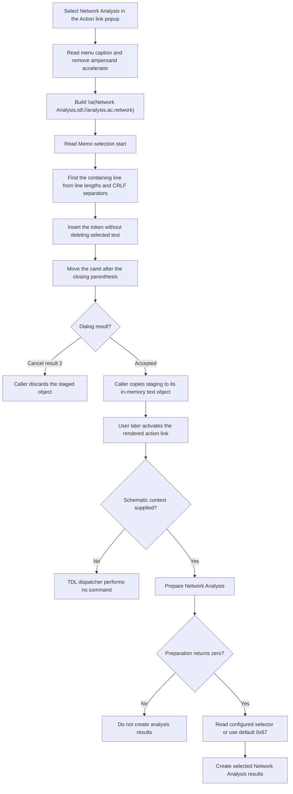

# Insert a Network Analysis action link

> Analysis status: Source reviewed and behavior traced.

## Control

| Property | Recovered value |
| --- | --- |
| Form | CSysTextDlg |
| Component path | CSysTextDlg.DeepLinkPopUpMnu.ACAnalysisMnu.NetworkAnalysisMnu |
| Control class | TMenuItem |
| Popup context | Action link > AC Analysis > Network Analysis |
| Caption | Network Analysis |
| Hint | Not present in the recovered resource. |
| Handler name | NetworkAnalysisMnuClick |
| Handler address | 0146baa0 |
| Graph node | `resource:dfm:CSysTextDlg/CSysTextDlg.DeepLinkPopUpMnu.ACAnalysisMnu.NetworkAnalysisMnu` |
| Handler node | `function:0146baa0` |
| Graph layer | UI |

## What happens when clicked

`FUN_0146baa0` reads the caption of `NetworkAnalysisMnu` from the form field at
`+0x8B0`. It removes an accelerator marker (`&`) from the caption, if one is
present. The recovered caption has no accelerator marker, so its visible text
remains **Network Analysis**.

The handler joins three strings:

```text
\a( + Network Analysis + ,tdl://analysis.ac.network)
```

The exact text sent to the editor insertion helper is therefore:

```text
\a(Network Analysis,tdl://analysis.ac.network)
```

The `\a(` prefix and the `&` removal token were read from constants at
`0x0146BBD8` and `0x0146BBC8` in the verified rebuilt runtime image. The
separate Anchor button inserts `\a(Link,http://www.)`, which confirms that
`\a(caption,target)` is the text system's action-link form.

This click does not start Network Analysis. It inserts an action link into the
dialog's `TMemo`. Network Analysis starts only if a user later activates the
rendered link in a context that supplies a schematic.

## Editor and selection changes

`FUN_014695a0` reads the Memo's current selection start, which is the caret
position. It walks `Memo.Lines` and adds each line length plus two characters
for the CRLF separator until it finds the line that contains the caret. It
then inserts the complete action-link string at the corresponding one-based
position in that line and writes the changed line back to `Memo.Lines`.

After insertion, the helper sets the selection start to the old position plus
the inserted string length. The caret is therefore immediately after the
closing `)`. The helper does not read a selection length and does not delete
selected text. If text is selected, insertion uses the selection start and
keeps the original text.

The handler does not change the current page, open a dialog, run an analysis,
or move to another document. Its direct state change is the Memo text and its
caret position.

## Later link interpretation

When the rendered text receives an activation input, `FUN_01a5e850` resolves
the target under that input. An external target follows the shell-open path.
A target that contains `tdl://` is sent to `FUN_01a62740` instead.

The TDL dispatcher removes the `tdl://` prefix, recognizes the `analysis.`
category, and matches the remaining target `ac.network`. For this target it:

1. calls `FUN_01537800` to prepare Network Analysis for the supplied schematic;
2. stops this branch if preparation returns a nonzero result;
3. obtains the configured network-result selector from `FUN_01536240`;
4. uses the default selector `0x67` when that value is zero; and
5. calls `FUN_013d6a00` to create the selected Network Analysis results.

`FUN_013d6a00` contains the recovered result paths for AC amplitude, phase,
Bode, group delay, loss, VSWR, Smith, and polar outputs. This confirms that
`analysis.ac.network` selects Network Analysis, not AC transfer analysis.

If the activation path has no schematic context, `FUN_01a62740` does nothing.
An unrecognized TDL target also reaches no application command in this
dispatcher. These are activation-time limits; they do not prevent insertion
of the link text.

## Persistence boundary

The click changes only the dialog Memo. `MemoExit` and `FormClose` synchronize
the current Memo lines into the dialog's private staged system-text object.
They do not write a file or copy the staged value to the caller-owned object.

The caller makes the commit decision after `ShowModal` returns. The recovered
existing-object caller copies the staged object back only for modal result 1.
Recovered new-object callers reject result 2 and can also require non-empty
text. Thus, the adjacent built-in Cancel button can still run `FormClose`, but
the caller discards the staged insertion. Accepting the dialog copies it to the
caller-owned in-memory object. Any later file or document save is outside this
click path.

## No-op and error boundaries

The handler has no conditional no-op branch for this menu item. Its action-link
text is non-empty, so it always attempts the Memo insertion. It does not
validate the TDL target, the current selection, or the resulting text.

The handler and insertion helper have no local exception handler. A Delphi
string-allocation failure, an invalid line access, or a VCL line-write failure
propagates through the runtime and can leave the operation incomplete. On later
activation, a missing schematic context performs no command. A nonzero Network
Analysis preparation result stops before result creation.

## Click and activation flow



## Evidence

- [Network Analysis handler `FUN_0146baa0`](../../../DecompiledSources/Tina16/functions/000000000146BAA0__FUN_0146baa0.c) reads the menu caption, builds the `analysis.ac.network` action-link text, and passes it to the common insertion helper.
- [String-replacement wrapper `FUN_005b84f0`](../../../DecompiledSources/Tina16/functions/00000000005B84F0__FUN_005b84f0.c) forwards the caption cleanup to the recovered Unicode string-replacement implementation.
- [Unicode string replacement `FUN_00450070`](../../../DecompiledSources/Tina16/functions/0000000000450070__FUN_00450070.c) proves that the call removes the recovered `&` search token by replacing it with an empty string.
- [Memo insertion helper `FUN_014695a0`](../../../DecompiledSources/Tina16/functions/00000000014695A0__FUN_014695a0.c) maps the current selection start to a line, inserts the supplied text, writes the line back, and advances the selection start.
- [Unicode insertion primitive `FUN_00416ea0`](../../../DecompiledSources/Tina16/functions/0000000000416EA0__FUN_00416ea0.c) inserts a non-empty source string at the bounded one-based destination position.
- [Action-link popup launcher `FUN_0146bfe0`](../../../DecompiledSources/Tina16/functions/000000000146BFE0__FUN_0146bfe0.c) opens `DeepLinkPopUpMnu` at the Action link button's calculated screen position.
- [Anchor insertion handler `FUN_014698a0`](../../../DecompiledSources/Tina16/functions/00000000014698A0__FUN_014698a0.c) supplies the independent literal `\a(Link,http://www.)` example.
- [Rendered-link router `FUN_01a5e850`](../../../DecompiledSources/Tina16/functions/0000000001A5E850__FUN_01a5e850.c) sends TDL links to the application dispatcher and sends non-TDL external targets to the shell-open path.
- [TDL dispatcher `FUN_01a62740`](../../../DecompiledSources/Tina16/functions/0000000001A62740__FUN_01a62740.c) recognizes `analysis.ac.network`, prepares Network Analysis, selects a result mask, and calls the analysis-result function.
- [Network Analysis preparation `FUN_01537800`](../../../DecompiledSources/Tina16/functions/0000000001537800__FUN_01537800.c) prepares the analysis state and returns the status tested by the TDL branch.
- [Network-result selector `FUN_01536240`](../../../DecompiledSources/Tina16/functions/0000000001536240__FUN_01536240.c) returns the selector used by the dispatcher.
- [Network Analysis result builder `FUN_013d6a00`](../../../DecompiledSources/Tina16/functions/00000000013D6A00__FUN_013d6a00.c) creates the result types selected by the bit mask.
- [Memo exit `FUN_0146b040`](../../../DecompiledSources/Tina16/functions/000000000146B040__FUN_0146b040.c) copies current Memo lines into the dialog's staged object.
- [Form close `FUN_0146ab60`](../../../DecompiledSources/Tina16/functions/000000000146AB60__FUN_0146ab60.c) synchronizes the Memo lines and font into staging before the caller handles the modal result.
- [Existing-object caller `FUN_0149e8d0`](../../../DecompiledSources/Tina16/functions/000000000149E8D0__FUN_0149e8d0.c) copies staging to its source object only when `ShowModal` returns 1.
- [New-object caller `FUN_01a7a4a0`](../../../DecompiledSources/Tina16/functions/0000000001A7A4A0__FUN_01a7a4a0.c) rejects result 2, requires non-empty lines, and copies staging only on the accepted path.

## Resource evidence

- `DeepLinkPopUpMnu` is a `TPopupMenu` on `CSysTextDlg`.
- `NetworkAnalysisMnu` is under the **AC Analysis** parent menu and has the caption **Network Analysis**.
- The popup launcher is the `DeepLinkBtn` speed button. Its hint is **Action link**. Its [running-person glyph](../../../glyph/0050_CSysTextDlg_CSysTextDlg_ToolsPanel_ToolsNB_Edit_DeepLinkBtn_Glyph_Data.png) supports an action-link command, but it does not identify Network Analysis by itself.
- `NetworkAnalysisMnu` has no recovered hint, text, action, image index, embedded glyph, or checked state.
- The editor is the client-aligned `TMemo` on the form's edit page.

## Analysis limits

- The recovered C source does not contain the original Delphi name of the common insertion helper.
- The displayed link label comes from the current menu caption. Runtime localization can change that label, but the `tdl://analysis.ac.network` target is fixed in the handler.
- The insertion helper assumes that the Memo's selection start maps to a valid line. It has no local exception handler or repair branch.
- The handler does not validate or execute the TDL target when it inserts the text.
- The later dispatcher needs a schematic context and successful Network Analysis preparation before it creates results.
- No file-save or document-save call is in the insertion, staging, or link-activation path described here.
