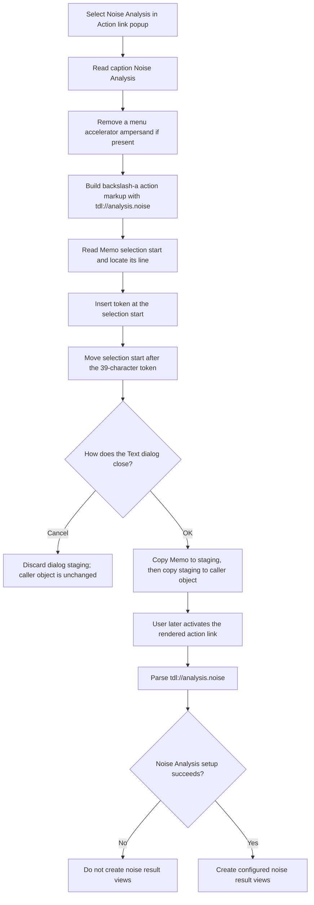

# Insert a Noise Analysis action link

> Analysis status: Complete. This menu item inserts `\a(Noise Analysis,tdl://analysis.noise)` into the Text dialog Memo. It does not start Noise Analysis at insertion time.

## Control

| Property | Recovered value |
| --- | --- |
| Form | CSysTextDlg |
| Form caption | Text |
| Component path | CSysTextDlg.DeepLinkPopUpMnu.NoiseAnalysisMnu |
| Control class | TMenuItem |
| Caption | Noise Analysis |
| Hint | Not present in the recovered resource. |
| Parent menu | DeepLinkPopUpMnu |
| Handler name | NoiseAnalysisMnuClick |
| Handler address | 0146bc30 |
| Graph node | `resource:dfm:CSysTextDlg/CSysTextDlg.DeepLinkPopUpMnu.NoiseAnalysisMnu` |
| Handler node | `function:0146bc30` |
| Graph layer | UI |

## Menu context

The **Action link** speed button opens `DeepLinkPopUpMnu`. The popup contains
internal links for several analyses and other application commands. **Noise
Analysis** is a direct child of that popup. It is not a command that runs the
analysis immediately. It creates markup for an action link in the editable
text.

## Exact inserted text

`FUN_0146bc30` reads the menu item's Caption from the form field at `+0x888`.
It calls the recovered Unicode string-replacement routine with `&` as the old
text and an empty replacement. This removes a Delphi menu accelerator marker
when one is present. The current DFM caption is **Noise Analysis**, without an
accelerator marker, so the visible link text stays unchanged.

The handler then concatenates three values:

1. `\a(`
2. `Noise Analysis`
3. `,tdl://analysis.noise)`

The exact result is:

```text
\a(Noise Analysis,tdl://analysis.noise)
```

The mapped runtime bytes establish the two constants that Ghidra names
`DAT_0146bd68` and `DAT_0146bd58`: `DAT_0146bd68` is `\a(`, and
`DAT_0146bd58` is `&`. The URI suffix is visible directly in the decompiled
handler.

## Editor and selection behavior

The handler passes the 39-character token to `FUN_014695a0`. This shared Memo
insertion helper:

- reads the Memo selection start;
- walks `Memo.Lines` and counts two characters for each CRLF line separator;
- converts the document position to a position in the current line;
- inserts the token into that line and writes the changed line back; and
- sets the Memo selection start to the old position plus 39, immediately after
  the inserted token.

The helper does not read the selection length and does not delete selected
text. Thus, it inserts at the selection start instead of replacing a selected
range. The recovered call sets the selection start after insertion. The exact
remaining selection-length behavior is inside the VCL control and is not
visible in this call path.

The handler does not add a newline, move to another line, close the dialog, or
request an explicit repaint. Updating the Memo line supplies the visible edit.

## Later link interpretation

The inserted `tdl://` value is an internal TINA deep link. It has no navigation
effect while the user edits the text. When application text-hit handling later
finds an action link, `FUN_01a5e850` extracts its target. External targets use
the shell open path. A target that contains `tdl://` goes to
`FUN_01a62740` instead.

The dispatcher removes the `tdl://` prefix, recognizes the `analysis.` group,
and compares the remaining value with `noise`. For this token it runs the
shared Noise Analysis setup path. If that path reports success with result
zero, the dispatcher calls the noise-result builder. The builder uses the
configured noise-output mask, or `0x0F` when that mask is zero. Those four bits
can create **Output noise**, **Input noise**, **Total noise**, and **Signal to
Noise** result views.

This later action needs a valid application or circuit context. It is separate
from the menu click and can occur only after the formatted text is displayed
and the user activates its link.

## Persistence boundary

Selecting this menu item changes only the dialog Memo. It does not write a
file, update the caller-owned text object, or save a circuit.

`MemoExit` copies the Memo lines into the dialog's private staging object.
`FormClose` copies the current lines again. An accepting modal caller then
copies the staged object to its caller-owned text object. A Cancel result makes
the inspected callers discard the dialog and its staging object. Therefore,
the inserted deep link persists to the edited object only when the user later
accepts the Text dialog. A separate save operation controls persistence to a
file.

## Click flow



## No-op and error behavior

- The menu handler has no condition that suppresses insertion. With the
  recovered caption, it always builds and submits the same 39-character token.
- The caption replacement is effectively a no-op for **Noise Analysis** because
  this caption has no `&` accelerator marker.
- The handler does not validate the link URI, the current selection length, or
  the later analysis context.
- On later activation, a missing dispatcher context prevents internal link
  execution. A nonzero result from the Noise Analysis setup path skips result
  creation. A null result-builder input also returns without creating views.
- The insertion handler has no local `try`/`except`, message, retry, or
  rollback. A Unicode allocation, Memo line access, or control update failure
  propagates through the Delphi runtime. No partial-edit recovery is visible.
- Cancel is not an insertion no-op: the token remains visible in the Memo until
  the dialog closes. Cancel prevents the later copy to the caller-owned object.

## Evidence

- [Noise menu handler `FUN_0146bc30`](../../../DecompiledSources/Tina16/functions/000000000146BC30__FUN_0146bc30.c) reads the menu caption, removes an accelerator marker, builds the `analysis.noise` token, and calls the Memo insertion helper.
- [Unicode string replacement `FUN_00450070`](../../../DecompiledSources/Tina16/functions/0000000000450070__FUN_00450070.c) implements the replacement used to remove `&` from the caption.
- [Shared Memo insertion `FUN_014695a0`](../../../DecompiledSources/Tina16/functions/00000000014695A0__FUN_014695a0.c) maps the selection start to a Memo line, inserts the supplied string, writes the line, and advances the selection start by the inserted length.
- [Unicode insertion `FUN_00416ea0`](../../../DecompiledSources/Tina16/functions/0000000000416EA0__FUN_00416ea0.c) inserts without deleting an existing range and clamps the requested string position to the target line length.
- [Action-link popup handler `FUN_0146bfe0`](../../../DecompiledSources/Tina16/functions/000000000146BFE0__FUN_0146bfe0.c) opens the popup menu from the **Action link** speed button.
- [Link target handler `FUN_01a5e850`](../../../DecompiledSources/Tina16/functions/0000000001A5E850__FUN_01a5e850.c) extracts a formatted-text link and routes targets containing `tdl://` to the internal dispatcher.
- [Internal deep-link dispatcher `FUN_01a62740`](../../../DecompiledSources/Tina16/functions/0000000001A62740__FUN_01a62740.c) recognizes `analysis.noise`, runs the Noise Analysis setup path, and starts result creation only after a zero setup result.
- [Noise Analysis setup `FUN_014f6590`](../../../DecompiledSources/Tina16/functions/00000000014F6590__FUN_014f6590.c) returns the status that guards result creation in the internal-link path.
- [Noise-result builder `FUN_013d8d70`](../../../DecompiledSources/Tina16/functions/00000000013D8D70__FUN_013d8d70.c) creates the four possible noise result types selected by the output mask and returns immediately for a null input object.
- [Memo exit `FUN_0146b040`](../../../DecompiledSources/Tina16/functions/000000000146B040__FUN_0146b040.c) copies Memo lines to the dialog-local staging object.
- [Form close `FUN_0146ab60`](../../../DecompiledSources/Tina16/functions/000000000146AB60__FUN_0146ab60.c) copies the current Memo lines and font to the staging object on close.
- [Accepted existing-object caller `FUN_0149e8d0`](../../../DecompiledSources/Tina16/functions/000000000149E8D0__FUN_0149e8d0.c) copies the staging object to the caller-owned object only after modal result `1`.

## Direct calls

- `function:005b84f0` - enters the Unicode caption-replacement routine.
- `function:00416cd0` - concatenates the action-link prefix, caption, and URI
  suffix.
- `function:014695a0` - inserts the completed token into the Memo and advances
  its selection start.
- `function:00414480`, `function:00414560`, and `function:00414b50` manage the
  temporary Delphi UnicodeStrings.

## Resource evidence

- Caption: **Noise Analysis**.
- Parent: `DeepLinkPopUpMnu`.
- The popup is opened by `DeepLinkBtn`, whose hint is **Action link**.
- The control has no hint, action binding, image reference, glyph, checked
  state, or nearby label.
- Sibling items construct the same `\a(display text,tdl://target)` form for
  transient, AC, DC, digital, network, temperature, and Fourier analyses.

## Analysis limits

- The generated C names the two short string constants by address. Their exact
  values come from the recovered mapped runtime image at virtual addresses
  `0146bd58` and `0146bd68`.
- The Memo's VCL implementation owns display refresh and its exact selection
  length after the selection-start setter. This source proves the new start
  position but does not expose all native edit-control state.
- The insertion path and the later activation path run at different times and
  in different objects. The article does not treat the menu click as immediate
  analysis execution.
