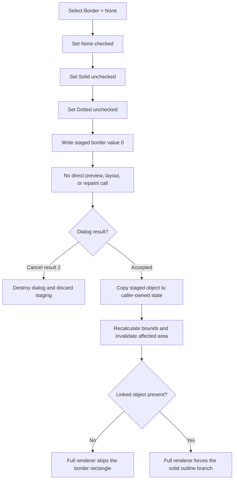

# Remove the system-text border

> Analysis status: Source reviewed and behavior traced.

## Control

| Property | Recovered value |
| --- | --- |
| Form | CSysTextDlg |
| Component path | CSysTextDlg.TTPopupMnu.Border1.NoneMnu |
| Control class | TMenuItem |
| Menu path | Border > None |
| Caption | None |
| Hint | Not present in the recovered resource. |
| Handler name | NoneMnuClick |
| Handler address | 0146bdb0 |
| Graph node | `resource:dfm:CSysTextDlg/CSysTextDlg.TTPopupMnu.Border1.NoneMnu` |
| Handler node | `function:0146bdb0` |
| Graph layer | UI |

## What happens when clicked

`FUN_0146bdb0` makes the three border choices mutually exclusive. It sets the
menu checks to these exact states:

| Menu item | Checked after the click | Staged value represented by the item |
| --- | --- | --- |
| None | Yes | `0` |
| Solid | No | `1` |
| Dotted | No | `2` |

The handler then writes byte value `0` to offset `+0xA0` of the dialog's
private system-text object at form field `+0x8E0`. This is the recovered
no-border model value. The Solid and Dotted handlers use the same three checks
and write `1` and `2`, respectively. The dialog-load function applies the
reverse mapping from values `0`, `1`, and `2` to the three menu checks.

The common menu-check setter changes a menu item only when its checked byte is
different. It also updates the owning native menu. When a menu item has the VCL
radio-item flag, the setter unchecks other radio items in the same group. The
None handler does not depend on that flag: it explicitly checks None and clears
both siblings.

## Preview, rendering, and layout

The click handler does not call the preview painter, invalidate a control,
recalculate a rectangle, or repaint the schematic. The immediate visible
feedback proven by this path is the changed menu checks.

`CSysTextDlg` has a separate paint handler for its preview box. That handler
copies the Memo lines into the staged nested text object, measures the text,
resizes the preview box, and draws the text. It does not read the outer border
byte at `+0xA0`. Therefore, the recovered source does not prove an immediate
border preview after this menu click.

The complete system-text renderer reads the border byte later:

- value `0` skips the user-selected border rectangle;
- value `1` draws a solid rectangle; and
- value `2` draws a dotted rectangle.

There is one proven renderer exception. If the system-text object has a linked
object at `+0xA8`, the renderer promotes border value `0` to the solid drawing
branch. Thus, `0` is the stored **None** choice, but a linked text object can
still receive a forced solid outline.

The width calculation also reads this byte. A nonzero border adds one extra
font-derived horizontal padding unit. Value `0` removes that border-driven
padding. A separate background mode can still request the same extra padding,
so selecting None does not always reduce the final width.

## Staged and committed state

The dialog begins with a deep copy of the caller-owned system-text object.
`FUN_0146a9a0` loads that private copy and checks None, Solid, or Dotted from
its current `+0xA0` value. `NoneMnuClick` changes only this private copy.

Closing the form synchronizes Memo text and font into the same staged object.
It does not overwrite the border byte. The caller decides whether to copy the
staged object back:

- the existing-object caller copies it only when `ShowModal` returns 1;
- the adjacent built-in Cancel button returns 2, so that caller discards it;
- recovered new-object callers also reject result 2 and can require non-empty
  text before they keep the staged object.

The accepted copy includes byte `+0xA0`. The existing-object caller then
invalidates the old and new display rectangles. A recovered new-object caller
calculates the width and height, attaches the new text object, and invalidates
its final area. These caller-side operations are the proven layout and repaint
boundary. This menu click does not save a file or document.

## Repeated selection and errors

Clicking None when None is already selected is idempotent. The VCL setter skips
menu-state updates that already have the requested values, and the handler
writes `0` to the staged byte again. There is no validation message, modal
result change, layout call, or repaint call on this path.

The handler has no local exception handler or rollback. It assumes that the
three menu-item fields and staged object exist. An exception during a menu
state update stops the handler at that point and propagates through the Delphi
runtime. The staged-byte write is the final statement, so it is not reached if
an earlier checked-state call raises.

## Click and commit flow

## Evidence

- [None handler `FUN_0146bdb0`](../../../DecompiledSources/Tina16/functions/000000000146BDB0__FUN_0146bdb0.c) checks None, clears Solid and Dotted, and writes `0` to the staged object's border byte.
- [Solid handler `FUN_0146be00`](../../../DecompiledSources/Tina16/functions/000000000146BE00__FUN_0146be00.c) proves the same check-state pattern and writes border value `1`.
- [Dotted handler `FUN_0146c1f0`](../../../DecompiledSources/Tina16/functions/000000000146C1F0__FUN_0146c1f0.c) proves the same check-state pattern and writes border value `2`.
- [Menu check setter `FUN_007e2d20`](../../../DecompiledSources/Tina16/functions/00000000007E2D20__FUN_007e2d20.c) stores a changed checked state, updates the native menu item, and invokes radio-group clearing when applicable.
- [Radio-group clearing `FUN_007e2ca0`](../../../DecompiledSources/Tina16/functions/00000000007E2CA0__FUN_007e2ca0.c) enumerates sibling radio items with the same group value and unchecks them.
- [Dialog staging load `FUN_0146a9a0`](../../../DecompiledSources/Tina16/functions/000000000146A9A0__FUN_0146a9a0.c) deep-copies the source object, maps border values `0`, `1`, and `2` to the menu checks, and loads the Memo.
- [System-text copy `FUN_01a5eb60`](../../../DecompiledSources/Tina16/functions/0000000001A5EB60__FUN_01a5eb60.c) copies the border byte at `+0xA0` with the rest of the model.
- [Dialog preview painter `FUN_0146af40`](../../../DecompiledSources/Tina16/functions/000000000146AF40__FUN_0146af40.c) measures and renders the staged nested text but does not read the outer border byte.
- [Full system-text renderer `FUN_01a5daf0`](../../../DecompiledSources/Tina16/functions/0000000001A5DAF0__FUN_01a5daf0.c) maps `1` to its solid rectangle branch, `2` to its dotted rectangle branch, and normally skips both for `0`; it also proves the linked-object override.
- [Width calculation `FUN_01a5ee60`](../../../DecompiledSources/Tina16/functions/0000000001A5EE60__FUN_01a5ee60.c) adds extra horizontal padding for a nonzero border or the separate background mode.
- [Existing-object caller `FUN_0149e8d0`](../../../DecompiledSources/Tina16/functions/000000000149E8D0__FUN_0149e8d0.c) copies staging only for modal result 1 and invalidates the old and new display rectangles.
- [New-object caller `FUN_01a7a4a0`](../../../DecompiledSources/Tina16/functions/0000000001A7A4A0__FUN_01a7a4a0.c) rejects result 2, requires non-empty text, calculates final dimensions, and invalidates the created object's area.
- [Text-properties popup launcher `FUN_0146c240`](../../../DecompiledSources/Tina16/functions/000000000146C240__FUN_0146c240.c) opens `TTPopupMnu` at the properties button's calculated screen position.

## Resource evidence

- `TTPopupMnu` is a `TPopupMenu` on `CSysTextDlg`.
- Its parent item has the caption **Border** with an `&` accelerator marker.
- Its three child items are **None**, **Solid**, and **Dotted**.
- `NoneMnu` has no recovered hint, text, action, checked property, image index, or embedded glyph.
- The popup-launch button has an embedded hand-and-arrow glyph. This supports a properties-popup action, but it does not identify the None border choice.

## Analysis limits

- The DFM stream does not contain a checked or radio-item property for None. The explicit handler calls and reverse load mapping prove exclusivity.
- Border value `0` is the stored None choice. A linked object can force the solid renderer branch even while this value remains zero.
- The preview painter does not consume the outer border byte, and the click does not invalidate it. Immediate border preview is not proven.
- Callers have different acceptance rules. The article separates staged state from the caller-owned commit.
- No disk persistence, undo transaction, or exception recovery is present in the recovered click path.
