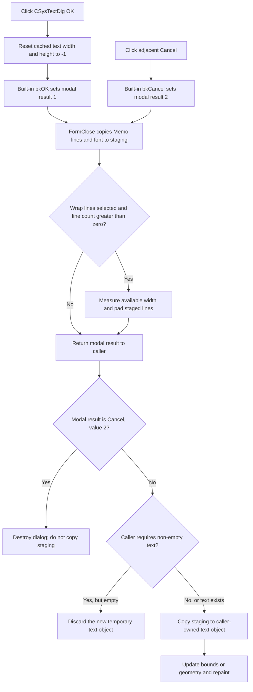

# Accept the text edit

> Analysis status: Complete. The button invalidates the staged text model's cached dimensions, then its built-in `bkOK` behavior closes the modal dialog with an accepted result. The caller, not the click handler, copies the staged object to the caller-owned object.

## Control

| Property | Recovered value |
| --- | --- |
| Form | CSysTextDlg |
| Form caption | Text |
| Component path | CSysTextDlg.ButtonsNB.TPage.OKBtn |
| Control class | TBitBtn |
| Caption | One space in the recovered resource. |
| Hint | Not present in the recovered resource. |
| Button kind | bkOK |
| Handler name | OKBtnClick |
| Handler address | 0146c5d0 |
| Graph node | `resource:dfm:CSysTextDlg/CSysTextDlg.ButtonsNB.TPage.OKBtn` |
| Handler node | `function:0146c5d0` |
| Graph layer | UI |

## What happens when clicked

`FUN_0146c5d0` gets the text-layout object from the dialog's staged text
object at form offset `+0x8E0`. It passes that object to `FUN_01d1c9b0`.
The helper writes `-1` to fields `+0xBC` and `+0xC0`. The corresponding
measurement functions store the calculated text width and height in these
fields. Thus, the click invalidates both cached dimensions.

The handler does not read the Memo, validate text, copy data to the caller, or
close the form directly. `OKBtn` has the Delphi built-in kind `bkOK`. This kind
sets the accepted modal result, value `1`, and closes the modal form after the
click event.

## Staging and commit

The dialog edits a private staging object:

- The caller loads its text object into the dialog with `FUN_0146a9a0`. This
  function makes a deep copy into the object at `+0x8E0`, then loads its text
  lines and font into the Memo.
- `MemoExit` copies the current Memo lines to that staging object.
- `FormClose` copies the current Memo lines and font again. It also writes the
  **Popup text** option to the staged model.
- If **Wrap lines** is selected and the Memo has at least one line,
  `FormClose` rebuilds the staged line list. It calculates a target character
  count from the Memo width, the font, and the first line. It then pads each
  line to that count. For an empty first line, it measures the literal
  `History` as a non-empty fallback.

All recovered callers inspected use `ShowModal`. After result `1`, the simple
existing-object caller `FUN_0149e8d0` copies the staging object back to the
caller-owned text object. It calculates the old and new display rectangles and
invalidates both rectangles. Other recovered creation callers accept any
result except `2`, but also require a non-empty line collection. They then copy
the staging object, update its font and geometry, attach or finalize the new
object, and request a view update.

The click handler does not do those ownership, layout, or repaint operations.
They occur after `ShowModal` returns to the caller.

## OK and Cancel contrast

The adjacent Cancel button has kind `bkCancel` and has no custom click handler.
It closes the modal dialog with result `2`. `FormClose` still refreshes the
dialog-local staging object because that handler runs for both close results.
However, each inspected caller tests the modal result before it copies the
staging object. On result `2`, it destroys the dialog and keeps the original
caller-owned object unchanged.

Therefore, the copy-back decision is the effective commit boundary. Updating
the staging object during `FormClose` does not commit a canceled edit.

## Click flow

## Validation, empty text, and errors

- The OK handler and `FormClose` do not show a validation message, veto the
  close, or reject empty text.
- An existing-object caller can accept and copy an empty line collection.
  Several new-object callers discard an accepted edit when the staged line
  count is zero. This is a caller-specific rule, not OK-button validation.
- The cache-reset helper only performs two field writes. The OK handler has no
  alternate or no-op branch.
- The handler, `FormClose`, and the inspected caller paths have no local
  exception handler or rollback. An exception during formatting, copy-back,
  measurement, layout, or repaint leaves that operation incomplete and
  propagates through the Delphi runtime.
- No recovered caller in the inspected set opens this dialog modelessly. The
  recovered source does not prove behavior for an unobserved modeless caller.

## Evidence

- [OK handler `FUN_0146c5d0`](../../../DecompiledSources/Tina16/functions/000000000146C5D0__FUN_0146c5d0.c) passes the staged text-layout object to the cache-reset helper and does nothing else.
- [Dimension-cache reset `FUN_01d1c9b0`](../../../DecompiledSources/Tina16/functions/0000000001D1C9B0__FUN_01d1c9b0.c) writes `-1` to fields `+0xBC` and `+0xC0`.
- [Width measurement `FUN_01d1b660`](../../../DecompiledSources/Tina16/functions/0000000001D1B660__FUN_01d1b660.c) calculates the text width and stores it at `+0xBC`.
- [Height measurement `FUN_01d1bfb0`](../../../DecompiledSources/Tina16/functions/0000000001D1BFB0__FUN_01d1bfb0.c) calculates the text height and stores it at `+0xC0`.
- [Dialog load `FUN_0146a9a0`](../../../DecompiledSources/Tina16/functions/000000000146A9A0__FUN_0146a9a0.c) copies the source object to the private staging object and loads its font and lines into the Memo.
- [Memo exit `FUN_0146b040`](../../../DecompiledSources/Tina16/functions/000000000146B040__FUN_0146b040.c) copies the Memo lines into the staging object.
- [Form close `FUN_0146ab60`](../../../DecompiledSources/Tina16/functions/000000000146AB60__FUN_0146ab60.c) copies the current lines and font, stores the popup-text option, and performs optional line wrapping and padding.
- [Wrap-lines handler `FUN_0146c620`](../../../DecompiledSources/Tina16/functions/000000000146C620__FUN_0146c620.c) toggles the same checked field that guards the close-time formatting pass and updates Memo wrapping.
- [Preview paint `FUN_0146af40`](../../../DecompiledSources/Tina16/functions/000000000146AF40__FUN_0146af40.c) measures the same staged object's width and height, resets the caches, and renders the preview. This use confirms that the two reset fields are measurement caches.
- [Existing-object caller `FUN_0149e8d0`](../../../DecompiledSources/Tina16/functions/000000000149E8D0__FUN_0149e8d0.c) accepts only modal result `1`, copies the staging object back, and invalidates the old and new rectangles.
- [New-object caller `FUN_01a7a4a0`](../../../DecompiledSources/Tina16/functions/0000000001A7A4A0__FUN_01a7a4a0.c) rejects result `2`, requires non-empty text, then copies, measures, finalizes, and redraws the new text object.

## Direct call

- `function:01d1c9b0` - invalidates the cached width and height of the staged
  text-layout object.

## Resource evidence

- The form caption is **Text**.
- The button caption is one space. The button has `Kind = bkOK` and
  `NumGlyphs = 2`, but it has no embedded custom glyph bytes.
- The adjacent Cancel button has `Kind = bkCancel` and no custom OnClick
  binding.
- The Memo has an `OnExit` binding to `FUN_0146b040`; the form has an
  `OnClose` binding to `FUN_0146ab60`.
- No hint, action, image-list reference, or nearby label supplies additional
  OK-button behavior.

## Analysis limits

- The original Delphi type and field names are not present in the recovered C
  source. The measurement writers and preview caller establish the width and
  height cache interpretation.
- Delphi `bkOK` and `bkCancel` supply the modal results. The generated resource
  evidence does not include explicit `ModalResult` properties for these two
  controls.
- Callers apply different acceptance rules. This article separates the proven
  dialog behavior from caller-specific empty-text and repaint behavior.
