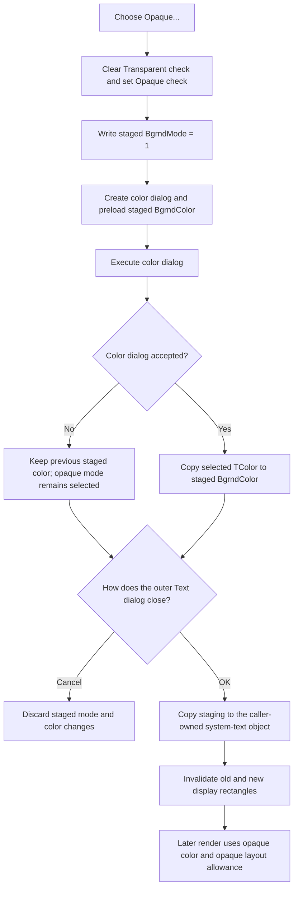

# Select an opaque system-text background

> Analysis status: Complete. This menu command selects opaque background mode in the staged system-text object, checks **Opaque...**, clears **Transparent**, and opens a color dialog. Canceling the color dialog keeps opaque mode but keeps the previous background color.

## Control

| Property | Recovered value |
| --- | --- |
| Form | CSysTextDlg |
| Form caption | Text |
| Component path | CSysTextDlg.TTPopupMnu.Background1.OpaqueMnu |
| Control class | TMenuItem |
| Parent menu | Background |
| Caption | Opaque... |
| Paired command | Transparent |
| Handler name | OpaqueMnuClick |
| Handler address | 0146ba00 |
| Graph node | `resource:dfm:CSysTextDlg/CSysTextDlg.TTPopupMnu.Background1.OpaqueMnu` |
| Handler node | `function:0146ba00` |
| Graph layer | UI |

## What happens when clicked

`FUN_0146ba00` performs the mode change before it opens the color dialog:

1. It clears the checked state of the menu item at form offset `+0x760`.
2. It sets the checked state of the menu item at `+0x768`.
3. It writes `1` to field `+0x99` of the private staged system-text object at
   form offset `+0x8E0`.

The dialog-load function `FUN_0146a9a0` maps background mode `0` to the first
menu item and mode `1` to the second. The sibling **Transparent** handler also
checks `+0x760`, clears `+0x768`, and writes mode `0`. This establishes that
`+0x760` is **Transparent**, `+0x768` is **Opaque...**, and staged field
`+0x99` is the background mode.

The handler then creates a VCL color dialog. It copies staged field `+0x9C`
into the dialog's `Color` field and enables the recovered full-color option.
It executes the dialog and branches on its Boolean result:

- On acceptance, it copies the selected `TColor` back to staged field `+0x9C`.
- On color-dialog Cancel, it leaves `+0x9C` unchanged.

The mode and menu checks are not conditional on the color-dialog result.
Therefore, color-dialog Cancel still leaves the dialog-local system text in
opaque mode. The ellipsis in **Opaque...** correctly indicates that the menu
command opens a second dialog.

## Check and repeated-click behavior

The menu-item checked setter avoids a low-level update when a requested check
value already matches the stored value. The handler itself does not test the
current background mode. Clicking **Opaque...** again still sets the same mode
and always opens a new color dialog. Thus, a repeated click is not a command
no-op. If the user accepts the same color, the handler writes the same color
value again because it does not compare old and new values.

The resource evidence does not declare `RadioItem`, `GroupIndex`, or
`AutoCheck`. The handler supplies the exclusive visible state explicitly by
clearing **Transparent** and setting **Opaque...**.

## Preview, rendering, and layout

`OpaqueMnuClick` does not call the CSysTextDlg preview paint handler, invalidate
a control, resize the preview, or request a repaint. The in-dialog paint
handler `FUN_0146af40` renders the nested text layout but is not called from
this command. Therefore, the recovered call path does not prove an immediate
background preview after either color-dialog result.

The committed system-text renderer does consume both fields. In
`FUN_01294700`, background mode `0` replaces the background color with the
sentinel `0x1FFFFFFF`; mode `1` passes field `+0x9C` as the background color to
the lower renderer. `FUN_01a5ee60` also adds an extra font-derived width
allowance when background mode is `1` or a border is enabled. Thus, opaque mode
can affect final rendering and measured layout even though this click does not
perform either operation directly.

After an accepted outer dialog, the inspected existing-object caller compares
the old and new display rectangles and invalidates both. That caller-owned
invalidation is the proven repaint path for the committed change.

## Staging and persistence boundary

CSysTextDlg edits a private copy at form field `+0x8E0`. `FUN_0146a9a0` copies
the caller's system-text object into this staging object before the dialog is
shown. `OpaqueMnuClick` changes only that staging object and its menu controls.
It does not write the caller-owned object or a file.

On form close, `FUN_0146ab60` refreshes the staged lines and font. The inspected
existing-object caller `FUN_0149e8d0` copies the complete staged object,
including background mode and color, back to its original only when
`ShowModal` returns `mrOK` (`1`). An outer Cancel therefore discards both the
opaque-mode selection and any accepted color-dialog color.

After the caller commits the object, recovered storage paths use the named
fields `BgrndMode` and `BgrndColor`, and the binary writer serializes both
values. Those are later model-persistence operations. This menu handler does
not invoke them. The separate **Save** and **Save As** menu commands are not
part of this click path.

## Click flow

## No-op and error behavior

- Color-dialog Cancel is not a full command rollback. It keeps the previous
  color but leaves mode `1` and the Opaque check selected in the staging UI.
- Outer-dialog Cancel is the proven rollback boundary because the inspected
  caller does not copy the staging object on that result.
- A repeated Opaque click always executes a new color dialog. Only the checked
  setters can skip their internal update when their requested values already
  match.
- The handler does not validate or transform the accepted `TColor`. It copies
  the 32-bit value directly.
- The handler has no local error message, exception handler, or rollback. If
  color-dialog construction or execution fails, the exception propagates
  after the handler has already selected opaque mode. The recovered source
  does not prove cleanup or state restoration for that exceptional path.
- No recovered branch disables the command or rejects a particular color.

## Evidence

- [Opaque handler `FUN_0146ba00`](../../../DecompiledSources/Tina16/functions/000000000146BA00__FUN_0146ba00.c) updates both menu checks and staged mode before it creates, preloads, and executes the color dialog; it copies the color only on acceptance.
- [Transparent handler `FUN_0146b9c0`](../../../DecompiledSources/Tina16/functions/000000000146B9C0__FUN_0146b9c0.c) applies the opposite checks and writes background mode `0` without opening a dialog.
- [Dialog load `FUN_0146a9a0`](../../../DecompiledSources/Tina16/functions/000000000146A9A0__FUN_0146a9a0.c) copies the source system text to staging and maps modes `0` and `1` to the Transparent and Opaque menu controls.
- [Menu checked setter `FUN_007e2d20`](../../../DecompiledSources/Tina16/functions/00000000007E2D20__FUN_007e2d20.c) writes checked state only when the value changes and can apply VCL radio behavior when configured.
- [Color-dialog constructor `FUN_00724d70`](../../../DecompiledSources/Tina16/functions/0000000000724D70__FUN_00724d70.c) creates the same recovered VCL dialog type used by other color-selection handlers.
- [Preview paint `FUN_0146af40`](../../../DecompiledSources/Tina16/functions/000000000146AF40__FUN_0146af40.c) synchronizes Memo lines, measures text, resizes the paint box, and draws the staged nested text. The Opaque handler has no call to it.
- [System-text renderer preparation `FUN_01294700`](../../../DecompiledSources/Tina16/functions/0000000001294700__FUN_01294700.c) maps mode `0` to the transparent sentinel and otherwise passes `BgrndColor` to the renderer.
- [System-text width calculation `FUN_01a5ee60`](../../../DecompiledSources/Tina16/functions/0000000001A5EE60__FUN_01a5ee60.c) adds a font-derived width allowance when background mode is `1` or a border is present.
- [System-text named-field reader `FUN_01a601e0`](../../../DecompiledSources/Tina16/functions/0000000001A601E0__FUN_01a601e0.c) reads fields named `BgrndMode` and `BgrndColor` into offsets `+0x99` and `+0x9C`.
- [System-text binary writer `FUN_01a61fe0`](../../../DecompiledSources/Tina16/functions/0000000001A61FE0__FUN_01a61fe0.c) writes the same mode and color fields to the model stream.
- [Object copy `FUN_01a5eb60`](../../../DecompiledSources/Tina16/functions/0000000001A5EB60__FUN_01a5eb60.c) copies both background fields between complete system-text objects.
- [Existing-object caller `FUN_0149e8d0`](../../../DecompiledSources/Tina16/functions/000000000149E8D0__FUN_0149e8d0.c) copies the staged object only on modal result `1` and invalidates the old and new display rectangles.

## Direct calls

- `function:007e2d20` - sets the Transparent and Opaque menu-item checked states.
- `function:00724d70` - constructs the recovered VCL color dialog.
- `function:00410f20` - destroys the temporary dialog through the nil-safe Delphi object destruction helper.
- The dialog `Execute` call is virtual dispatch at slot `+0xA8` and is not a direct graph call edge.

## Resource evidence

- `OpaqueMnu` is a `TMenuItem` with caption **Opaque...** below the
  **Background** submenu.
- Its sibling `TransparentMnu` has caption **Transparent** and a separate
  OnClick handler.
- Neither menu item has a recovered hint, glyph, image, shortcut, initial
  checked value, radio-item flag, or group index.
- No same-parent label candidate is available.

## Analysis limits

- The dialog type name is not present at the construction call site. Its VCL
  class, `Color` field, Boolean `Execute` result, and use in other recovered
  color commands establish the color-dialog role.
- The original Delphi enum name for background mode is absent. The named
  `BgrndMode` storage key, the Transparent/Opaque control mapping, and renderer
  behavior establish values `0` and `1`.
- The recovered click path does not request an immediate preview repaint. This
  article does not infer that the operating system repaints the preview for an
  unrelated reason.
