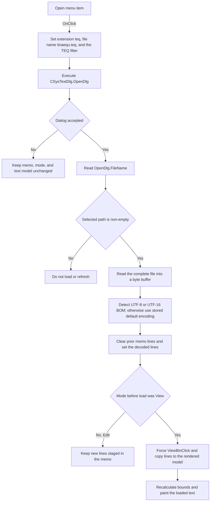

# &Open...

> Analysis status: Source reviewed. The file-dialog, line-loading, decoding,
> and view-refresh paths support the documented behavior.

## Control

| Property | Recovered value |
| --- | --- |
| Form | CSysTextDlg |
| Component path | CSysTextDlg.TTPopupMnu.OpenMnu |
| Control class | TMenuItem |
| Caption | &Open... |
| Hint | Not present in the recovered resource. |
| Text | Not present in the recovered resource. |
| Handler name | OpenMnuClick |
| Handler address | 0146c2d0 |
| Graph node | `resource:dfm:CSysTextDlg/CSysTextDlg.TTPopupMnu.OpenMnu` |
| Handler node | `function:0146c2d0` |
| Graph layer | UI |

## What happens when clicked

This command replaces the system-text memo with text from a selected TINA
equation file. It does not append the selected file to the current text.

`FUN_0146c2d0` configures `CSysTextDlg.OpenDlg` before it shows the dialog:

- Default extension: `teq`.
- File name: `tinaequ.teq`.
- Filter: `Tina equation (*.teq)|*.teq`.

The handler writes these values on every click. It does not set an initial
directory, a dialog title, or a current-document path. Therefore, the recovered
code does not establish the folder that the operating-system dialog shows
first. The selected path remains in `OpenDlg.FileName` after an accepted
dialog, but the next Open click resets that property to `tinaequ.teq`. The
handler does not copy the path to `SaveDlg` or to another recovered form field.

The handler then executes the open dialog. There are three result branches:

- If the user cancels, it does not read a path and does not change the memo,
  editor/view mode, or text model. The dialog properties were already reset.
- If the dialog reports success but its returned file name is empty, it does
  not load or refresh anything.
- If the dialog reports success with a non-empty file name, it calls the memo
  line collection's one-argument file-load method.

## File read and decoding

The line-load path opens the selected file as a read-only file stream. It reads
the complete stream into a byte buffer before it decodes or changes the line
collection. The no-encoding overload then performs this detection:

1. Use UTF-8 when the file starts with the UTF-8 byte-order mark.
2. Otherwise, use UTF-16 little-endian when its byte-order mark is present.
3. Otherwise, use UTF-16 big-endian when its byte-order mark is present.
4. Otherwise, use the line collection's stored default encoding. The Open
   handler does not override that default.

The decoder skips a detected byte-order mark. It converts the remaining bytes
to one UnicodeString. The final text setter clears the old lines, separates the
decoded string at line endings, and adds the new lines. Thus, an empty file is
a successful load that clears the prior memo text.

The handler does not ask for confirmation before this replacement. It also
does not set a recovered document-path field or custom dirty flag. Form byte
`0x8d8` is an Edit/View mode flag, not a dirty flag: `EditBtnClick` sets it to
one and `ViewBtnClick` sets it to zero.

## Edit and view staging

After a successful load, the next action depends on form byte `0x8d8`:

- In Edit mode (`1`), the handler leaves the form in Edit mode. The loaded
  lines are present in the memo, but this handler does not copy them to the
  rendered text model. `MemoExit`, a later View click, or `FormClose` performs
  that copy.
- In View mode (`0`), the handler first sets the byte to one and calls
  `FUN_0146a6e0`. That View handler sets it back to zero, selects the View
  pages, and calls `FUN_0146af40`. The refresh function copies all memo lines
  to the text model, recalculates the rendered bounds, and paints the new text.
  The temporary `0 -> 1 -> 0` change forces the existing View state through
  the normal refresh path; the final mode remains View.

This separation is the staging boundary. Loading always replaces the editable
memo. It updates the rendered model immediately only when the form was already
in View mode.

## Click flow

## Errors and partial state

- The handler has no local exception handler and no recovered error message.
  File-open, file-read, allocation, or decoding exceptions leave through the
  normal Delphi application exception path.
- The loader reads and decodes the complete file before it calls the text
  setter. An exception before that setter leaves the prior memo lines in
  place.
- The final setter begins an update, clears the old collection, and then adds
  decoded lines. There is no transactional rollback around that operation. The
  recovered code does not guarantee restoration if a line-add or change
  notification fails after the clear.
- In View mode, the memo replacement completes before the render refresh. The
  refresh first copies the new lines to the text model and then recalculates
  and paints. A later refresh exception can therefore leave the new memo and
  model text in place even if rendering did not complete. There is no rollback
  in this handler.
- Cancel and an empty returned path are clean no-op paths for document text.
  They do not clear or partially replace the memo.

## Handler evidence

- Source: [FUN_0146c2d0](../../../DecompiledSources/Tina16/functions/000000000146C2D0__FUN_0146c2d0.c)
- Recovered role: Configure the TEQ open dialog, replace the system-text memo
  from the accepted file, and refresh the active View state.
- Current graph summary: Handles 1 Delphi UI event:
  `CSysTextDlg.TTPopupMnu.OpenMnu.OnClick`.
- Current graph behavior: The checked-in graph does not yet contain a curated
  behavior description for this function.
- Complexity: complex
- Distinct outgoing calls: 5

The checked-in DuckDB graph supplies the handler neighborhood because the
ignored dashboard JSON export is not present. The graph has the resource
trigger edge and five recovered direct call edges from this handler.

## Direct and virtual calls

Direct calls from `FUN_0146c2d0`:

- `function:00414ad0` assigns the `teq` extension and TEQ filter strings.
- `function:00724380` assigns `OpenDlg.FileName` to `tinaequ.teq` before the
  dialog opens.
- `function:00724270` gets the accepted `OpenDlg.FileName`.
- `function:0146a6e0` performs the View transition and refresh when the form
  was already in View mode.
- `function:00414480` finalizes the local selected-path UnicodeString.

The handler also makes two important virtual calls:

- `OpenDlg` virtual slot `0xa8` executes the file dialog and returns its
  accepted/cancelled result.
- `Memo.Lines` virtual slot `0xd8` loads the selected file.

Relevant file and text sources:

- [FUN_00724380](../../../DecompiledSources/Tina16/functions/0000000000724380__FUN_00724380.c)
  writes the dialog file-name field at offset `0x108`.
- [FUN_00724270](../../../DecompiledSources/Tina16/functions/0000000000724270__FUN_00724270.c)
  returns the current or accepted dialog file name.
- [FUN_004b43e0](../../../DecompiledSources/Tina16/functions/00000000004B43E0__FUN_004b43e0.c)
  opens the file stream and forwards it to the line-stream loader.
- [FUN_004b4500](../../../DecompiledSources/Tina16/functions/00000000004B4500__FUN_004b4500.c)
  reads the complete stream, detects an encoding, decodes the bytes, and calls
  the final text setter inside the line collection's update boundary.
- [FUN_00458f20](../../../DecompiledSources/Tina16/functions/0000000000458F20__FUN_00458f20.c)
  detects UTF-8, UTF-16 little-endian, and UTF-16 big-endian byte-order marks,
  then returns the byte count to skip.
- [FUN_004b4c80](../../../DecompiledSources/Tina16/functions/00000000004B4C80__FUN_004b4c80.c)
  shows the clear-then-add semantics of the recovered line text setter.
- [FUN_0146a6e0](../../../DecompiledSources/Tina16/functions/000000000146A6E0__FUN_0146a6e0.c)
  selects View mode and starts the render refresh.
- [FUN_0146af40](../../../DecompiledSources/Tina16/functions/000000000146AF40__FUN_0146af40.c)
  copies memo lines to the text model and renders them.

## Resource evidence

- Caption: `&Open...`. The ampersand defines the menu accelerator.
- Dialog component: `CSysTextDlg.OpenDlg`, class `TOpenDialog`.
- Kind: Not present in the recovered resource.
- Modal result: Not present in the recovered resource.
- Checked state: Not present in the recovered resource.
- Hint: Not present in the recovered resource.
- List items: Not present in the recovered resource.
- Image reference: Not present in the recovered resource.
- Extracted glyph: None.

## Nearby label candidates

Nearby labels are layout candidates only. They are not proof of behavior.

- No same-parent label candidate is available.

## Analysis limits

- The handler does not set `InitialDir`. The recovered source cannot prove
  which folder the operating-system dialog selects when it opens.
- The handler uses the line collection's no-encoding overload. A BOM-less
  file uses that collection's stored default encoding; this article does not
  invent a fixed code page.
- The recovered code does not expose a custom dirty-state field for this load.
  It also does not prove how the native memo control reports its own Modified
  property after line replacement.
- Shared file-dialog helpers, Delphi text-loading helpers, and the separate
  View button handler are documented here as call-path evidence. Their graph
  annotations belong to their shared or control-specific owners.
