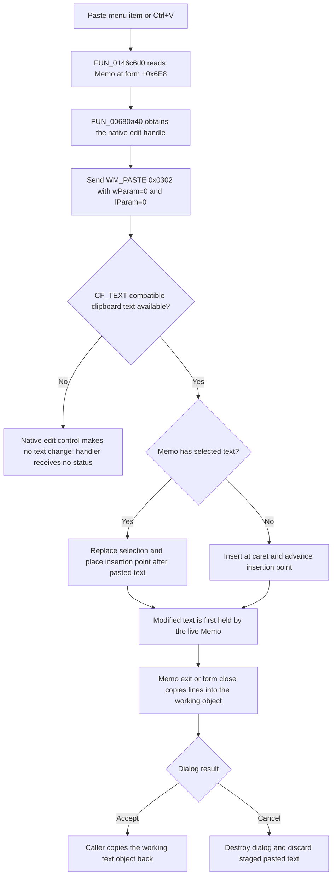

# Paste clipboard text into the system-text editor

> Analysis status: Source reviewed. Clipboard dispatch, selection behavior, staging, cancellation, and error boundaries are documented.

## Control

| Property | Recovered value |
| --- | --- |
| Form | CSysTextDlg |
| Component path | CSysTextDlg.TTPopupMnu.PasteMnu |
| Control class | TMenuItem |
| Caption | Paste |
| Shortcut | Ctrl+V (`16470`) |
| Hint | Not present in the recovered resource. |
| Text | Not present in the recovered resource. |
| Handler name | PasteMnuClick |
| Handler address | 0146c6d0 |
| Graph node | `resource:dfm:CSysTextDlg/CSysTextDlg.TTPopupMnu.PasteMnu` |
| Handler node | `function:0146c6d0` |
| Graph layer | UI |

## What happens when clicked

`FUN_0146c6d0` reads the `TMemo` field at form offset `0x6E8` and passes that
control to `FUN_00680a40`. The shared VCL wrapper obtains the Memo's native
edit-control handle and sends message `0x0302` (`WM_PASTE`) with both message
parameters set to zero. The handler does not open the clipboard, choose a
clipboard format, read clipboard memory, or copy text itself.

The native edit control owns the text operation. `WM_PASTE` asks it to insert
clipboard text at the current insertion point. When the Memo has a non-empty
selection, the paste replaces that selection. When the selection is empty, it
inserts at the caret. Selection replacement collapses the selection at the end
of the inserted text, which becomes the new insertion point. The application
handler does not calculate or restore a selection or caret position.

The Win32 `WM_PASTE` contract accepts clipboard data in `CF_TEXT` format.
Windows can synthesize `CF_TEXT` from `CF_UNICODETEXT` or `CF_OEMTEXT`, so a
compatible text format can satisfy the request. This is native clipboard
conversion. It is not evidence that this handler explicitly requests one of
those alternate formats.

If no compatible clipboard text is available, the edit control inserts
nothing. `WM_PASTE` has no return value, and neither the wrapper nor
`FUN_0146c6d0` checks a result. This path therefore has no application-level
success branch, no unavailable-clipboard message, and no retry. A native
clipboard access failure also stays inside the edit-control operation; the
recovered handler has no local exception recovery or error dialog.

## Relationship to Copy and Cut

The three popup commands operate on the same Memo field and use parallel VCL
wrappers:

| Command | Handler | Native message | Effect |
| --- | --- | --- | --- |
| Copy | `FUN_0146c6b0` | `WM_COPY` (`0x0301`) | Copies the current selection without changing the Memo text. |
| Cut | `FUN_0146c690` | `WM_CUT` (`0x0300`) | Copies the current selection and removes it from the Memo. |
| Paste | `FUN_0146c6d0` | `WM_PASTE` (`0x0302`) | Replaces the current selection, or inserts compatible clipboard text at the caret. |

Paste does not modify the clipboard. Unlike Copy and Cut, its data flow is
from the process-wide clipboard into the dialog's Memo.

## Staging, Cancel, and persistence

The pasted text first changes only the live Memo in this modal dialog. On Memo
exit, `FUN_0146b040` copies the Memo lines into the dialog-private working text
object. `FUN_0146ab60` also copies the Memo lines and font into that working
object when the form closes.

For the existing-object workflow, `FUN_0149e8d0` copies that working object
back to the caller only when the modal result is `1`. Modal result `2`
discards the dialog and its staged changes. Thus, Paste followed by Cancel can
change the Memo while the dialog is open, but it does not change the caller's
text object. The new-object workflow in `FUN_01a7a4a0` also rejects modal
result `2`, and it requires non-empty Memo lines before it accepts a new text
object.

Paste itself does not write a file or update persistent settings. The separate
Save As handler `FUN_0146c470` owns explicit equation-text file output.

## Click flow

## Handler evidence

- Source: [FUN_0146c6d0](../../../DecompiledSources/Tina16/functions/000000000146C6D0__FUN_0146c6d0.c)
- Recovered role: Paste clipboard text into the `CSysTextDlg` Memo.
- Behavior: Sends `WM_PASTE` to the Memo's native edit handle. Native edit
  control behavior owns clipboard access, format conversion, selection
  replacement, insertion, and the final caret position.
- Evidence: The DFM binds `PasteMnu.OnClick` to `PasteMnuClick` at
  `0146c6d0`. The handler passes form field `0x6E8` to `FUN_00680a40`; that
  wrapper resolves a native handle and sends `0x0302` with zero parameters.
- Complexity: simple
- Distinct outgoing calls: 1

## Direct calls

- [FUN_00680a40](../../../DecompiledSources/Tina16/functions/0000000000680A40__FUN_00680a40.c)
  is the shared VCL `WM_PASTE` wrapper. Its canonical annotation is owned by
  the related clipboard-command analysis.

## Supporting source evidence

- [Recovered UI evidence](../../../DecompiledSources/Tina16/resources/dfm/ui-evidence.json)
  identifies `PasteMnu`, caption `Paste`, shortcut Ctrl+V, and the resolved
  `PasteMnuClick` address.
- [Copy handler](../../../DecompiledSources/Tina16/functions/000000000146C6B0__FUN_0146c6b0.c)
  and [Cut handler](../../../DecompiledSources/Tina16/functions/000000000146C690__FUN_0146c690.c)
  pass the same Memo field to the parallel native-message wrappers.
- [Memo-exit staging](../../../DecompiledSources/Tina16/functions/000000000146B040__FUN_0146b040.c)
  and [form-close staging](../../../DecompiledSources/Tina16/functions/000000000146AB60__FUN_0146ab60.c)
  transfer the live Memo state to the dialog-private working object.
- [Existing-object owner](../../../DecompiledSources/Tina16/functions/000000000149E8D0__FUN_0149e8d0.c)
  commits the working object only for modal result `1`.
- [New-object owner](../../../DecompiledSources/Tina16/functions/0000000001A7A4A0__FUN_01a7a4a0.c)
  rejects modal result `2` and empty Memo lines.
- [Save As handler](../../../DecompiledSources/Tina16/functions/000000000146C470__FUN_0146c470.c)
  is the separate file-persistence path.
- Microsoft documents the [`WM_PASTE` message](https://learn.microsoft.com/en-us/windows/win32/dataxchg/wm-paste),
  [edit-control text operations](https://learn.microsoft.com/en-us/windows/win32/controls/edit-controls-text-operations),
  and [clipboard-format synthesis](https://learn.microsoft.com/en-us/windows/win32/dataxchg/clipboard-formats).

## Resource evidence

- `PasteMnu` is a `TMenuItem` under `TTPopupMnu`.
- Caption: `Paste`.
- Shortcut: Ctrl+V (`16470`).
- No hint, action, checked state, image reference, or extracted glyph is
  present.

## Analysis limits

- The decompiled handler proves a native `WM_PASTE` dispatch. It does not show
  a direct application call to `OpenClipboard`, `GetClipboardData`, or an
  explicit Unicode clipboard-format request.
- The handler cannot report whether text was inserted because `WM_PASTE` has
  no return value and the recovered code does not compare Memo contents before
  and after the message.
- The native control can enforce its text limit and other edit-control rules.
  No Paste-specific application response to such a condition is proven here.
- The knowledge-graph JSON export was absent during review. Graph node, event,
  call, and layer checks used the canonical DuckDB database in read-only mode.
