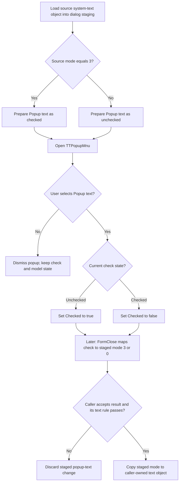

# Popup text

> Analysis status: Source reviewed. Check-state preparation, toggle behavior, staged-model synchronization, commit, cancel, dismissal, and error boundaries are documented.

## Control

| Property | Recovered value |
| --- | --- |
| Form | CSysTextDlg |
| Form caption | Text |
| Component path | CSysTextDlg.TTPopupMnu.PopupText |
| Parent menu | CSysTextDlg.TTPopupMnu |
| Control class | TMenuItem |
| Caption | Popup text |
| Hint | Not present in the recovered resource. |
| Shortcut | Not present in the recovered resource. |
| Action | Not present in the recovered resource. |
| Handler name | PopupTextClick |
| Handler address | 0146c6f0 |
| Graph node | `resource:dfm:CSysTextDlg/CSysTextDlg.TTPopupMnu.PopupText` |
| Handler node | `function:0146c6f0` |
| Graph layer | UI |

## What happens when clicked

`Popup text` toggles whether the staged system-text object uses the recovered
popup-text mode. The click itself changes only the menu item's check mark.

`FUN_0146c6f0` reads the fixed `PopupText` item from form field `0x848`. It
reads that item's `Checked` byte at item offset `0x80`, compares it with zero,
and passes the result to the recovered `TMenuItem.Checked` setter
`FUN_007e2d20`:

- If the item was unchecked, the requested value is true and the item becomes
  checked.
- If the item was checked, the requested value is false and the item becomes
  unchecked.

The handler does not use the event sender. It has no branch for memo content,
text selection, background, border, or any other menu item. It does not change
the Memo, render the preview, or write the system-text model at click time.

## Prepared and committed state

The dialog prepares this menu state before the user opens `TTPopupMnu`.
`FUN_0146a9a0` copies the caller's system-text object into the dialog's private
staged object. It then checks `Popup text` only when the source mode byte at
offset `0x98` equals `3`; all other recovered values make the item unchecked.
The popup menu has no recovered `OnPopup` handler, so opening it does not
recalculate this check.

The toggle reaches the model later:

- On every form close, `FUN_0146ab60` reads the same `Checked` byte. It writes
  mode `3` to the dialog's staged system-text object when checked and mode `0`
  when unchecked.
- The form-close handler also synchronizes Memo lines and font, but this menu
  click does not start that work.
- An existing-object caller copies the staged object back only when
  `ShowModal` returns `1`.
- Recovered new-object callers reject modal result `2` and can also require
  non-empty text before they keep the staged object.

Thus, the check mark changes immediately, the dialog-local model changes on
close, and the caller-owned model changes only after the caller accepts the
dialog result and passes any caller-specific text check. Cancel result `2`
discards the staged value instead of committing it.

## Popup selection, enabled state, and no-op paths

The separate `TTPopUpBtn` click handler only shows `TTPopupMnu`. VCL calls
`FUN_0146c6f0` only after the user selects `Popup text`. Dismissing the popup
without a selection does not dispatch this handler, so the check and both model
objects stay unchanged by this command.

The recovered DFM does not set `Enabled = false`, `Visible = false`,
`AutoCheck`, `RadioItem`, or a group index on this item. It also has no action
binding. The only recovered CSysTextDlg references to form field `0x848` are
the model loader, the form-close reader, and this toggle handler. Therefore,
the recovered application evidence establishes an enabled, visible,
independent check item. It does not establish a branch that disables or hides
the item before display. If VCL does not dispatch the item because the menu is
dismissed or because of unobserved external state, this command has no effect.

`FUN_007e2d20` contains a same-value no-op guard. In the normal click path, the
handler always passes the inverse of the current value, so that guard cannot
skip the change. The setter can omit its native menu refresh while the owner
menu is unavailable or the component is loading, but it writes the check byte
first. Neither the click handler nor the setter reports an application error.
They have no explicit exception handler or rollback, so an unexpected runtime
failure propagates through the Delphi/VCL boundary.

## Click flow

## Handler evidence

- Source: [DecompiledSources/Tina16/functions/000000000146C6F0__FUN_0146c6f0.c](../../../DecompiledSources/Tina16/functions/000000000146C6F0__FUN_0146c6f0.c)
- Recovered role: Toggle the staged system-text object's popup-text option in
  the CSysTextDlg menu.
- Current graph summary: Handles 1 Delphi UI event: CSysTextDlg.TTPopupMnu.PopupText.OnClick.
- Behavior: Inverts `PopupText.Checked`. The close handler later maps the check
  to staged mode `3` or `0`; accepted callers own the final copy-back.
- Evidence: The handler reads form field `0x848`, inverts its byte at `0x80`,
  and calls the menu-item checked setter. It has no other statement.
- Complexity: simple
- Distinct outgoing calls: 1

## Direct call

- [TMenuItem checked setter `FUN_007e2d20`](../../../DecompiledSources/Tina16/functions/00000000007E2D20__FUN_007e2d20.c)
  writes the check byte only when it changes and updates the native menu when
  an active owner menu is available.

## State and ownership evidence

- [Popup opener `FUN_0146c240`](../../../DecompiledSources/Tina16/functions/000000000146C240__FUN_0146c240.c)
  shows `TTPopupMnu` and does not call this command directly.
- [Dialog loader `FUN_0146a9a0`](../../../DecompiledSources/Tina16/functions/000000000146A9A0__FUN_0146a9a0.c)
  copies the source object to staging and checks this item when source mode is
  `3`.
- [Form close `FUN_0146ab60`](../../../DecompiledSources/Tina16/functions/000000000146AB60__FUN_0146ab60.c)
  maps the final check to staged mode `3` or `0`.
- [System-text copy `FUN_01a5eb60`](../../../DecompiledSources/Tina16/functions/0000000001A5EB60__FUN_01a5eb60.c)
  copies the mode byte and other recovered system-text fields between objects.
- [Existing-object dialog owner `FUN_0149e8d0`](../../../DecompiledSources/Tina16/functions/000000000149E8D0__FUN_0149e8d0.c)
  copies staging back only for modal result `1`.
- [New-object dialog owner `FUN_01a7a4a0`](../../../DecompiledSources/Tina16/functions/0000000001A7A4A0__FUN_01a7a4a0.c)
  rejects result `2`, requires non-empty staged text, and then copies and
  finalizes the new object.

## Resource evidence

- The item caption is `Popup text` under `TTPopupMnu`.
- Checked state: Not set in the DFM; the model loader supplies the live check.
- Enabled state: Not set in the DFM; the recovered default is enabled.
- Visible state: Not set in the DFM; the recovered default is visible.
- Auto-check, radio-item, group-index, action, shortcut, hint, image reference,
  and embedded glyph: Not present in the recovered resource.

## Nearby label candidates

Nearby labels are layout candidates only. They are not proof of behavior.

- No same-parent label candidate is available. The menu caption and recovered
  state data flow establish the command meaning.

## Analysis limits

- Mode values `3` and `0`, the check mapping, and the accepted copy-back are
  proven. The recovered source does not expose a Delphi enum name for these
  mode values.
- The click does not render or modify text. The final visual effect of mode `3`
  occurs when downstream code consumes the accepted system-text object; that
  rendering path is outside this menu command.
- The knowledge-graph JSON export was absent during review. Graph node, edge,
  and layer checks used the canonical DuckDB database in read-only mode.
