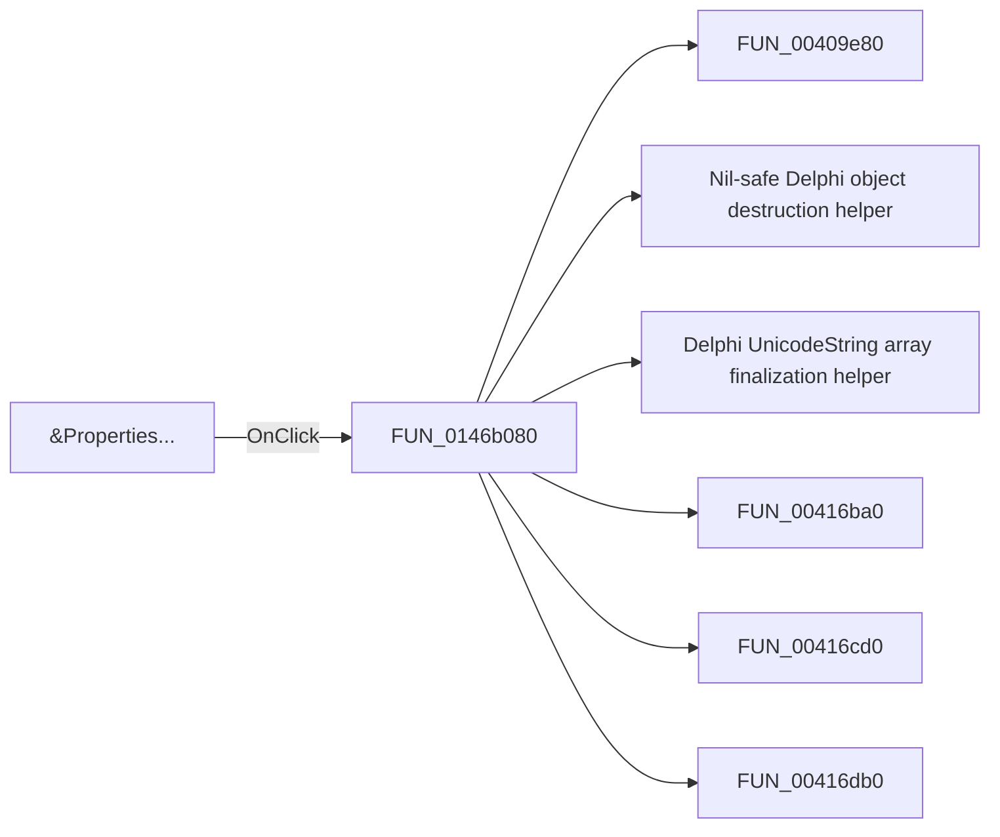

# &Properties...

> Analysis status: Pending individual source review.

## Control

| Property | Recovered value |
| --- | --- |
| Form | CSysTextDlg |
| Component path | CSysTextDlg.TTPopupMnu.Properties1 |
| Control class | TMenuItem |
| Caption | &Properties... |
| Hint | Not present in the recovered resource. |
| Text | Not present in the recovered resource. |
| Handler name | Properties1Click |
| Handler address | 0146b080 |
| Graph node | `resource:dfm:CSysTextDlg/CSysTextDlg.TTPopupMnu.Properties1` |
| Handler node | `function:0146b080` |
| Graph layer | UI |

## What happens when clicked

Pending individual analysis. An agent must read the recovered handler source and its relevant callees before it replaces this text.

## Click flow

## Handler evidence

- Source: [DecompiledSources/Tina16/functions/000000000146B080__FUN_0146b080.c](../../../DecompiledSources/Tina16/functions/000000000146B080__FUN_0146b080.c)
- Recovered role: Not present in the recovered resource.
- Current graph summary: Handles 1 Delphi UI event: CSysTextDlg.TTPopupMnu.Properties1.OnClick.
- Current graph behavior: Not present in the recovered resource.
- Current graph evidence: Not present in the recovered resource.
- Complexity: complex
- Distinct outgoing calls: 17

## Direct calls

- `function:00409e80` — FUN_00409e80
- `function:00410f20` — Nil-safe Delphi object destruction helper
- `function:00414560` — Delphi UnicodeString array finalization helper
- `function:00416ba0` — FUN_00416ba0
- `function:00416cd0` — FUN_00416cd0
- `function:00416db0` — FUN_00416db0
- `function:0043f750` — FUN_0043f750
- `function:004b6930` — FUN_004b6930
- `function:005da0f0` — FUN_005da0f0
- `function:007fc180` — FUN_007fc180
- `function:00848a70` — FUN_00848a70
- `function:0084e320` — FUN_0084e320
- `function:0084e3e0` — FUN_0084e3e0
- `function:00b905e0` — FUN_00b905e0
- `function:01466720` — FUN_01466720
- `function:019b6ae0` — FUN_019b6ae0
- `function:01d11f10` — FUN_01d11f10

## Resource evidence

- Kind: Not present in the recovered resource.
- Modal result: Not present in the recovered resource.
- Checked state: Not present in the recovered resource.
- List items: Not present in the recovered resource.
- Image reference: Not present in the recovered resource.
- Extracted glyph: None.

## Nearby label candidates

Nearby labels are layout candidates only. They are not proof of behavior.

- No same-parent label candidate is available.

## Analysis limits

- Do not infer behavior from the control class, caption, hint, glyph, or nearby label alone.
- Do not replace the pending status until the handler source and relevant call path provide enough evidence.
