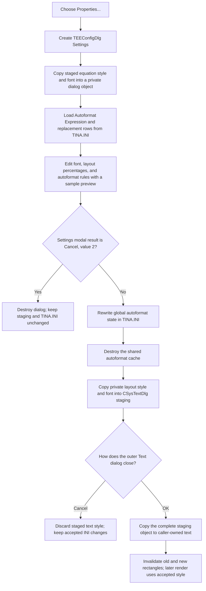

# Edit equation rendering and autoformat properties

> Analysis status: Complete. This command opens the Equation Editor **Settings** dialog with a private copy of the current text's equation-layout style and with global autoformat settings loaded from `TINA.INI`. Cancel copies nothing. Acceptance writes the global autoformat settings immediately and copies the edited style and font into the CSysTextDlg staging object.

## Control

| Property | Recovered value |
| --- | --- |
| Form | CSysTextDlg |
| Form caption | Text |
| Component path | CSysTextDlg.TTPopupMnu.Properties1 |
| Control class | TMenuItem |
| Caption | &Properties... |
| Parent menu | TTPopupMnu |
| Opened form | TEEConfigDlg, caption **Settings** |
| Handler name | Properties1Click |
| Handler address | 0146b080 |
| Graph node | `resource:dfm:CSysTextDlg/CSysTextDlg.TTPopupMnu.Properties1` |
| Handler node | `function:0146b080` |
| Graph layer | UI |

## Dialog construction and input state

`FUN_0146b080` constructs a modal `TEEConfigDlg`. It passes the nested equation
style object below the CSysTextDlg staging object at form field `+0x8E0` to
`FUN_01466720`.

The initializer creates a dialog-private style object at TEEConfigDlg field
`+0x798` and copies the supplied style into it. It then loads six recovered
layout values into percentage-based spin editors:

- exponent relative size;
- exponent base overlap;
- index relative size;
- index label overlap;
- numerator/denominator distance; and
- special overlap.

The dialog resource also provides a **Font** group with a **Set ...** button
and a sample image. Each spin-editor change writes the displayed percentage,
divided by 100, into the private style object and arms a 200 ms timer. The
timer measures and draws that private object into the sample. The Font button
preloads `FontDialog`, and an accepted font selection updates the private style
and refreshes the sample. None of these dialog edits changes CSysTextDlg while
the Settings dialog remains open.

The handler separately loads global autoformat state from `TINA.INI`. It reads
the enabled value into **Autoformat Expression** and loads replacement pairs
from the `Equation Editor Autoformat` section into `ReplaceSG`. These settings
are application-wide configuration, not fields of the current system-text
object.

## Modal result and accepted copy-back

The Settings form has built-in `bkOK` and `bkCancel` buttons. After
`ShowModal`, `FUN_0146b080` treats modal result `2` as Cancel:

- It destroys the Settings dialog.
- It does not rewrite `TINA.INI`.
- It does not reset the shared autoformat cache.
- It does not copy the private style or font to CSysTextDlg.

For any recovered non-Cancel result, the handler performs the accepted path:

1. It clears the `Equation Editor Autoformat` section in `TINA.INI`.
2. It writes the **Autoformat Expression** state under the `Main` section.
3. It writes each replacement-grid row whose first column is non-empty. Each
   stored value joins the left and right columns with the recovered `XXTOXX`
   separator.
4. It destroys and clears the shared cached autoformat object so later equation
   edits reload the accepted rules.
5. It uses `FUN_01d11f10` to copy the dialog-private equation-layout state into
   the nested style object of the CSysTextDlg staging object.
6. It assigns the accepted font to that nested object and to `Memo.Font`.

The style-copy helper transfers the six recovered layout values, another
recovered style value, font state, one style string, and cached dimensions. It
does not replace the Memo's text lines. The Properties handler also does not
close CSysTextDlg or set its outer modal result.

## Repaint and layout behavior

The Settings dialog has its own delayed sample renderer, as described above.
After accepted copy-back, `Properties1Click` does not directly call the
CSysTextDlg preview paint handler and does not invalidate or resize the outer
preview. Therefore, the recovered click path does not prove an immediate outer
preview repaint.

When the CSysTextDlg paint box later receives `OnPaint`, `FUN_0146af40` copies
Memo lines into the staged nested text object, measures its height and width
with the accepted font and layout values, resizes the paint box, clears cached
measurements, and draws it. Thus, the accepted style can change both preview
geometry and rendering on the next paint.

After an accepted outer Text dialog, the inspected existing-object caller
calculates the old and new display rectangles and invalidates both. This is the
proven caller-owned repaint path for the committed style.

## Two persistence boundaries

The command edits two different state domains:

- **Global autoformat configuration:** accepting the inner Settings dialog
  writes `TINA.INI` before control returns to CSysTextDlg. A later Cancel of the
  outer Text dialog does not undo those file writes or the autoformat-cache
  reset.
- **Current system-text style:** the accepted font and equation layout are
  copied only into the CSysTextDlg staging object. The inspected caller copies
  that complete staged object to the caller-owned text only when the outer
  `ShowModal` returns `mrOK` (`1`). Outer Cancel therefore discards the
  text-specific style and font changes.

After the caller commits the text object, the recovered system-text binary
writer serializes its font and equation-layout values. That later model
serialization is separate from the immediate `TINA.INI` autoformat writes.

## Click flow

## Repeated action, no-op, and errors

- Inner Cancel is a rollback for the documented configuration and style
  outputs because it performs no INI write, autoformat-cache reset, or style
  copy-back before the result check.
- An accepted Settings dialog is not a no-op even when visible values are
  unchanged. The handler clears and rewrites the autoformat section, resets the
  shared cache, and copies the private style to staging without comparing old
  and new values.
- Empty replacement rows are not stored. A row is written only when its first
  grid column is non-empty.
- The handler has no application-level validation branch or error message.
  Spin-editor controls and the Settings dialog own their input behavior.
- The handler has no local transaction, exception handler, or rollback. The
  accepted path writes `TINA.INI` before it resets the cache and copies style
  to staging. A failure can therefore leave some global settings written while
  the text-specific style copy remains incomplete.
- The recovered source checks only result `2` for Cancel. It does not require
  result `1` explicitly for the accepted path.

## Evidence

- [Properties handler `FUN_0146b080`](../../../DecompiledSources/Tina16/functions/000000000146B080__FUN_0146b080.c) constructs and initializes TEEConfigDlg, loads INI state, checks modal result `2`, rewrites accepted autoformat settings, clears the shared cache, and copies accepted style and font to staging.
- [Settings initializer `FUN_01466720`](../../../DecompiledSources/Tina16/functions/0000000001466720__FUN_01466720.c) creates a private style copy, converts its six layout values to percentages, loads the spin editors, and prepares the sample.
- [Exponent-size change `FUN_01466970`](../../../DecompiledSources/Tina16/functions/0000000001466970__FUN_01466970.c) is representative of the six spin change handlers: it divides the displayed value by 100, updates the private style, and arms the sample timer.
- [Font command `FUN_01466c10`](../../../DecompiledSources/Tina16/functions/0000000001466C10__FUN_01466c10.c) preloads the font dialog and updates the private font and sample only on acceptance.
- [Sample timer `FUN_01466cb0`](../../../DecompiledSources/Tina16/functions/0000000001466CB0__FUN_01466cb0.c) calls the private sample renderer and disables itself.
- [Sample renderer `FUN_01466580`](../../../DecompiledSources/Tina16/functions/0000000001466580__FUN_01466580.c) measures, sizes, and draws the dialog-private style object.
- [Style copy `FUN_01d11f10`](../../../DecompiledSources/Tina16/functions/0000000001D11F10__FUN_01d11f10.c) copies recovered layout values, font, a style string, and cached measurements between nested equation-style objects.
- [Outer preview paint `FUN_0146af40`](../../../DecompiledSources/Tina16/functions/000000000146AF40__FUN_0146af40.c) measures and draws the staged nested object. The Properties handler has no direct call to it.
- [Existing-object caller `FUN_0149e8d0`](../../../DecompiledSources/Tina16/functions/000000000149E8D0__FUN_0149e8d0.c) copies the full CSysTextDlg staging object and invalidates display rectangles only after outer modal result `1`.
- [System-text binary writer `FUN_01a61fe0`](../../../DecompiledSources/Tina16/functions/0000000001A61FE0__FUN_01a61fe0.c) serializes the committed font and the six recovered equation-layout values.

## Direct calls

- `function:007fc180` - constructs the TEEConfigDlg Settings form.
- `function:01466720` - initializes its private equation-layout style and controls.
- `function:005da0f0` - opens the recovered `TINA.INI` configuration object.
- `function:00848a70`, `function:0084e320`, and `function:0084e3e0` - size, read, and populate the autoformat replacement grid.
- `function:019b6ae0` - splits a stored replacement rule at `XXTOXX` during load.
- `function:01d11f10` - copies accepted equation-layout state into staging.
- `function:00410f20` - destroys temporary Delphi objects, including TEEConfigDlg.
- `ShowModal`, checkbox access, and the INI object's read and write operations use virtual dispatch and do not all appear as direct graph edges.

## Resource evidence

- `Properties1` is a `TMenuItem` with caption **&Properties...**. The ampersand
  marks its menu accelerator; the ellipsis indicates a dialog.
- TEEConfigDlg has caption **Settings** and uses screen-centered positioning.
- Its resource provides built-in `bkOK`, `bkCancel`, and `bkHelp` buttons;
  **Font**, **Exponent**, **Index**, **Sample**, and **Autoformat** groups; the
  six labeled spin editors; **Autoformat Expression**; and a replacement grid.
- The Properties menu item has no recovered hint, glyph, image, checked state,
  or nearby label candidate.

## Analysis limits

- The original Delphi names of the nested style fields are absent. The dialog
  labels, getter/setter pairs, percentage conversions, and sample renderer
  establish the six documented layout meanings.
- The decoded INI key for the enabled checkbox is not present as a literal in
  the recovered C file. Its load and write data flow to **Autoformat
  Expression** establishes its role.
- The accepted path copies one additional numeric style value and one style
  string whose original Delphi property names are not recovered. This article
  does not invent names for them.
- No direct outer-preview invalidation follows copy-back. A later normal paint
  can use the staged values, but its scheduling is outside this handler.
